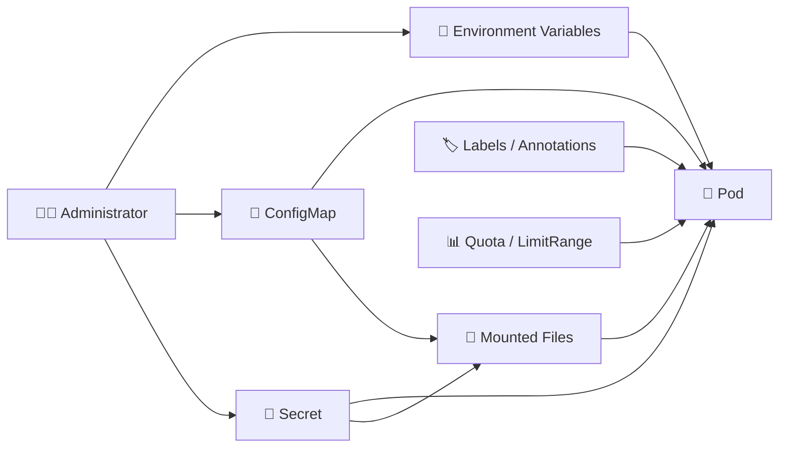

# Kubernetes Configuration ⚙️

## Overview

Kubernetes provides several ways to configure applications without rebuilding container images.

Configuration can be injected through environment variables, ConfigMaps, Secrets, mounted files, container commands, metadata, and namespace-level resource constraints.

This folder focuses on the main configuration patterns used to control application behavior while keeping container images reusable and portable.

---

## Configuration Flow



---

## Folder Structure

```text
06-Configuration/
├── README.md
├── Environment-Variables.md
├── ConfigMap.md
├── Secret.md
├── ConfigMaps-and-Secrets-as-Volumes.md
├── Downward-API.md
├── Commands-and-Arguments.md
├── Labels-and-Selectors.md
├── Annotations.md
└── ResourceQuota-and-LimitRange.md
```

---

## Main Topics

### `Environment-Variables.md`

Covers direct environment-variable configuration and values sourced from ConfigMaps, Secrets, and Pod metadata.

### `ConfigMap.md`

Explains how non-sensitive configuration such as URLs, feature flags, application modes, and configuration files can be stored separately from container images.

### `Secret.md`

Covers Kubernetes Secrets for values such as passwords, tokens, certificates, and credentials.

### `ConfigMaps-and-Secrets-as-Volumes.md`

Explains how ConfigMaps and Secrets can be mounted into Pods as files instead of being exposed only as environment variables.

### `Downward-API.md`

Shows how Pods can access information about themselves, including names, namespaces, labels, annotations, and resource values.

### `Commands-and-Arguments.md`

Covers overriding a container image's default command and arguments through the Pod specification.

### `Labels-and-Selectors.md`

Explains how resources are organized and selected by Deployments, Services, NetworkPolicies, and other Kubernetes objects.

### `Annotations.md`

Covers additional metadata used by tools, controllers, automation systems, and administrators.

### `ResourceQuota-and-LimitRange.md`

Explains namespace-wide resource quotas and default or minimum/maximum resource constraints for workloads.

---

## Useful Commands

```bash
kubectl get configmaps
kubectl get secrets
kubectl describe configmap <name>
kubectl describe secret <name>

kubectl create configmap app-config \
  --from-literal=APP_MODE=production

kubectl create secret generic db-secret \
  --from-literal=username=admin \
  --from-literal=password=change-me

kubectl get pods --show-labels
kubectl label pod <pod-name> environment=production

kubectl get resourcequota
kubectl get limitrange
```

---

## Goal

The goal of this folder is to explain how Kubernetes separates **application configuration from application images**.

After completing it, the reader should understand environment variables, ConfigMaps, Secrets, mounted configuration files, the Downward API, container commands and arguments, metadata, labels and selectors, and namespace-level resource constraints.
