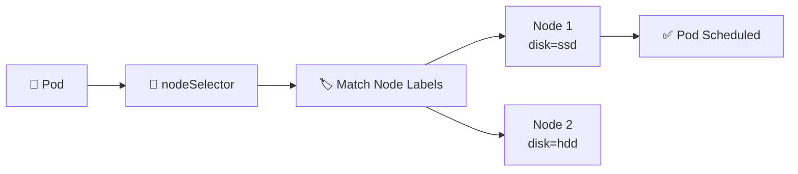

# Node Selector 🏷️

## 1. Overview

`nodeSelector` is the simplest way to control **which nodes a Pod can run on**.

It works by matching labels on nodes.

If a Pod specifies:

```yaml
nodeSelector:
  disk: ssd
```

Kubernetes will only schedule that Pod onto nodes labeled:

```text
disk=ssd
```

---

## 2. Scheduling Flow



---

## 3. Key Concepts

| Concept        | Purpose                        |
| -------------- | ------------------------------ |
| Node label     | Describes a node               |
| `nodeSelector` | Requires matching labels       |
| Exact match    | Key and value must match       |
| Scheduler      | Filters out non-matching nodes |

`nodeSelector` is simple and strict.

For more flexible rules, use **Node Affinity**.

---

## 4. Cheat Sheet

Show node labels:

```bash
kubectl get nodes --show-labels
```

Add a label:

```bash
kubectl label node worker1 disk=ssd
```

Check one label:

```bash
kubectl get node worker1 \
  -o jsonpath='{.metadata.labels.disk}'
```

Remove a label:

```bash
kubectl label node worker1 disk-
```

See where Pods are running:

```bash
kubectl get pods -o wide
```

Inspect scheduling failures:

```bash
kubectl describe pod <pod-name>
```

---

## 5. Practical Example

Suppose a cluster contains:

```text
worker1   disk=ssd
worker2   disk=hdd
worker3   disk=ssd
```

A database workload requires SSD-backed nodes.

The Pod can specify:

```text
disk=ssd
```

The scheduler may therefore choose `worker1` or `worker3`, but not `worker2`.

---

## 6. YAML Example

```yaml
apiVersion: v1
kind: Pod
metadata:
  name: database-app
spec:
  nodeSelector:
    disk: ssd

  containers:
    - name: app
      image: nginx:1.27

      resources:
        requests:
          cpu: 250m
          memory: 256Mi
```

Before creating the Pod:

```bash
kubectl label node worker1 disk=ssd
```

Then:

```bash
kubectl apply -f pod.yaml
kubectl get pod database-app -o wide
```

---

## 7. Common Problems 🚨

* No node has the required label
* Label key or value is misspelled
* Label was removed after the Pod was scheduled
* Matching node lacks enough CPU or memory
* Taints prevent the Pod from using an otherwise matching node
* `nodeSelector` is too restrictive

A typical failure may show:

```text
node(s) didn't match Pod's node affinity/selector
```

---

## 8. Interview Questions 🎯

1. What is `nodeSelector`?
2. How does Kubernetes use node labels during scheduling?
3. What happens if no node matches the selector?
4. Is `nodeSelector` mandatory or preferred placement?
5. What is the difference between `nodeSelector` and Node Affinity?
6. Can taints still block a Pod that matches `nodeSelector`?
7. How do you label a Kubernetes node?

---

## 9. Related Topics 🔗

* Node Affinity
* Taints and Tolerations
* Labels and Selectors
* kube-scheduler
* Resource Requests
* Scheduling Troubleshooting
