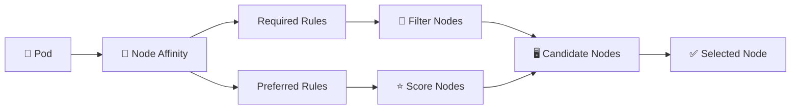

# Node Affinity 🧲

## 1. Overview

**Node Affinity** controls which nodes a Pod can run on based on node labels.

It is more flexible than `nodeSelector` because it supports:

* Required rules
* Preferred rules
* Multiple expressions
* Operators such as `In`, `NotIn`, `Exists`, and `DoesNotExist`

Node Affinity is useful when workloads need specific hardware, zones, environments, or node groups.

---

## 2. Scheduling Flow



---

## 3. Key Concepts

| Rule                                              | Meaning                        |
| ------------------------------------------------- | ------------------------------ |
| `requiredDuringSchedulingIgnoredDuringExecution`  | Must match                     |
| `preferredDuringSchedulingIgnoredDuringExecution` | Preference only                |
| `matchExpressions`                                | Defines label rules            |
| `weight`                                          | Importance of a preferred rule |

Common operators:

```text id="ew8i4d"
In
NotIn
Exists
DoesNotExist
Gt
Lt
```

---

## 4. Cheat Sheet

Label a node:

```bash id="cvtz31"
kubectl label node worker1 disk=ssd
```

Show labels:

```bash id="a95tz7"
kubectl get nodes --show-labels
```

Find SSD nodes:

```bash id="g4pr4u"
kubectl get nodes -l disk=ssd
```

Check Pod placement:

```bash id="8f9mhs"
kubectl get pods -o wide
```

Troubleshoot scheduling:

```bash id="u9b8cm"
kubectl describe pod <pod-name>
```

---

## 5. Practical Example

Suppose a workload **must** run on Linux nodes but would **prefer** nodes equipped with SSD storage.

The rules become:

```text id="rb9vn4"
Required:
  kubernetes.io/os = linux

Preferred:
  disk = ssd
```

If SSD nodes are available, Kubernetes prefers them.

If they are unavailable, the Pod may still run on another Linux node.

---

## 6. YAML Example

```yaml id="4wzzhk"
apiVersion: v1
kind: Pod
metadata:
  name: affinity-app
spec:
  affinity:
    nodeAffinity:

      requiredDuringSchedulingIgnoredDuringExecution:
        nodeSelectorTerms:
          - matchExpressions:
              - key: kubernetes.io/os
                operator: In
                values:
                  - linux

      preferredDuringSchedulingIgnoredDuringExecution:
        - weight: 100
          preference:
            matchExpressions:
              - key: disk
                operator: In
                values:
                  - ssd

  containers:
    - name: app
      image: nginx:1.27
```

The Linux requirement is mandatory, while SSD storage is only preferred.

---

## 7. Common Problems 🚨

* Required rule matches no nodes
* Wrong node label or value
* Affinity rules become overly restrictive
* Matching node lacks CPU or memory
* Matching node has an untolerated taint
* Preferred affinity is mistaken for guaranteed placement

---

## 8. Interview Questions 🎯

1. What is Node Affinity?
2. How is it different from `nodeSelector`?
3. What is required Node Affinity?
4. What is preferred Node Affinity?
5. What does the `weight` field do?
6. What does `IgnoredDuringExecution` mean?
7. Can Node Affinity override taints?

---

## 9. Related Topics 🔗

* Node Selector
* Pod Affinity
* Pod Anti-Affinity
* Taints and Tolerations
* Topology Spread Constraints
* kube-scheduler
