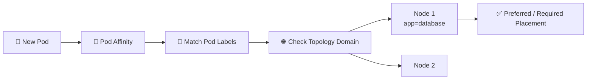

# Pod Affinity 🧲

## 1. Overview

**Pod Affinity** allows a Pod to prefer or require placement **near other Pods**.

Instead of selecting nodes directly, Kubernetes looks at the **labels of existing Pods** and the topology where they are running.

Typical uses include:

* Keeping related services close together
* Reducing network latency
* Co-locating tightly coupled workloads
* Placing helper workloads near application Pods

---

## 2. Scheduling Flow



---

## 3. Key Concepts

| Concept         | Purpose                        |
| --------------- | ------------------------------ |
| `podAffinity`   | Places Pods near matching Pods |
| `labelSelector` | Selects existing Pods          |
| `topologyKey`   | Defines what “near” means      |
| Required rule   | Must satisfy placement         |
| Preferred rule  | Tries to satisfy placement     |

Common topology keys include:

```text
kubernetes.io/hostname
topology.kubernetes.io/zone
```

---

## 4. Cheat Sheet

Show Pod labels:

```bash
kubectl get pods --show-labels
```

Show Pods and nodes:

```bash
kubectl get pods -o wide
```

Inspect node topology labels:

```bash
kubectl get nodes --show-labels
```

Inspect scheduling decisions:

```bash
kubectl describe pod <pod-name>
```

Find matching Pods:

```bash
kubectl get pods -l app=database
```

---

## 5. Practical Example

Suppose a cache Pod should run on the **same node** as Pods labeled:

```text
app=web
```

Pod Affinity can use:

```text
topologyKey: kubernetes.io/hostname
```

This tells Kubernetes to place the new Pod in the same node topology domain as a matching web Pod.

If the topology key were:

```text
topology.kubernetes.io/zone
```

the Pods would only need to be in the same availability zone.

---

## 6. YAML Example

```yaml
apiVersion: v1
kind: Pod
metadata:
  name: cache
spec:
  affinity:
    podAffinity:
      requiredDuringSchedulingIgnoredDuringExecution:
        - labelSelector:
            matchExpressions:
              - key: app
                operator: In
                values:
                  - web

          topologyKey: kubernetes.io/hostname

  containers:
    - name: cache
      image: redis:7
      resources:
        requests:
          cpu: 100m
          memory: 128Mi
```

This Pod must be scheduled onto a node that already runs a Pod labeled:

```text
app=web
```

---

## 7. Common Problems 🚨

* No matching Pods exist
* Incorrect `labelSelector`
* Wrong `topologyKey`
* Required affinity makes scheduling impossible
* Matching node lacks CPU or memory
* Taints still prevent placement
* Pod Affinity is confused with Node Affinity

---

## 8. Interview Questions 🎯

1. What is Pod Affinity?
2. How is Pod Affinity different from Node Affinity?
3. What does `topologyKey` define?
4. What is required vs preferred Pod Affinity?
5. How does `labelSelector` work?
6. Can Pod Affinity place Pods on the same node?
7. Why can heavy affinity rules affect scheduler performance?

---

## 9. Related Topics 🔗

* Pod Anti-Affinity
* Node Affinity
* Labels and Selectors
* Topology Spread Constraints
* Taints and Tolerations
* kube-scheduler
