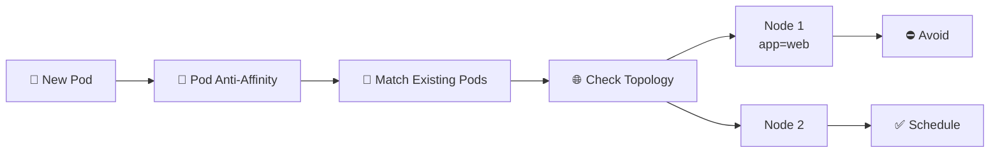

# Pod Anti-Affinity 🚫🧲

## 1. Overview

**Pod Anti-Affinity** tells Kubernetes to keep Pods **away from other matching Pods**.

It is commonly used to improve availability by spreading replicas across:

* Different nodes
* Different zones
* Different failure domains

A classic example is preventing multiple replicas of the same application from running on the same node.

---

## 2. Scheduling Flow



---

## 3. Key Concepts

| Concept           | Purpose                         |
| ----------------- | ------------------------------- |
| `podAntiAffinity` | Keeps Pods apart                |
| `labelSelector`   | Selects Pods to avoid           |
| `topologyKey`     | Defines the separation boundary |
| Required rule     | Separation is mandatory         |
| Preferred rule    | Separation is attempted         |

Common topology keys:

```text id="buh1b1"
kubernetes.io/hostname
topology.kubernetes.io/zone
```

---

## 4. Cheat Sheet

Show Pod placement:

```bash id="8n4v9u"
kubectl get pods -o wide
```

Show Pod labels:

```bash id="6r69lc"
kubectl get pods --show-labels
```

Find matching Pods:

```bash id="yz6yup"
kubectl get pods -l app=web
```

Inspect node topology:

```bash id="4g5nr5"
kubectl get nodes --show-labels
```

Check scheduling events:

```bash id="ek2ftm"
kubectl describe pod <pod-name>
```

---

## 5. Practical Example

Suppose a Deployment runs three replicas:

```text id="0a7qqs"
web-1
web-2
web-3
```

For high availability, you do not want two replicas on the same node.

Anti-affinity can match:

```text id="3vx7ru"
app=web
```

with:

```text id="7civly"
topologyKey: kubernetes.io/hostname
```

Kubernetes will then try, or be required, to place each replica on a different node.

---

## 6. YAML Example

```yaml id="evlk2h"
apiVersion: apps/v1
kind: Deployment
metadata:
  name: web
spec:
  replicas: 3

  selector:
    matchLabels:
      app: web

  template:
    metadata:
      labels:
        app: web

    spec:
      affinity:
        podAntiAffinity:
          preferredDuringSchedulingIgnoredDuringExecution:
            - weight: 100
              podAffinityTerm:
                labelSelector:
                  matchExpressions:
                    - key: app
                      operator: In
                      values:
                        - web

                topologyKey: kubernetes.io/hostname

      containers:
        - name: nginx
          image: nginx:1.27
```

This strongly prefers spreading the replicas across different nodes.

---

## 7. Common Problems 🚨

* Too few nodes exist for required anti-affinity
* Incorrect Pod labels
* Wrong `topologyKey`
* Required rules leave Pods `Pending`
* Anti-affinity is mistaken for topology spread constraints
* Matching nodes lack enough resources

---

## 8. Interview Questions 🎯

1. What is Pod Anti-Affinity?
2. How does it differ from Pod Affinity?
3. Why is anti-affinity useful for high availability?
4. What does `topologyKey` define?
5. What happens if required anti-affinity cannot be satisfied?
6. What is the difference between required and preferred anti-affinity?
7. How is Pod Anti-Affinity different from Topology Spread Constraints?

---

## 9. Related Topics 🔗

* Pod Affinity
* Node Affinity
* Topology Spread Constraints
* Labels and Selectors
* High Availability
* kube-scheduler
