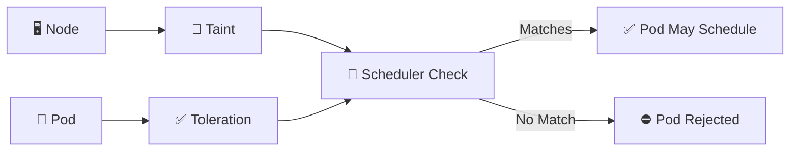

# Taints and Tolerations 🚫✅

## 1. Overview

**Taints** are applied to nodes to repel Pods.

**Tolerations** are added to Pods to allow them to be scheduled onto nodes with matching taints.

They are commonly used for:

* Dedicated workloads
* GPU nodes
* Control-plane protection
* Special hardware
* Isolating critical applications

A toleration does **not** force a Pod onto a node. It only allows the Pod to tolerate the taint.

---

## 2. Scheduling Flow



---

## 3. Key Concepts

A taint has three parts:

```text id="e3d92x"
key=value:effect
```

Example:

```text id="j4o7a1"
dedicated=database:NoSchedule
```

Common effects:

| Effect             | Meaning                                          |
| ------------------ | ------------------------------------------------ |
| `NoSchedule`       | New Pods without toleration cannot schedule      |
| `PreferNoSchedule` | Scheduler tries to avoid the node                |
| `NoExecute`        | Existing non-tolerating Pods may also be evicted |

---

## 4. Cheat Sheet

Add a taint:

```bash id="u4fg11"
kubectl taint node worker1 \
  dedicated=database:NoSchedule
```

View node taints:

```bash id="1u68xb"
kubectl describe node worker1
```

Remove a taint:

```bash id="ygxk29"
kubectl taint node worker1 \
  dedicated=database:NoSchedule-
```

Check Pod scheduling:

```bash id="0sbng4"
kubectl describe pod <pod-name>
```

A common error:

```text id="otzdho"
node(s) had untolerated taint
```

---

## 5. Practical Example

Suppose `worker1` should be reserved for database workloads.

Apply:

```text id="bl4by9"
dedicated=database:NoSchedule
```

Normal Pods are blocked.

Database Pods can include a matching toleration and become eligible for that node.

If you want them to run **specifically** on that node, combine the toleration with Node Affinity or `nodeSelector`.

---

## 6. YAML Example

```yaml id="xbk2z3"
apiVersion: v1
kind: Pod
metadata:
  name: database
spec:
  tolerations:
    - key: dedicated
      operator: Equal
      value: database
      effect: NoSchedule

  nodeSelector:
    dedicated: database

  containers:
    - name: database
      image: postgres:17
      resources:
        requests:
          cpu: 500m
          memory: 512Mi
```

The node would typically have both:

```bash id="2utv9b"
kubectl label node worker1 dedicated=database

kubectl taint node worker1 \
  dedicated=database:NoSchedule
```

The label attracts the workload; the toleration permits it.

---

## 7. Common Problems 🚨

* Toleration key or value does not match
* Wrong taint effect
* Assuming toleration forces placement
* Pod tolerates the taint but node lacks resources
* `NoExecute` unexpectedly evicts running Pods
* Control-plane taints prevent workloads from scheduling

---

## 8. Interview Questions 🎯

1. What is a node taint?
2. What is a toleration?
3. Does a toleration guarantee Pod placement?
4. What is the difference between `NoSchedule` and `NoExecute`?
5. What does `PreferNoSchedule` mean?
6. How do you remove a taint?
7. Why combine taints with Node Affinity?

---

## 9. Related Topics 🔗

* Node Affinity
* Node Selector
* Dedicated Nodes
* Pod Scheduling
* Control Plane Nodes
* Scheduling Troubleshooting
