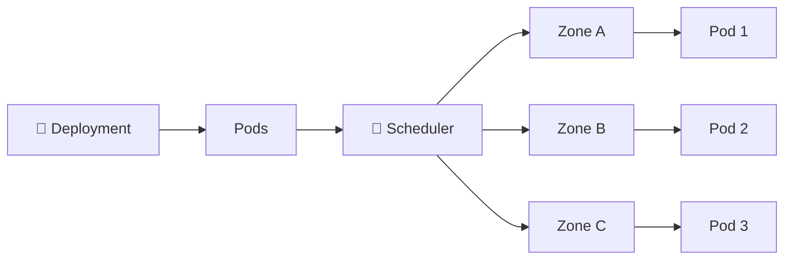

# Topology Spread Constraints 🌐

## 1. Overview

**Topology Spread Constraints** control how Pods are distributed across topology domains such as:

* Nodes
* Availability zones
* Regions
* Racks

They help improve **availability and resilience** by preventing too many replicas from being concentrated in the same failure domain.

---

## 2. Distribution Flow



The scheduler attempts to keep the workload evenly distributed.

---

## 3. Key Concepts

| Field               | Purpose                                  |
| ------------------- | ---------------------------------------- |
| `topologyKey`       | Defines the topology domain              |
| `maxSkew`           | Maximum allowed imbalance                |
| `whenUnsatisfiable` | What happens when the rule cannot be met |
| `labelSelector`     | Selects Pods included in the calculation |

Common topology keys:

```text id="jf3kpa"
kubernetes.io/hostname
topology.kubernetes.io/zone
```

---

## 4. Cheat Sheet

Show topology labels:

```bash id="0dckbt"
kubectl get nodes \
  -L topology.kubernetes.io/zone
```

Show Pod placement:

```bash id="axow3c"
kubectl get pods -o wide
```

Inspect node labels:

```bash id="mshbbp"
kubectl get nodes --show-labels
```

Troubleshoot scheduling:

```bash id="9yj4ob"
kubectl describe pod <pod-name>
```

---

## 5. Practical Example

Suppose an application has six replicas running across three zones:

```text id="ev7byx"
zone-a
zone-b
zone-c
```

Without topology constraints, several Pods might end up in one zone.

A spread constraint can tell Kubernetes to keep the difference between topology domains within:

```text id="w6hjrx"
maxSkew: 1
```

A possible distribution becomes:

```text id="h0i3uq"
zone-a → 2 Pods
zone-b → 2 Pods
zone-c → 2 Pods
```

This reduces the impact of losing an entire zone.

---

## 6. YAML Example

```yaml id="piq716"
apiVersion: apps/v1
kind: Deployment
metadata:
  name: web
spec:
  replicas: 6

  selector:
    matchLabels:
      app: web

  template:
    metadata:
      labels:
        app: web

    spec:
      topologySpreadConstraints:
        - maxSkew: 1
          topologyKey: topology.kubernetes.io/zone
          whenUnsatisfiable: DoNotSchedule

          labelSelector:
            matchLabels:
              app: web

      containers:
        - name: nginx
          image: nginx:1.27
```

`DoNotSchedule` prevents placement if adding the Pod would violate the constraint.

Another option is:

```text id="u3y8zo"
ScheduleAnyway
```

which treats the rule as a preference.

---

## 7. Common Problems 🚨

* Nodes lack the required topology labels
* `labelSelector` does not match the workload
* `maxSkew` is too restrictive
* Too few topology domains exist
* `DoNotSchedule` leaves Pods `Pending`
* Constraints conflict with affinity or taints

---

## 8. Interview Questions 🎯

1. What are Topology Spread Constraints?
2. What does `maxSkew` control?
3. What does `topologyKey` define?
4. What is `DoNotSchedule`?
5. What is `ScheduleAnyway`?
6. How do topology spread constraints improve availability?
7. How are they different from Pod Anti-Affinity?

---

## 9. Related Topics 🔗

* Pod Anti-Affinity
* Node Affinity
* Availability Zones
* High Availability
* kube-scheduler
* Scheduling Troubleshooting
