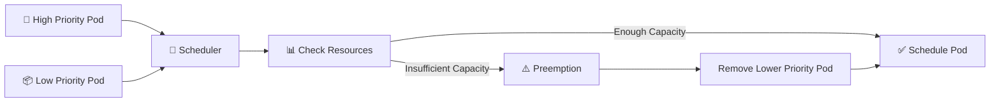

# PriorityClass ⭐

## 1. Overview

A **PriorityClass** assigns a priority value to Pods.

When the cluster is under resource pressure, higher-priority Pods are considered before lower-priority Pods.

PriorityClass is useful for:

* Critical platform workloads
* Monitoring components
* Production applications
* Batch jobs with different importance levels
* Workloads that must be scheduled before less important Pods

Higher priority can also trigger **preemption**, where lower-priority Pods are removed to make room.

---

## 2. Scheduling Flow



---

## 3. Key Concepts

| Concept             | Purpose                                  |
| ------------------- | ---------------------------------------- |
| `PriorityClass`     | Defines a scheduling priority            |
| `value`             | Numerical priority                       |
| `priorityClassName` | Assigns the class to a Pod               |
| Preemption          | Removes lower-priority Pods if necessary |
| `preemptionPolicy`  | Controls whether preemption is allowed   |

A larger numerical value means a higher priority.

PriorityClass is a **cluster-scoped** resource.

---

## 4. Cheat Sheet

List PriorityClasses:

```bash
kubectl get priorityclass
kubectl get pc
```

Inspect one:

```bash
kubectl describe priorityclass high-priority
```

Show Pod priorities:

```bash
kubectl get pods \
  -o custom-columns=NAME:.metadata.name,PRIORITY:.spec.priority
```

Check assigned class:

```bash
kubectl get pod <pod-name> \
  -o jsonpath='{.spec.priorityClassName}'
```

---

## 5. Practical Example

Suppose a cluster runs:

```text
Production API
Monitoring
Development Jobs
```

You might define:

```text
critical        → 100000
production      → 50000
development     → 1000
```

If resources become scarce, Kubernetes considers the production workloads more important than development workloads.

Priority does not guarantee that a Pod can run if its other scheduling requirements cannot be satisfied.

---

## 6. YAML Example

```yaml
apiVersion: scheduling.k8s.io/v1
kind: PriorityClass
metadata:
  name: production-high
value: 50000
globalDefault: false
description: "Priority class for production workloads"

---
apiVersion: v1
kind: Pod
metadata:
  name: production-app
spec:
  priorityClassName: production-high

  containers:
    - name: app
      image: nginx:1.27
      resources:
        requests:
          cpu: 500m
          memory: 256Mi
```

The Pod receives the priority value defined by `production-high`.

---

## 7. Common Problems 🚨

* `priorityClassName` does not exist
* Priority values are poorly designed
* Too many workloads receive high priority
* Preemption unexpectedly removes lower-priority Pods
* Priority is mistaken for guaranteed scheduling
* Affinity, taints, or resource requirements still prevent scheduling

---

## 8. Interview Questions 🎯

1. What is a PriorityClass?
2. Is PriorityClass namespaced?
3. What does the `value` field mean?
4. What is Pod preemption?
5. Does higher priority guarantee scheduling?
6. What does `globalDefault` do?
7. What is `preemptionPolicy` used for?

---

## 9. Related Topics 🔗

* kube-scheduler
* Resource Requests
* Scheduling
* Preemption
* Taints and Tolerations
* Scheduling Troubleshooting
