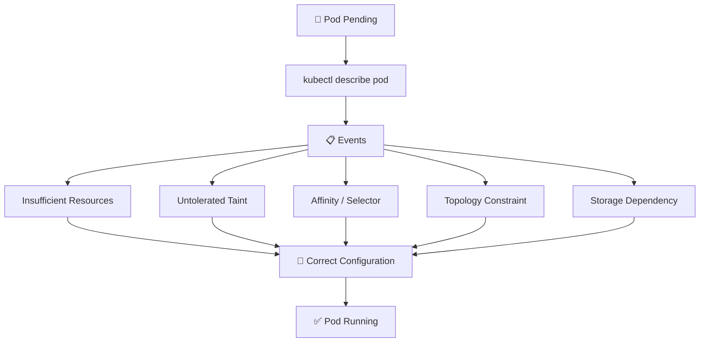

# Scheduling Troubleshooting 🛠️

## 1. Overview

When a Pod remains in the `Pending` state, Kubernetes has usually **created the Pod but cannot find a suitable node**.

Common causes include:

* Insufficient CPU or memory
* Node selector mismatch
* Node affinity mismatch
* Untolerated taints
* Pod anti-affinity rules
* Topology spread constraints
* PVC scheduling dependencies
* ResourceQuota or LimitRange restrictions

The most important command is usually:

```bash
kubectl describe pod <pod-name>
```

---

## 2. Troubleshooting Flow



---

## 3. Cheat Sheet

Check Pod status:

```bash
kubectl get pods
kubectl get pod <pod-name> -o wide
```

Inspect scheduling events:

```bash
kubectl describe pod <pod-name>
```

View recent events:

```bash
kubectl get events \
  --sort-by=.metadata.creationTimestamp
```

Check node capacity:

```bash
kubectl describe nodes
kubectl top nodes
```

Inspect labels and taints:

```bash
kubectl get nodes --show-labels
kubectl describe node <node-name>
```

Check storage:

```bash
kubectl get pvc
kubectl describe pvc <pvc-name>
```

---

## 4. Common Scheduler Messages

| Message                                     | Likely Cause                    |
| ------------------------------------------- | ------------------------------- |
| `Insufficient cpu`                          | CPU request cannot be satisfied |
| `Insufficient memory`                       | Memory request is too large     |
| `untolerated taint`                         | Pod lacks required toleration   |
| `didn't match Pod's node affinity/selector` | Placement rule mismatch         |
| `didn't match pod anti-affinity rules`      | Anti-affinity blocks placement  |
| `unbound immediate PersistentVolumeClaims`  | PVC is not bound                |

A message such as:

```text
0/3 nodes are available
```

means the scheduler evaluated three nodes and rejected all of them.

---

## 5. Practical Troubleshooting Order

A useful sequence is:

```text
1. Check Pod status
        ↓
2. kubectl describe pod
        ↓
3. Read scheduler Events
        ↓
4. Check resources
        ↓
5. Check labels / affinity
        ↓
6. Check taints / tolerations
        ↓
7. Check topology constraints
        ↓
8. Check PVC dependencies
```

Always start with the scheduler's own error message before changing configuration.

---

## 6. YAML Example

```yaml
apiVersion: v1
kind: Pod
metadata:
  name: scheduling-demo
spec:
  nodeSelector:
    disk: ssd

  tolerations:
    - key: dedicated
      operator: Equal
      value: web
      effect: NoSchedule

  containers:
    - name: web
      image: nginx:1.27

      resources:
        requests:
          cpu: 500m
          memory: 256Mi
```

If the Pod stays `Pending`, check whether:

```text
A node has disk=ssd
The taint matches the toleration
Enough CPU and memory are available
```

---

## 7. Common Mistakes 🚨

* Looking at application logs before the Pod is scheduled
* Increasing resources without checking scheduler events
* Forgetting node taints
* Using incorrect node labels
* Making affinity rules too restrictive
* Assuming a matching node always has enough capacity
* Ignoring PVC binding problems

---

## 8. Interview Questions 🎯

1. What does `Pending` mean?
2. What command should you run first for a Pending Pod?
3. What causes `Insufficient cpu`?
4. How do taints prevent scheduling?
5. How do you identify node selector problems?
6. Can a PVC prevent Pod scheduling?
7. What does `0/3 nodes are available` mean?
8. How would you systematically troubleshoot a scheduling failure?

---

## 9. Related Topics 🔗

* Node Selector
* Node Affinity
* Pod Anti-Affinity
* Taints and Tolerations
* Topology Spread Constraints
* PriorityClass
* PersistentVolumeClaim
