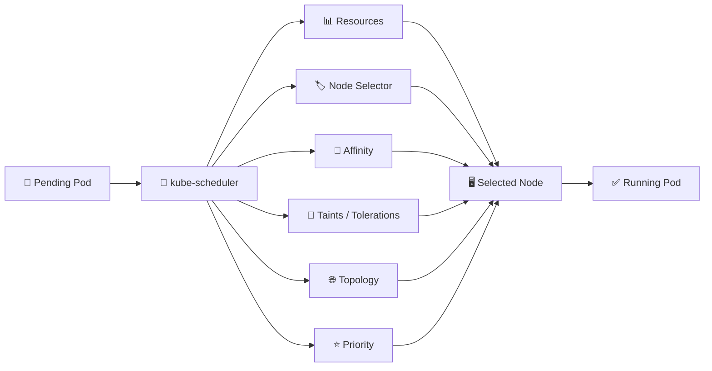

# Kubernetes Scheduling 🎯

## Overview

Kubernetes scheduling determines **which node should run each Pod**.

The scheduler evaluates available nodes and considers factors such as:

* Resource availability
* Node labels
* Affinity and anti-affinity
* Taints and tolerations
* Topology distribution
* Pod priority

Scheduling policies allow administrators to control **where workloads run and how they are distributed across the cluster**.

---

## Scheduling Flow



---

## Folder Structure

```text
07-Scheduling/
├── README.md
├── Node-Selector.md
├── Node-Affinity.md
├── Pod-Affinity.md
├── Pod-Anti-Affinity.md
├── Taints-and-Tolerations.md
├── Topology-Spread-Constraints.md
├── PriorityClass.md
└── Scheduling-Troubleshooting.md
```

---

## Main Topics

### `Node-Selector.md`

Uses node labels to place Pods on specific groups of nodes.

### `Node-Affinity.md`

Provides more flexible rules for selecting preferred or required nodes.

### `Pod-Affinity.md`

Places Pods near other Pods based on labels and topology.

### `Pod-Anti-Affinity.md`

Keeps Pods apart to improve availability and workload distribution.

### `Taints-and-Tolerations.md`

Allows nodes to repel Pods unless those Pods explicitly tolerate the taint.

### `Topology-Spread-Constraints.md`

Distributes replicas across zones, nodes, or other topology domains.

### `PriorityClass.md`

Assigns workload priority and influences scheduling and preemption.

### `Scheduling-Troubleshooting.md`

Covers common reasons Pods remain `Pending` and how to diagnose scheduling failures.

---

## Useful Commands

```bash
kubectl get nodes
kubectl get nodes --show-labels
kubectl describe node <node-name>

kubectl get pods -o wide
kubectl describe pod <pod-name>

kubectl get priorityclass

kubectl taint nodes <node-name> key=value:NoSchedule
kubectl label node <node-name> disk=ssd
```

Check scheduling events:

```bash
kubectl describe pod <pod-name>
```

Typical messages include:

```text
Insufficient cpu
Insufficient memory
node(s) had untolerated taint
node(s) didn't match Pod's node affinity
```

---

## Quick YAML Example

```yaml
apiVersion: v1
kind: Pod
metadata:
  name: scheduled-app
spec:
  nodeSelector:
    disk: ssd

  containers:
    - name: app
      image: nginx:1.27
      resources:
        requests:
          cpu: 100m
          memory: 128Mi
```

This Pod can only be scheduled onto nodes carrying:

```text
disk=ssd
```

---

## Goal

The goal of this folder is to explain how Kubernetes decides **where workloads run**.

After completing it, the reader should understand node selection, affinity, taints, topology distribution, workload priority, and how to diagnose Pods that cannot be scheduled.
