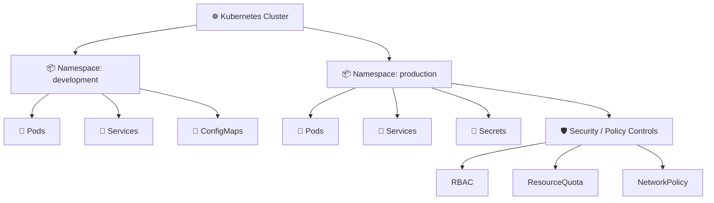

# Namespaces 📦

## 1. Overview

A **Namespace** provides logical separation between Kubernetes resources inside the same cluster.

Namespaces are commonly used to separate:

* Applications
* Teams
* Environments
* Projects
* Security boundaries
* Resource policies

Typical examples:

```text id="xowd5m"
development
staging
production
monitoring
```

Namespaces help organize resources, but they are **not complete security isolation by themselves**.

---

## 2. Namespace Flow



<hr>

```
📦 production namespace
│
├── 🚀 Pods
├── 🔗 Services
├── 🔐 Secrets
├── 📘 ConfigMaps
│
├── 🛡️ RBAC
│      └── Who can access these resources?
│
├── 📊 ResourceQuota
│      └── How much CPU/RAM can this namespace use?
│
└── 🌐 NetworkPolicy
       └── Who can communicate with these Pods?
```

Namespaces become much more useful when combined with RBAC, quotas, and network policies.

---

## 3. Key Concepts

| Concept                 | Meaning                         |
| ----------------------- | ------------------------------- |
| Namespaced resource     | Exists inside a namespace       |
| Cluster-scoped resource | Exists across the whole cluster |
| `metadata.namespace`    | Specifies resource namespace    |
| Default namespace       | Used when none is specified     |

Examples of namespaced resources:

```text id="9vyugo"
Pods
Deployments
Services
Secrets
ConfigMaps
Roles
```

Examples of cluster-scoped resources:

```text id="z57kzh"
Nodes
Namespaces
PersistentVolumes
ClusterRoles
StorageClasses
```

---

## 4. Cheat Sheet

List namespaces:

```bash id="g2ecdk"
kubectl get namespaces
kubectl get ns
```

Create one:

```bash id="is26rm"
kubectl create namespace development
```

Work inside a namespace:

```bash id="45ei34"
kubectl get pods -n development
```

Set the current namespace:

```bash id="wxkdf0"
kubectl config set-context --current \
  --namespace=development
```

Delete a namespace:

```bash id="v62m0r"
kubectl delete namespace development
```

Show resources across all namespaces:

```bash id="9vvoao"
kubectl get pods -A
```

---

## 5. Practical Example

Suppose the same application exists in two environments:

```text id="oyv20b"
development
production
```

Both namespaces can contain resources named:

```text id="v6csy1"
web
database
app-config
```

without name conflicts.

You can then apply separate:

* RBAC rules
* Resource quotas
* Network policies
* Secrets

to each environment.

---

## 6. YAML Example

```yaml id="evtoyd"
apiVersion: v1
kind: Namespace
metadata:
  name: production
  labels:
    environment: production
---
apiVersion: v1
kind: Pod
metadata:
  name: web
  namespace: production
spec:
  containers:
    - name: nginx
      image: nginx:1.27
      resources:
        requests:
          cpu: 100m
          memory: 128Mi
```

The Pod belongs specifically to the `production` namespace.

---

## 7. Common Problems 🚨

* Resource created in the wrong namespace
* `kubectl` command searches only the current namespace
* RBAC permission exists in another namespace
* Secret or ConfigMap cannot be found
* Service DNS name is used incorrectly across namespaces
* Namespace deletion becomes stuck in `Terminating`
* Assuming namespaces provide complete isolation

---

## 8. Interview Questions 🎯

1. What is a Kubernetes Namespace?
2. Are all Kubernetes resources namespaced?
3. Can two namespaces contain resources with the same name?
4. How do namespaces interact with RBAC?
5. Can NetworkPolicies isolate namespaces?
6. What is the default namespace?
7. Are Nodes namespaced?
8. Are namespaces a complete security boundary?

---

## 9. Related Topics 🔗

* RBAC
* Roles and RoleBindings
* ResourceQuota
* NetworkPolicy
* Secrets
* ServiceAccounts
