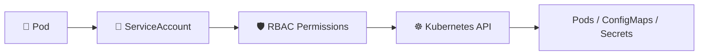

# ServiceAccounts 🤖🔐

## 1. Overview

A **ServiceAccount** provides an identity for processes running inside Pods.

Humans usually authenticate to Kubernetes with users or external identity systems.

Pods, however, often need their own identity to interact with the Kubernetes API.

Typical uses include:

* Reading ConfigMaps
* Watching Pods
* Accessing Secrets
* Running controllers
* CI/CD agents
* Operators and automation tools

Every namespace contains a `default` ServiceAccount unless otherwise configured.

---

## 2. Identity Flow



The ServiceAccount identifies the workload.

RBAC determines what that identity is allowed to do.

---

## 3. Key Concepts

| Concept              | Purpose                                  |
| -------------------- | ---------------------------------------- |
| `ServiceAccount`     | Workload identity                        |
| `serviceAccountName` | Assigns a ServiceAccount to a Pod        |
| RBAC                 | Grants permissions                       |
| Token                | Used to authenticate to the API          |
| `default`            | Default ServiceAccount in each namespace |

ServiceAccounts are **namespaced resources**.

---

## 4. Cheat Sheet

List ServiceAccounts:

```bash id="w5h2br"
kubectl get serviceaccounts
kubectl get sa
```

Create one:

```bash id="q70hal"
kubectl create serviceaccount app-sa
```

Inspect:

```bash id="fd5dmj"
kubectl describe serviceaccount app-sa
```

Check a Pod's ServiceAccount:

```bash id="7i5ng6"
kubectl get pod <pod-name> \
  -o jsonpath='{.spec.serviceAccountName}'
```

Test permissions:

```bash id="8in9t6"
kubectl auth can-i get pods \
  --as=system:serviceaccount:default:app-sa
```

---

## 5. Practical Example

Suppose an application needs to list Pods in its namespace.

Instead of giving the container administrator credentials, create a dedicated identity:

```text id="lrr16n"
app-sa
```

Then grant only:

```text id="0s2l59"
get
list
```

permissions for Pods.

This follows the **principle of least privilege**.

---

## 6. YAML Example

```yaml id="k4ibfb"
apiVersion: v1
kind: ServiceAccount
metadata:
  name: app-sa
  namespace: default

---
apiVersion: v1
kind: Pod
metadata:
  name: app
spec:
  serviceAccountName: app-sa

  containers:
    - name: app
      image: nginx:1.27
      resources:
        requests:
          cpu: 100m
          memory: 128Mi
```

The Pod now runs using the `app-sa` identity.

Permissions are granted separately through RBAC.

---

## 7. Common Problems 🚨

* ServiceAccount does not exist
* ServiceAccount is in another namespace
* RBAC permissions are missing
* Pod unintentionally uses the `default` ServiceAccount
* ServiceAccount has excessive privileges
* Authentication succeeds but authorization fails
* Application assumes API access it has not been granted

---

## 8. Interview Questions 🎯

1. What is a Kubernetes ServiceAccount?
    ```text
    A ServiceAccount gives an automated workload an identity, and RBAC uses that identity for authorization.
    ```
2. Why do Pods need ServiceAccounts?
3. Are ServiceAccounts namespaced?
4. What is the `default` ServiceAccount?
5. How do you assign a ServiceAccount to a Pod?
6. Does creating a ServiceAccount automatically grant permissions?
7. How does RBAC interact with ServiceAccounts?
8. How can you test a ServiceAccount's permissions?

---

## 9. Related Topics 🔗

* RBAC
* Roles and RoleBindings
* ClusterRoles
* Authentication and Authorization
* Secrets
* Pods
