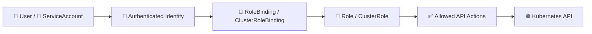

# RBAC 🛡️

## 1. Overview

**RBAC** stands for **Role-Based Access Control**.

It determines **what an authenticated user or ServiceAccount is allowed to do** inside Kubernetes.

RBAC does not prove identity.

Instead:

```text
Authentication = Who are you?
Authorization  = What are you allowed to do?
RBAC           = One mechanism Kubernetes uses for authorization
```

RBAC is commonly used to control access to:

* Pods
* Deployments
* Secrets
* ConfigMaps
* Namespaces
* Nodes
* Kubernetes API resources

---

## 2. Authorization Flow



The binding connects an identity to a set of permissions.

<hr>
ServiceAccount says who the automated process is; RBAC decides what that process may do.
---

## 3. Key Concepts

| Object               | Purpose                                                 |
| -------------------- | ------------------------------------------------------- |
| `Role`               | Defines permissions inside a namespace                  |
| `ClusterRole`        | Defines cluster-scoped or reusable permissions          |
| `RoleBinding`        | Grants a Role or ClusterRole inside a namespace         |
| `ClusterRoleBinding` | Grants a ClusterRole cluster-wide                       |
| `subjects`           | Users, groups, or ServiceAccounts receiving permissions |
| `verbs`              | Allowed API actions                                     |

Common verbs:

```text
get
list
watch
create
update
patch
delete
```

---

## 4. Cheat Sheet

Check your permissions:

```bash
kubectl auth can-i get pods
kubectl auth can-i delete deployments
kubectl auth can-i --list
```

Check another identity:

```bash
kubectl auth can-i get pods \
  --as=system:serviceaccount:default:app-sa
```

List RBAC objects:

```bash
kubectl get roles,rolebindings
kubectl get clusterroles,clusterrolebindings
```

Inspect:

```bash
kubectl describe role <role-name>
kubectl describe rolebinding <binding-name>
```

---

## 5. Practical Example

Suppose an application only needs to read Pods.

You want:

```text
app-sa
  ↓
can get Pods
can list Pods
cannot delete Pods
cannot read Secrets
```

RBAC lets you grant exactly those permissions.

This follows the **principle of least privilege**.

---

## 6. YAML Example

```yaml
apiVersion: v1
kind: ServiceAccount
metadata:
  name: app-sa
  namespace: default

---
apiVersion: rbac.authorization.k8s.io/v1
kind: Role
metadata:
  name: pod-reader
  namespace: default
rules:
  - apiGroups: [""]
    resources:
      - pods
    verbs:
      - get
      - list

---
apiVersion: rbac.authorization.k8s.io/v1
kind: RoleBinding
metadata:
  name: pod-reader-binding
  namespace: default
subjects:
  - kind: ServiceAccount
    name: app-sa
    namespace: default

roleRef:
  kind: Role
  name: pod-reader
  apiGroup: rbac.authorization.k8s.io
```

The flow is:

```text
app-sa
   ↓
RoleBinding
   ↓
pod-reader Role
   ↓
get + list Pods
```

---

## 7. Common Problems 🚨

* Role exists but no RoleBinding exists
* Binding points to the wrong Role
* ServiceAccount is in the wrong namespace
* Required verb is missing
* Wrong API group is specified
* Excessive permissions are granted
* `Role` is confused with `ClusterRole`

---

## 8. Interview Questions 🎯

1. What is RBAC?
```text
RBAC is Kubernetes’ Role-Based Access Control system for defining what authenticated identities are allowed to do.
```
2. Is RBAC authentication or authorization?
```text
 RBAC is an authorization mechanism, not an authentication mechanism.
```
3. What is the difference between Role and ClusterRole?
```text
 A Role grants permissions within a namespace, while a ClusterRole can grant cluster-wide permissions or be reused across namespaces.
```
4. What does a RoleBinding do?
```text
 A RoleBinding connects a user, group, or ServiceAccount to a Role or ClusterRole within a namespace.
```
5. Can a ServiceAccount receive RBAC permissions?
```text
 Yes, ServiceAccounts can receive RBAC permissions through RoleBindings or ClusterRoleBindings.
```
6. What are RBAC verbs?
```text
 RBAC verbs are API actions such as get, list, watch, create, update, and delete.
```
7. What does least privilege mean?
```text
 Least privilege means granting an identity only the minimum permissions required to perform its job.
```
8. How do you test permissions with `kubectl auth can-i`?
```text
 kubectl auth can-i checks whether a specific identity is allowed to perform a particular action on a Kubernetes resource.
```

---

## 9. Related Topics 🔗

* ServiceAccounts
* Roles and RoleBindings
* ClusterRoles and ClusterRoleBindings
* Authentication and Authorization
* Namespaces
* Secrets Security
