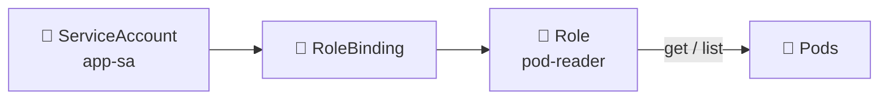

# Roles and RoleBindings 📜🔗

## 1. Overview

A **Role** defines a set of permissions inside a Kubernetes **namespace**.

A **RoleBinding** assigns those permissions to an identity such as:

* User
* Group
* ServiceAccount

The easiest mental model is:

```text id="s9rzng"
Role        = WHAT can be done?
RoleBinding = WHO receives those permissions?
```

Together, they provide namespace-scoped RBAC authorization.

---

## 2. Permission Flow



In plain English:

```text id="04vuij"
app-sa
   ↓
RoleBinding
   ↓
pod-reader Role
   ↓
May GET and LIST Pods
```

---

## 3. Key Concepts

| Concept       | Purpose                              |
| ------------- | ------------------------------------ |
| `Role`        | Defines namespace-scoped permissions |
| `RoleBinding` | Assigns permissions to identities    |
| `rules`       | Defines allowed actions              |
| `resources`   | Resources being controlled           |
| `verbs`       | Allowed operations                   |
| `subjects`    | Identities receiving access          |
| `roleRef`     | References the Role                  |

Common verbs include:

```text id="r4c3p6"
get
list
watch
create
update
patch
delete
```

---

## 4. Cheat Sheet

Create a Role:

```bash id="98xnxd"
kubectl create role pod-reader \
  --verb=get,list \
  --resource=pods
```

Create a RoleBinding:

```bash id="lmjqms"
kubectl create rolebinding app-pod-reader \
  --role=pod-reader \
  --serviceaccount=default:app-sa
```

List them:

```bash id="x3xigm"
kubectl get roles
kubectl get rolebindings
```

Inspect:

```bash id="jik13v"
kubectl describe role pod-reader
kubectl describe rolebinding app-pod-reader
```

Test permission:

```bash id="d9rf6l"
kubectl auth can-i list pods \
  --as=system:serviceaccount:default:app-sa
```

---

## 5. Practical Example

Suppose `app-sa` needs to monitor Pods in the `production` namespace.

It should be allowed to:

```text id="2o12ft"
✅ get Pods
✅ list Pods
✅ watch Pods

❌ create Pods
❌ delete Pods
❌ read Secrets
```

Create a Role containing only those permissions and connect it to `app-sa` using a RoleBinding.

---

## 6. YAML Example

```yaml id="6vx9ul"
apiVersion: rbac.authorization.k8s.io/v1
kind: Role
metadata:
  name: pod-reader
  namespace: production
rules:
  - apiGroups: [""]
    resources:
      - pods
    verbs:
      - get
      - list
      - watch

---
apiVersion: rbac.authorization.k8s.io/v1
kind: RoleBinding
metadata:
  name: app-pod-reader
  namespace: production

subjects:
  - kind: ServiceAccount
    name: app-sa
    namespace: production

roleRef:
  kind: Role
  name: pod-reader
  apiGroup: rbac.authorization.k8s.io
```

The result:

```text id="mqjh81"
production/app-sa
        ↓
app-pod-reader
        ↓
pod-reader
        ↓
get + list + watch Pods
```

---

## 7. Common Problems 🚨

* Role exists but no RoleBinding exists
* Wrong ServiceAccount is referenced
* Role and RoleBinding are in different namespaces
* Required verb is missing
* Wrong resource or API group is specified
* RoleBinding references the wrong Role
* Permissions are broader than necessary

---

## 8. Interview Questions 🎯

1. What is a Kubernetes Role?
2. What does a RoleBinding do?
3. Are Roles namespace-scoped?
4. What are `verbs` in an RBAC rule?
5. What does `subjects` contain?
6. What does `roleRef` do?
7. Can a RoleBinding grant permissions to a ServiceAccount?
8. Can the same Role be assigned to multiple identities?

---

## 9. Related Topics 🔗

* RBAC
* ServiceAccounts
* ClusterRoles and ClusterRoleBindings
* Namespaces
* Authentication and Authorization
* Least Privilege
