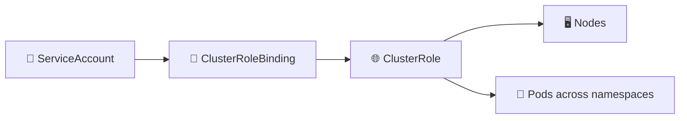

# ClusterRoles and ClusterRoleBindings 🌐🔐

## 1. Overview

A **ClusterRole** defines permissions that can apply across the Kubernetes cluster.

A **ClusterRoleBinding** grants those permissions to a:

* User
* Group
* ServiceAccount

The simple model is:

```text id="5q9znt"
ClusterRole        = WHAT can be done across the cluster?
ClusterRoleBinding = WHO receives those permissions?
```

Unlike a `Role`, a `ClusterRole` is **cluster-scoped**.

---

## 2. Permission Flow



The binding connects an identity to cluster-level permissions.

---

## 3. Key Concepts

| Concept              | Purpose                                        |
| -------------------- | ---------------------------------------------- |
| `ClusterRole`        | Defines cluster-scoped or reusable permissions |
| `ClusterRoleBinding` | Grants permissions cluster-wide                |
| `rules`              | Defines allowed API actions                    |
| `subjects`           | Identities receiving access                    |
| `roleRef`            | References the ClusterRole                     |

A ClusterRole can also be referenced by a **RoleBinding** to grant its permissions only inside one namespace.

---

## 4. Cheat Sheet

Create a ClusterRole:

```bash id="y72q0v"
kubectl create clusterrole node-reader \
  --verb=get,list \
  --resource=nodes
```

Create a ClusterRoleBinding:

```bash id="7nt5ez"
kubectl create clusterrolebinding node-reader-binding \
  --clusterrole=node-reader \
  --serviceaccount=default:monitoring-sa
```

List objects:

```bash id="xsj9kk"
kubectl get clusterroles
kubectl get clusterrolebindings
```

Inspect:

```bash id="m8h4p3"
kubectl describe clusterrole node-reader
kubectl describe clusterrolebinding node-reader-binding
```

---

## 5. Practical Example

Suppose a monitoring application needs to inspect nodes across the entire cluster.

You might allow:

```text id="ej1nd8"
✅ get Nodes
✅ list Nodes

❌ delete Nodes
❌ modify Nodes
❌ manage Secrets
```

A ClusterRole can define those permissions, and a ClusterRoleBinding can grant them to the monitoring ServiceAccount.

---

## 6. YAML Example

```yaml id="fsk1qw"
apiVersion: rbac.authorization.k8s.io/v1
kind: ClusterRole
metadata:
  name: node-reader
rules:
  - apiGroups: [""]
    resources:
      - nodes
    verbs:
      - get
      - list

---
apiVersion: rbac.authorization.k8s.io/v1
kind: ClusterRoleBinding
metadata:
  name: node-reader-binding

subjects:
  - kind: ServiceAccount
    name: monitoring-sa
    namespace: monitoring

roleRef:
  kind: ClusterRole
  name: node-reader
  apiGroup: rbac.authorization.k8s.io
```

The result:

```text id="0n4j0g"
monitoring/monitoring-sa
          ↓
ClusterRoleBinding
          ↓
node-reader ClusterRole
          ↓
get + list Nodes
```

---

## 7. Common Problems 🚨

* Cluster-wide permissions are granted unnecessarily
* ClusterRoleBinding references the wrong ClusterRole
* ServiceAccount namespace is incorrect
* Required verb is missing
* Wrong API group or resource is specified
* ClusterRole and Role are confused
* Least-privilege principles are ignored

---

## 8. Interview Questions 🎯

1. What is a ClusterRole?
2. What is a ClusterRoleBinding?
3. What is the difference between Role and ClusterRole?
4. What is the difference between RoleBinding and ClusterRoleBinding?
5. Can a ClusterRole be used inside only one namespace?
6. Are ClusterRoles namespaced?
7. Can a ServiceAccount receive cluster-wide permissions?
8. Why should ClusterRoleBindings be used carefully?

---

## 9. Related Topics 🔗

* RBAC
* Roles and RoleBindings
* ServiceAccounts
* Namespaces
* Authentication and Authorization
* Least Privilege
