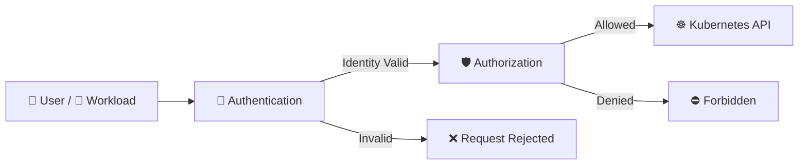

# Authentication and Authorization 🔑🛡️

## 1. Overview

Kubernetes separates security into two important questions:

```text id="4j2w8x"
Authentication = Who are you?
Authorization  = What are you allowed to do?
```

A request must first be authenticated before Kubernetes decides whether it should be authorized.

Typical identities include:

* Human users
* ServiceAccounts
* External identity providers
* Automation tools

---

## 2. Request Flow



First Kubernetes identifies the requester, then checks permissions.

---

## 3. Key Concepts

| Concept        | Purpose                          |
| -------------- | -------------------------------- |
| Authentication | Verifies identity                |
| Authorization  | Checks permissions               |
| RBAC           | Common authorization mechanism   |
| ServiceAccount | Identity for workloads           |
| Credentials    | Used to prove identity           |
| API Server     | Performs request security checks |

Common authentication methods can include:

* Client certificates
* Bearer tokens
* ServiceAccount tokens
* OIDC / external identity providers

---

## 4. Cheat Sheet

Check current identity configuration:

```bash id="8q3l7c"
kubectl config view
```

Check whether you can perform an action:

```bash id="t2a4mv"
kubectl auth can-i get pods
```

List your permissions:

```bash id="mp31dv"
kubectl auth can-i --list
```

Test another identity:

```bash id="z8x6nr"
kubectl auth can-i list pods \
  --as=system:serviceaccount:default:app-sa
```

Typical authorization failure:

```text id="4dvn19"
Error from server (Forbidden)
```

---

## 5. Practical Example

Suppose a ServiceAccount sends a request to list Pods.

The flow is:

```text id="4ug33c"
ServiceAccount Token
        ↓
Authentication
        ↓
Identity = app-sa
        ↓
Authorization / RBAC
        ↓
Can app-sa list Pods?
        ↓
Yes → Request succeeds
No  → Forbidden
```

Authentication alone does not grant access.

---

## 6. YAML Example

```yaml id="7u0w4s"
apiVersion: v1
kind: ServiceAccount
metadata:
  name: app-sa
  namespace: production

---
apiVersion: rbac.authorization.k8s.io/v1
kind: Role
metadata:
  name: pod-reader
  namespace: production
rules:
  - apiGroups: [""]
    resources:
      - pods
    verbs:
      - get
      - list

---
apiVersion: rbac.authorization.k8s.io/v1
kind: RoleBinding
metadata:
  name: pod-reader-binding
  namespace: production
subjects:
  - kind: ServiceAccount
    name: app-sa
    namespace: production

roleRef:
  kind: Role
  name: pod-reader
  apiGroup: rbac.authorization.k8s.io
```

Here, the ServiceAccount provides the identity, while RBAC provides authorization.

---

## 7. Common Problems 🚨

* Credentials are invalid or expired
* Authentication succeeds but authorization fails
* RBAC permission is missing
* Wrong user or ServiceAccount is used
* Access is granted in the wrong namespace
* Authentication and authorization are confused

A useful distinction:

```text id="u60t09"
Unauthorized → Authentication problem
Forbidden    → Authorization problem
```

---

## 8. Interview Questions 🎯

1. What is authentication in Kubernetes?
2. What is authorization?
3. What is the difference between authentication and authorization?
4. What does RBAC provide?
5. What identity do Pods normally use?
6. What does `Forbidden` usually indicate?
7. What does `Unauthorized` usually indicate?
8. Can an authenticated user still be denied access?

---

## 9. Related Topics 🔗

* RBAC
* ServiceAccounts
* Roles and RoleBindings
* ClusterRoles and ClusterRoleBindings
* API Server
* Admission Control
