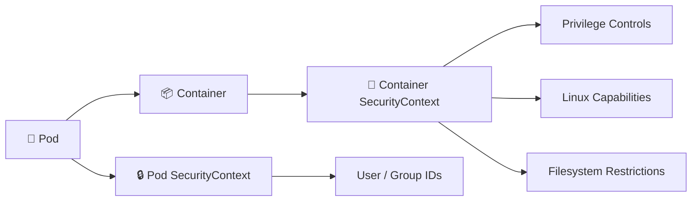

# SecurityContext 🔒

## 1. Overview

A **SecurityContext** defines security settings for a Pod or container.

It can control things such as:

* User and group IDs
* Privileged mode
* Linux capabilities
* Filesystem permissions
* Read-only root filesystem
* Privilege escalation

SecurityContext helps reduce the impact of a compromised container.

---

## 2. Security Flow



Pod-level settings apply broadly, while container-level settings can be more specific.

---

## 3. Key Concepts

| Field                      | Purpose                                           |
| -------------------------- | ------------------------------------------------- |
| `runAsUser`                | Runs the process as a specific UID                |
| `runAsGroup`               | Sets the primary GID                              |
| `runAsNonRoot`             | Requires a non-root user                          |
| `fsGroup`                  | Sets group ownership for mounted volumes          |
| `privileged`               | Gives the container elevated host-like privileges |
| `allowPrivilegeEscalation` | Controls privilege escalation                     |
| `readOnlyRootFilesystem`   | Makes the root filesystem read-only               |
| `capabilities`             | Adds or removes Linux capabilities                |

---

## 4. Cheat Sheet

Inspect Pod security settings:

```bash id="scmd01"
kubectl get pod <pod-name> -o yaml
```

Check container UID:

```bash id="scmd02"
kubectl exec <pod-name> -- id
```

Check running user:

```bash id="scmd03"
kubectl exec <pod-name> -- whoami
```

Inspect security-related events:

```bash id="scmd04"
kubectl describe pod <pod-name>
```

---

## 5. Practical Example

Suppose an application does not require root privileges.

A secure configuration might require:

```text id="scex01"
runAsNonRoot = true
UID          = 1000
Privilege escalation = disabled
Root filesystem      = read-only
Extra capabilities   = dropped
```

This significantly reduces what the container can do if compromised.

---

## 6. YAML Example

```yaml id="scyaml1"
apiVersion: v1
kind: Pod
metadata:
  name: secure-app
spec:
  securityContext:
    runAsUser: 1000
    runAsGroup: 3000
    fsGroup: 2000

  containers:
    - name: app
      image: nginx:1.27

      securityContext:
        runAsNonRoot: true
        allowPrivilegeEscalation: false
        readOnlyRootFilesystem: true

        capabilities:
          drop:
            - ALL

      resources:
        requests:
          cpu: 100m
          memory: 128Mi
```

This Pod runs with restricted Linux privileges rather than using root-level defaults.

---

## 7. Common Problems 🚨

* Image requires root privileges
* Application cannot write to a read-only filesystem
* Volume permissions conflict with `fsGroup`
* Wrong UID or GID is configured
* Required Linux capability was removed
* `privileged: true` is enabled unnecessarily
* Application fails because privilege escalation is disabled

---

## 8. Interview Questions 🎯

1. What is a SecurityContext?
2. What is the difference between Pod and container SecurityContext?
3. What does `runAsNonRoot` do?
4. What is `fsGroup` used for?
5. What does `allowPrivilegeEscalation` control?
6. Why use `readOnlyRootFilesystem`?
7. What are Linux capabilities?
8. Why should privileged containers be avoided?

---

## 9. Related Topics 🔗

* Pod Security Standards
* Linux Permissions
* ServiceAccounts
* Admission Control
* Volumes
* Container Security
