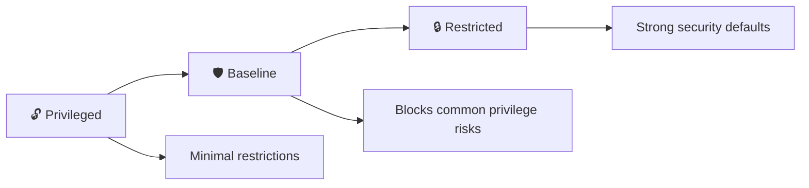

# Pod Security Standards 🛡️

## 1. Overview

**Pod Security Standards (PSS)** define security profiles for Pods.

Kubernetes provides three standard levels:

* **Privileged**
* **Baseline**
* **Restricted**

These profiles describe how permissive or restrictive Pod security settings should be.

They are commonly enforced at the namespace level using **Pod Security Admission**.

---

## 2. Security Levels



Think of the profiles as increasing security:

```text id="psslevels"
Privileged  → Least restrictive
Baseline    → Moderate protection
Restricted  → Strongest standard profile
```

---

## 3. Key Concepts

| Profile      | Purpose                                       |
| ------------ | --------------------------------------------- |
| `Privileged` | Allows highly permissive workloads            |
| `Baseline`   | Prevents common privilege escalation risks    |
| `Restricted` | Enforces stronger container security controls |

Restricted workloads typically require controls such as:

* Running as non-root
* Dropping unnecessary capabilities
* Disabling privilege escalation
* Using approved seccomp settings
* Avoiding privileged containers

---

## 4. Cheat Sheet

Show namespace labels:

```bash id="psscmd1"
kubectl get namespace <namespace> --show-labels
```

Enforce Restricted policy:

```bash id="psscmd2"
kubectl label namespace production \
  pod-security.kubernetes.io/enforce=restricted
```

Add warning mode:

```bash id="psscmd3"
kubectl label namespace production \
  pod-security.kubernetes.io/warn=restricted
```

Add audit mode:

```bash id="psscmd4"
kubectl label namespace production \
  pod-security.kubernetes.io/audit=restricted
```

---

## 5. Practical Example

Suppose the `production` namespace should reject insecure Pods.

You can configure:

```text id="psspractical"
enforce = restricted
warn    = restricted
audit   = restricted
```

If a developer tries to create a privileged container, Kubernetes can reject the request before the Pod runs.

---

## 6. YAML Example

Namespace policy:

```yaml id="pssyaml1"
apiVersion: v1
kind: Namespace
metadata:
  name: production
  labels:
    pod-security.kubernetes.io/enforce: restricted
    pod-security.kubernetes.io/warn: restricted
    pod-security.kubernetes.io/audit: restricted
```

A compatible Pod might use:

```yaml id="pssyaml2"
apiVersion: v1
kind: Pod
metadata:
  name: secure-app
  namespace: production
spec:
  containers:
    - name: app
      image: nginx:1.27

      securityContext:
        runAsNonRoot: true
        allowPrivilegeEscalation: false

        capabilities:
          drop:
            - ALL

        seccompProfile:
          type: RuntimeDefault
```

---

## 7. Common Problems 🚨

* Pod violates the namespace security profile
* Privileged mode is enabled
* Container runs as root
* Required capabilities are not dropped
* Seccomp configuration is missing
* Policy is enforced in the wrong namespace
* Existing workloads are incompatible with stricter policies

---

## 8. Interview Questions 🎯

1. What are Pod Security Standards?
2. What are the three PSS profiles?
3. Which profile is the most restrictive?
4. What is Pod Security Admission?
5. At what scope are PSS policies commonly enforced?
6. What is the difference between `enforce`, `warn`, and `audit`?
7. Why should production workloads prefer the Restricted profile?
8. How does SecurityContext relate to Pod Security Standards?

---

## 9. Related Topics 🔗

* SecurityContext
* Admission Control
* Namespaces
* Linux Capabilities
* Seccomp
* Container Security
