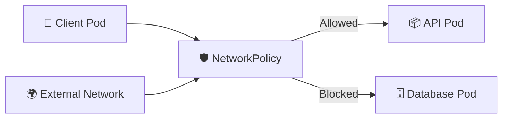

# NetworkPolicy Security 🌐🛡️

## 1. Overview

A **NetworkPolicy** controls which Pods are allowed to communicate with each other and with external destinations.

From a security perspective, NetworkPolicies help implement:

* Network isolation
* Least-privilege communication
* Segmentation between applications
* Protection of sensitive services
* Reduced lateral movement after compromise

By default, Pods may be able to communicate freely unless network policies restrict that traffic.

---

## 2. Security Flow



The policy decides which network connections are permitted.

---

## 3. Key Concepts

| Concept             | Purpose                                 |
| ------------------- | --------------------------------------- |
| `podSelector`       | Selects Pods protected by the policy    |
| `policyTypes`       | Defines Ingress and/or Egress control   |
| `ingress`           | Controls incoming traffic               |
| `egress`            | Controls outgoing traffic               |
| `namespaceSelector` | Allows traffic from selected namespaces |
| `ipBlock`           | Allows or blocks specific IP ranges     |

NetworkPolicy enforcement depends on a **CNI plugin that supports NetworkPolicy**.

---

## 4. Cheat Sheet

List policies:

```bash id="npsec02"
kubectl get networkpolicy
kubectl get netpol
```

Inspect a policy:

```bash id="npsec03"
kubectl describe networkpolicy <policy-name>
```

Show Pod labels:

```bash id="npsec04"
kubectl get pods --show-labels
```

Check policies across namespaces:

```bash id="npsec05"
kubectl get networkpolicy -A
```

---

## 5. Practical Example

Suppose a database Pod is labeled:

```text id="npsec06"
app=database
```

Only application Pods labeled:

```text id="npsec07"
app=backend
```

should be allowed to connect to it on TCP port `5432`.

Everything else should be blocked.

This creates a much stronger security boundary than allowing unrestricted Pod-to-Pod communication.

---

## 6. YAML Example

```yaml id="npsec08"
apiVersion: networking.k8s.io/v1
kind: NetworkPolicy
metadata:
  name: allow-backend-to-database
  namespace: production
spec:
  podSelector:
    matchLabels:
      app: database

  policyTypes:
    - Ingress

  ingress:
    - from:
        - podSelector:
            matchLabels:
              app: backend

      ports:
        - protocol: TCP
          port: 5432
```

This policy protects Pods labeled:

```text id="npsec09"
app=database
```

and allows incoming traffic only from matching backend Pods on port `5432`.

---

## 7. Common Problems 🚨

* CNI plugin does not enforce NetworkPolicy
* Wrong Pod labels are selected
* Policy is created in the wrong namespace
* Required DNS egress is accidentally blocked
* Ingress is allowed but return traffic assumptions are misunderstood
* Policies become overly restrictive
* No default-deny strategy exists

---

## 8. Interview Questions 🎯

1. What security problem does NetworkPolicy solve?
2. What does `podSelector` do?
3. What is the difference between ingress and egress policy?
4. Does every CNI plugin support NetworkPolicy?
5. What happens when a Pod becomes isolated by a NetworkPolicy?
6. Can NetworkPolicy filter traffic by namespace?
7. Why is a default-deny policy useful?
8. How does NetworkPolicy support least privilege?

---

## 9. Related Topics 🔗

* NetworkPolicy
* CNI
* Namespaces
* Pod Security Standards
* Zero Trust
* Kubernetes Networking
