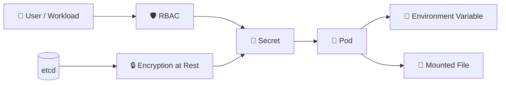

# Secrets Security 🔐

## 1. Overview

Kubernetes Secrets store sensitive data such as:

* Passwords
* API tokens
* TLS certificates
* SSH keys
* Registry credentials

From a security perspective, the important point is:

> **A Secret is sensitive data, not automatically secure data.**

Kubernetes Secrets are typically base64-encoded for transport/storage representation, which is **not encryption** by itself.

Strong protection requires controls around storage, access, and exposure.

---

## 2. Security Flow



The main security layers are:

```text id="secflow2"
Access control
+
Secure storage
+
Safe delivery to workloads
```

---

## 3. Key Concepts

| Concept              | Purpose                                    |
| -------------------- | ------------------------------------------ |
| RBAC                 | Restricts who can read Secrets             |
| Encryption at rest   | Protects Secret data stored in etcd        |
| Secret volume        | Mounts Secret values as files              |
| Environment variable | Injects Secret values into processes       |
| Least privilege      | Limits Secret access to required workloads |

Avoid granting broad access such as:

```text id="secwarn1"
get/list/watch secrets
```

unless it is genuinely required.

---

## 4. Cheat Sheet

List Secrets:

```bash id="seccmd1"
kubectl get secrets
```

Inspect metadata:

```bash id="seccmd2"
kubectl describe secret <secret-name>
```

Check who can read Secrets:

```bash id="seccmd3"
kubectl auth can-i get secrets
```

Test a ServiceAccount:

```bash id="seccmd4"
kubectl auth can-i get secrets \
  --as=system:serviceaccount:production:app-sa
```

Decode a value:

```bash id="seccmd5"
kubectl get secret db-secret \
  -o jsonpath='{.data.password}' | base64 -d
```

---

## 5. Practical Example

Suppose a database password is stored in:

```text id="secprac1"
db-secret
```

Only the application that needs the database should be allowed to access it.

A safer design is:

```text id="secprac2"
App ServiceAccount
      ↓
Limited RBAC
      ↓
db-secret
      ↓
Mounted into App Pod
```

Other workloads should not receive access.

---

## 6. YAML Example

```yaml id="secyaml1"
apiVersion: v1
kind: Secret
metadata:
  name: db-secret
  namespace: production
type: Opaque
stringData:
  password: change-me

---
apiVersion: rbac.authorization.k8s.io/v1
kind: Role
metadata:
  name: db-secret-reader
  namespace: production
rules:
  - apiGroups: [""]
    resources:
      - secrets
    resourceNames:
      - db-secret
    verbs:
      - get
```

This Role permits access only to the specific `db-secret`, rather than every Secret in the namespace.

---

## 7. Common Problems 🚨

* Assuming base64 means encryption
* Granting `list` access to all Secrets
* Storing Secrets in Git repositories
* Printing Secret values into logs
* Sharing the same Secret across unrelated workloads
* Giving Pods unnecessary Secret access
* Leaving etcd unencrypted at rest
* Exposing credentials through debugging output

---

## 8. Interview Questions 🎯

1. Are Kubernetes Secrets encrypted by default?
2. Is base64 encoding secure?
3. How does RBAC protect Secrets?
4. Why should Secret access follow least privilege?
5. What is encryption at rest?
6. Can Secrets be mounted as files?
7. Why is broad `list secrets` permission dangerous?
8. Should plain Secret manifests be committed to Git?

---

## 9. Related Topics 🔗

* Secrets
* RBAC
* ServiceAccounts
* Encryption at Rest
* etcd
* ConfigMaps and Secrets as Volumes
* External Secret Managers
