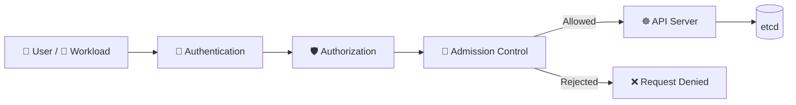

# Admission Control 🚧

## 1. Overview

**Admission Control** is the stage where Kubernetes can validate or modify API requests **after authentication and authorization, but before the object is stored**.

It is commonly used to:

* Reject insecure workloads
* Enforce security policies
* Apply default values
* Validate configuration
* Restrict privileged containers
* Enforce organizational standards

Admission Control is a major security enforcement point in Kubernetes.

---

## 2. Request Flow



The key sequence is:

```text id="admflow2"
Authenticate
   ↓
Authorize
   ↓
Admission Control
   ↓
Store Object
```

---

## 3. Key Concepts

| Concept                | Purpose                                       |
| ---------------------- | --------------------------------------------- |
| Admission Controller   | Built-in API request policy mechanism         |
| Validating admission   | Accepts or rejects requests                   |
| Mutating admission     | Modifies requests before storage              |
| Admission webhook      | External service used for custom policy logic |
| Pod Security Admission | Enforces Pod Security Standards               |

Admission applies mainly to **create and modify operations**, not ordinary read requests.

---

## 4. Cheat Sheet

Check API server configuration:

```bash id="admcmd1"
ps aux | grep kube-apiserver
```

Inspect admission-related failures:

```bash id="admcmd2"
kubectl describe pod <pod-name>
```

Create a resource and see admission errors:

```bash id="admcmd3"
kubectl apply -f pod.yaml
```

Inspect namespace Pod Security labels:

```bash id="admcmd4"
kubectl get namespace <namespace> --show-labels
```

List validating webhooks:

```bash id="admcmd5"
kubectl get validatingwebhookconfigurations
```

List mutating webhooks:

```bash id="admcmd6"
kubectl get mutatingwebhookconfigurations
```

---

## 5. Practical Example

Suppose the `production` namespace enforces the **Restricted** Pod Security profile.

A developer submits a Pod using:

```yaml id="admprac1"
securityContext:
  privileged: true
```

The request may:

```text id="admprac2"
Pass Authentication
      ↓
Pass RBAC Authorization
      ↓
Fail Admission Policy
      ↓
❌ Pod is not created
```

So authorization alone does not guarantee that Kubernetes will accept the object.

---

## 6. YAML Example

```yaml id="admyaml1"
apiVersion: v1
kind: Namespace
metadata:
  name: production
  labels:
    pod-security.kubernetes.io/enforce: restricted
---
apiVersion: v1
kind: Pod
metadata:
  name: insecure-pod
  namespace: production
spec:
  containers:
    - name: app
      image: nginx:1.27
      securityContext:
        privileged: true
```

The namespace admission policy can reject this Pod because it violates the `restricted` security profile.

---

## 7. Common Problems 🚨

* Confusing admission control with RBAC
* Workload passes authorization but fails admission
* Webhook becomes unavailable
* Policy is too restrictive
* Wrong namespace policy is applied
* Mutating webhook unexpectedly changes an object
* Admission error messages are ignored

---

## 8. Interview Questions 🎯

1. What is Admission Control?
2. Where does admission occur in the API request flow?
3. What is the difference between validating and mutating admission?
4. What is an admission webhook?
5. Can Admission Control reject an authorized request?
6. What is Pod Security Admission?
7. Does Admission Control usually affect read requests?
8. Why is Admission Control important for security?

---

## 9. Related Topics 🔗

* Authentication and Authorization
* RBAC
* Pod Security Standards
* SecurityContext
* API Server
* Policy Enforcement
