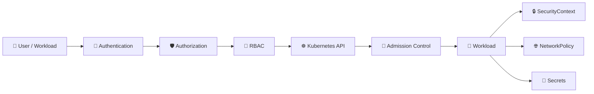

# Kubernetes Security 🔐

## Overview

Kubernetes security controls **who can access the cluster, what they can do, and how workloads are isolated**.

Security in Kubernetes spans several layers:

* Authentication
* Authorization
* Service Accounts
* RBAC
* Pod-level security
* Network isolation
* Secret protection
* Admission policies

This folder focuses on the main **Kubernetes-native security mechanisms** used to protect clusters and workloads.

---

## Security Flow



---

## Folder Structure

```text
08-Security/
├── README.md
├── Namespaces.md
├── ServiceAccounts.md
├── RBAC.md
├── Roles-and-RoleBindings.md
├── ClusterRoles-and-ClusterRoleBindings.md
├── Authentication-and-Authorization.md
├── SecurityContext.md
├── Pod-Security-Standards.md
├── NetworkPolicy-Security.md
├── Secrets-Security.md
└── Admission-Control.md
```

---

## Main Topics

### `Namespaces.md`

Explains logical separation of workloads and how namespaces interact with RBAC, quotas, and policies.

### `ServiceAccounts.md`

Covers workload identity and how Pods authenticate to the Kubernetes API.

### `RBAC.md`

Introduces Kubernetes Role-Based Access Control and the core permission model.

### `Roles-and-RoleBindings.md`

Covers namespace-scoped permissions and how users or ServiceAccounts receive them.

### `ClusterRoles-and-ClusterRoleBindings.md`

Explains cluster-wide permissions and reusable cluster-level roles.

### `Authentication-and-Authorization.md`

Explains the difference between proving identity and deciding what that identity may do.

### `SecurityContext.md`

Covers container and Pod security settings such as UID, privileges, Linux capabilities, and filesystem restrictions.

### `Pod-Security-Standards.md`

Introduces the `Privileged`, `Baseline`, and `Restricted` security profiles.

### `NetworkPolicy-Security.md`

Focuses on network isolation as a security mechanism between workloads.

### `Secrets-Security.md`

Covers secure handling, RBAC restrictions, encryption concerns, and common Secret exposure risks.

### `Admission-Control.md`

Explains how Kubernetes validates or modifies requests before objects are stored.

---

## Useful Commands

```bash
kubectl auth can-i get pods
kubectl auth can-i --list

kubectl get serviceaccounts
kubectl get roles,rolebindings
kubectl get clusterroles,clusterrolebindings

kubectl get networkpolicy
kubectl get secrets
kubectl describe pod <pod-name>
```

Check permissions for a ServiceAccount:

```bash
kubectl auth can-i get pods \
  --as=system:serviceaccount:default:my-sa
```

---

## Quick YAML Example

```yaml
apiVersion: v1
kind: ServiceAccount
metadata:
  name: app-sa
  namespace: default
---
apiVersion: rbac.authorization.k8s.io/v1
kind: Role
metadata:
  name: pod-reader
  namespace: default
rules:
  - apiGroups: [""]
    resources: ["pods"]
    verbs: ["get", "list"]
```

This defines a workload identity and a namespace-scoped permission set.

---

## Goal

The goal of this folder is to explain how Kubernetes protects **identities, API access, workloads, network traffic, and sensitive data**.

After completing it, the reader should understand the core Kubernetes security model and the main controls used to enforce least privilege and workload isolation.
