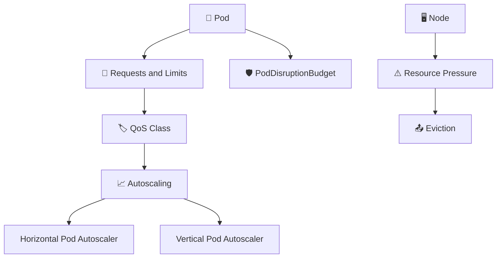

# Resource Management and Autoscaling 📊

## Overview

Kubernetes resource management controls **how much CPU and memory workloads request, consume, and compete for**.

Autoscaling then adjusts workloads based on demand.

This section covers:

* Resource requests and limits
* QoS classes
* Horizontal and vertical autoscaling
* Pod disruption protection
* Eviction
* Node pressure
* Resource troubleshooting

These topics are critical for running stable production clusters.

---

## Resource Management Flow



---

## Folder Structure

```text id="rmstruct1"
09-Resource-Management-and-Autoscaling/
├── README.md
├── Requests-and-Limits.md
├── QoS-Classes.md
├── Horizontal-Pod-Autoscaler.md
├── Vertical-Pod-Autoscaler.md
├── Pod-Disruption-Budget.md
├── Eviction.md
├── Node-Pressure.md
└── Resource-Troubleshooting.md
```

---

## Main Topics

### `Requests-and-Limits.md`

Explains CPU and memory requests, limits, scheduling decisions, and runtime enforcement.

### `QoS-Classes.md`

Covers the Kubernetes QoS classes:

* Guaranteed
* Burstable
* BestEffort

and how they affect eviction priority.

### `Horizontal-Pod-Autoscaler.md`

Explains how Kubernetes changes the number of Pod replicas based on observed metrics.

### `Vertical-Pod-Autoscaler.md`

Covers automated adjustment of container CPU and memory requests.

### `Pod-Disruption-Budget.md`

Explains how to protect application availability during voluntary disruptions such as node maintenance.

### `Eviction.md`

Covers situations where Kubernetes removes Pods because of resource pressure or administrative action.

### `Node-Pressure.md`

Explains conditions such as:

```text id="rmpres1"
MemoryPressure
DiskPressure
PIDPressure
```

and how they affect workload placement and survival.

### `Resource-Troubleshooting.md`

Provides a systematic approach for investigating CPU, memory, scheduling, autoscaling, and eviction problems.

---

## Useful Commands

```bash id="rmcmd1"
kubectl top nodes
kubectl top pods

kubectl describe pod <pod-name>
kubectl describe node <node-name>

kubectl get hpa
kubectl get pdb

kubectl get events \
  --sort-by=.metadata.creationTimestamp
```

---

## Quick YAML Example

```yaml id="rmyaml1"
apiVersion: v1
kind: Pod
metadata:
  name: web
spec:
  containers:
    - name: nginx
      image: nginx:1.27

      resources:
        requests:
          cpu: 250m
          memory: 256Mi

        limits:
          cpu: 500m
          memory: 512Mi
```

The request influences scheduling, while the limit constrains runtime resource usage.

---

## Goal

The goal of this section is to explain how Kubernetes **allocates resources, scales workloads, protects availability, and reacts to resource pressure**.

After completing it, the reader should understand how to size workloads, autoscale applications, handle disruption, and troubleshoot resource-related failures.
