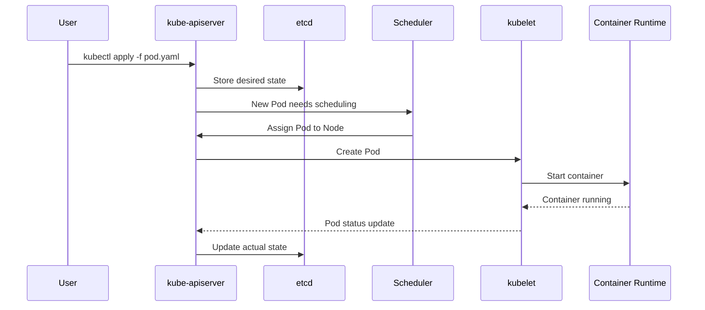

# 🧠 Kubernetes `kubectl` Command Cheat Sheet

## 📄 Get Information
| Command | Description |
|--------|-------------|
| `kubectl get <resource>` | List resources (e.g., pods, svc, deploy) |
| `kubectl describe <resource> <name>` | Show detailed information about a resource |
| `kubectl logs <pod-name>` | View logs from a pod |
| `kubectl top pod/node` | View CPU/memory usage |

---

## 🚀 Create & Modify Resources
| Command | Description |
|--------|-------------|
| `kubectl create -f <file>.yaml` | Create resource from manifest |
| `kubectl apply -f <file>.yaml` | Apply changes declaratively |
| `kubectl edit <resource> <name>` | Edit a resource live in your editor |
| `kubectl delete <resource> <name>` | Delete a resource |

---

## 🔧 Debug & Interact
| Command | Description |
|--------|-------------|
| `kubectl exec -it <pod> -- <cmd>` | Run a command inside a container |
| `kubectl port-forward <pod|svc> <local-port>:<remote-port>` | Forward port to pod/service |
| `kubectl cp <pod>:<path> <local-path>` | Copy files to/from a pod |
| `kubectl attach <pod>` | Attach to a running container |
| `kubectl proxy` | Start a proxy to the Kubernetes API server |

---

## 📦 Deployment & Exposure
| Command | Description |
|--------|-------------|
| `kubectl run <name> --image=` | Run a new pod (quick & easy) |
| `kubectl expose <resource>` | Expose as a service |
| `kubectl rollout status <deploy>` | Check roll
