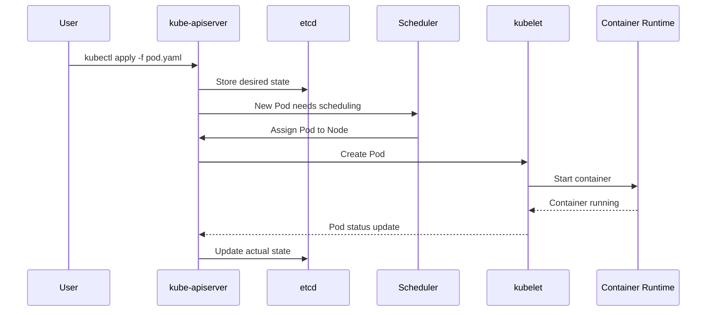

```mermaid
sequenceDiagram

    participant User
    participant API as kube-apiserver
    participant ETCD as etcd
    participant S as Scheduler
    participant K as kubelet
    participant C as Container Runtime

    User->>API: kubectl apply -f pod.yaml
    API->>ETCD: Store desired state
    API->>S: New Pod needs scheduling
    S->>API: Assign Pod to Node
    API->>K: Create Pod
    K->>C: Start container
    C-->>K: Container running
    K-->>API: Pod status update
    API->>ETCD: Update actual state
```

# Kubernetes

## Overview

Kubernetes is an open-source container orchestration platform that automates the deployment, scaling, networking, and management of containerized applications. It has become the industry standard for running modern cloud-native workloads, providing high availability, self-healing, service discovery, rolling updates, and declarative infrastructure management.

This repository is a structured learning resource covering Kubernetes from the fundamentals to advanced administration topics. Each chapter focuses on a specific area of Kubernetes and contains detailed explanations, practical examples, troubleshooting guidance, and real-world use cases.

---

## Repository Structure

```text
02-Kubernetes/
│
├── README.md
│
├── 01-Core-Concepts/
├── 02-Pods/
├── 03-Workloads/
├── 04-Configuration/
├── 05-Networking/
├── 06-Storage/
├── 07-Scheduling/
├── 08-Security/
├── 09-Observability/
├── 10-Troubleshooting/
├── 11-Architecture/
└── 12-Ecosystem/
```

---

## Chapters

### 01 – Core Concepts

Introduction to Kubernetes architecture, clusters, control plane, worker nodes, API server, etcd, scheduler, controller manager, kubelet, kube-proxy, and the Kubernetes object model.

### 02 – Pods

The smallest deployable unit in Kubernetes, including pod lifecycle, multi-container pods, init containers, sidecars, ephemeral containers, resource management, and Quality of Service (QoS).

### 03 – Workloads

Managing applications using Deployments, ReplicaSets, StatefulSets, DaemonSets, Jobs, CronJobs, and deployment strategies such as rolling updates, blue-green deployments, and canary releases.

### 04 – Configuration

Managing application configuration using Namespaces, Labels, Selectors, Annotations, ConfigMaps, Secrets, Environment Variables, ResourceQuotas, and LimitRanges.

### 05 – Networking

Kubernetes networking fundamentals including Services, DNS, ClusterIP, NodePort, LoadBalancer, Ingress, Network Policies, EndpointSlices, and Container Network Interface (CNI).

### 06 – Storage

Persistent storage concepts including Volumes, PersistentVolumes (PV), PersistentVolumeClaims (PVC), StorageClasses, CSI drivers, snapshots, reclaim policies, and dynamic provisioning.

### 07 – Scheduling

How Kubernetes schedules workloads using Node Selectors, Affinity, Anti-Affinity, Taints, Tolerations, Priority Classes, and Topology Spread Constraints.

### 08 – Security

Authentication, Authorization, RBAC, Service Accounts, Security Contexts, Admission Controllers, Pod Security, certificates, and Kubernetes secrets management.

### 09 – Observability

Monitoring and troubleshooting applications using logs, events, metrics, probes, resource monitoring, and debugging techniques.

### 10 – Troubleshooting

Diagnosing common Kubernetes issues including pod failures, networking problems, storage issues, scheduling failures, node health, and control plane troubleshooting.

### 11 – Architecture

Cluster design, high availability, kubeadm, KIND, K3s, Minikube, upgrades, backup, restore, and disaster recovery strategies.

### 12 – Ecosystem

Popular Kubernetes tools including Helm, Kustomize, Argo CD, Prometheus, Grafana, MetalLB, cert-manager, Rook Ceph, Longhorn, Harbor, and related projects.

---

## Learning Approach

Each topic in this repository follows a consistent structure to make learning and reviewing easier:

* Overview
* Syntax
* Practical Examples
* YAML Examples
* Related Topics

---

## Goal

The goal of this repository is to provide a comprehensive, practical, and well-organized Kubernetes knowledge base for Linux administrators, DevOps engineers, Site Reliability Engineers (SREs), Platform Engineers, and anyone preparing for production environments or Kubernetes certifications.
