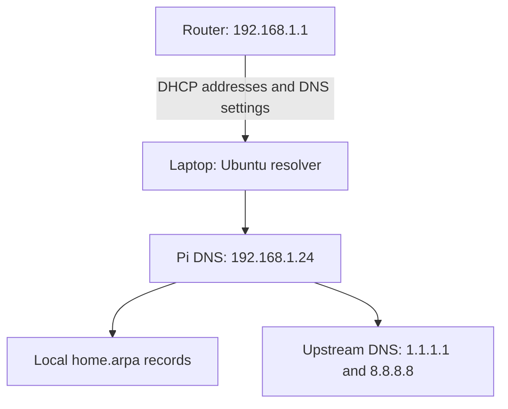

# Raspberry Pi Homelab DNS — Setup and Troubleshooting

## What we achieved

We configured a Raspberry Pi Zero 2 W running Raspbian 11 (Bullseye) as a lightweight DNS server using **dnsmasq**. The Pi answers our local `home.arpa` records and forwards internet lookups to upstream DNS servers. The router continues to provide DHCP.

The final laptop tests successfully resolved both `dns.home.arpa` and `example.com` through Ubuntu's normal resolver, including after clearing its cache. This verifies the laptop's working DNS setup; other clients still need appropriate DNS settings.



## Environment

| Component | Value |
|---|---|
| Pi | Raspberry Pi Zero 2 W, Raspbian 11 |
| DNS software | dnsmasq 2.85 in this session |
| Pi LAN address | `192.168.1.24/24` |
| Pi interface | `wlan0` |
| Pi Wi-Fi MAC | `e4:##:##:##:##:e5` |
| Router / gateway | `192.168.1.1` |
| Router DHCP pool | `192.168.1.10`–`192.168.1.100` |
| Local DNS domain | `home.arpa` |
| Laptop LAN interface | `enx00e04c360b56` |
| Laptop connection profile | `Wired connection 2` |

Interface and connection names below are specific to this setup.

## Command cheat sheet

**On the Pi:**

```bash
ip -br addr show wlan0
ip route
sudo systemctl status dnsmasq --no-pager
sudo dnsmasq --test --conf-file=/etc/dnsmasq.d/homelab.conf
sudo systemctl restart dnsmasq
sudo ss -lntup 'sport = :53'
sudo ufw status verbose
sudo journalctl -u dnsmasq -n 30 --no-pager
```

**On the laptop:**

```bash
nslookup dns.home.arpa 192.168.1.24
nslookup example.com 192.168.1.24
resolvectl status enx00e04c360b56 --no-pager
sudo resolvectl flush-caches
nslookup dns.home.arpa
nslookup example.com
```

Run each command separately. Explicitly specifying `192.168.1.24` tests the Pi directly; omitting it tests the laptop's configured resolver path.

## 1. Give the Pi a stable IP

The Pi initially used `192.168.1.15`; we changed its intended stable address to `192.168.1.24`.

Find its MAC and current network settings:

```bash
cat /sys/class/net/wlan0/address
ip -br addr show wlan0
ip route
```

In the router's **DHCP Static Leases / Address Reservation** section, reserve `192.168.1.24` for `e4:5f:01:5b:ce:e5`. Ensure no other device has that address. Because `.24` lies inside the DHCP pool, the router must reserve or exclude it so it cannot be allocated to another client. Merely setting `.24` manually on the Pi does not provide that protection.

After renewing the lease or rebooting the Pi, verify:

```bash
hostname -I
ip -br addr show wlan0
```

Expected LAN address: `192.168.1.24/24`. The additional `172.17.0.1` address belongs to Docker's bridge and is not the LAN DNS address.

## 2. Install dnsmasq

On the **Pi**:

```bash
sudo apt update
sudo apt install dnsmasq dnsutils -y
```

## 3. Configure local records and forwarding

On the **Pi**, edit:

```bash
sudo nano /etc/dnsmasq.d/homelab.conf
```

Use this configuration:

```ini
interface=wlan0
bind-dynamic
no-dhcp-interface=wlan0

no-resolv
server=1.1.1.1
server=8.8.8.8

domain-needed
bogus-priv
local=/home.arpa/

host-record=dns.home.arpa,192.168.1.24
```

| Directive | Purpose |
|---|---|
| `interface=wlan0` | Serve the Wi-Fi LAN; loopback is also available |
| `bind-dynamic` | Bind to interface addresses and adapt as they change |
| `no-dhcp-interface=wlan0` | Keep DHCP service off this interface |
| `no-resolv` | Ignore automatically supplied upstream resolver files |
| `server=...` | Set explicit upstream DNS servers |
| `domain-needed` | Avoid forwarding unqualified names upstream |
| `bogus-priv` | Avoid forwarding unresolved private-address reverse lookups |
| `local=/home.arpa/` | Answer this domain locally rather than forwarding it |
| `host-record=...` | Map our DNS server name to its address |

The router remains the DHCP server. We did not configure a DHCP range on the Pi.

Validate, restart, and ensure startup at boot:

```bash
sudo dnsmasq --test --conf-file=/etc/dnsmasq.d/homelab.conf
sudo systemctl restart dnsmasq
sudo systemctl enable dnsmasq
sudo systemctl status dnsmasq --no-pager
```

The explicit test checks this file's syntax. The service restart also checks the configuration used by the packaged service. During our session, plain `dnsmasq --test` reported success even though the service found errors in `homelab.conf`, so it was insufficient on its own.

## 4. Allow LAN DNS through the Pi firewall

The Pi could answer its own queries, and the laptop could ping it, but remote DNS requests initially timed out. Its firewall showed UFW chains and an INPUT policy of DROP.

Run these commands on the **Pi**, allowing both DNS transports from our LAN:

```bash
sudo ufw allow in on wlan0 from 192.168.1.0/24 to any port 53 proto udp
sudo ufw allow in on wlan0 from 192.168.1.0/24 to any port 53 proto tcp
sudo ufw status verbose
```

UFW rules are persistent. One screenshot showed a rule entered at the laptop prompt: that does not open the Pi's firewall. Always check which machine's terminal you are using.

Check listeners and local resolution on the Pi:

```bash
sudo ss -lntup 'sport = :53'
nslookup dns.home.arpa 192.168.1.24
```

## 5. Test from the laptop before changing client defaults

```bash
ping -c 3 192.168.1.24
ip route get 192.168.1.24
nslookup dns.home.arpa 192.168.1.24
nslookup example.com 192.168.1.24
```

Expected: the local name returns `192.168.1.24`; the public name returns public addresses. Public answers can change, so do not compare them against a fixed address from an old screenshot.

For a separate TCP test:

```bash
dig +tcp +time=2 +tries=1 @192.168.1.24 dns.home.arpa
```

## 6. Router DHCP DNS settings

In the router's **LAN / DHCP** page, we selected **Manual DNS**. The router accepted:

| Field | Accepted value |
|---|---|
| Primary DNS | `192.168.1.24` |
| Secondary DNS | `1.1.1.1` |
| Third DNS | `8.8.8.8` |

An attempt with empty additional fields was rejected. The exact firmware validation behavior was not established.

**This accepted configuration has a limitation:** public DNS servers do not know our local records. Clients may use them even while the Pi is available; “secondary” is not a guarantee of strict standby behavior. Our laptop actually selected `8.8.8.8`, causing intermittent `NXDOMAIN` for `dns.home.arpa`.

Ideally, advertise only the Pi, or multiple internal DNS servers that all know the same local records. For this session, we solved the laptop's problem with a persistent client override. Other devices using the router's mixed list may still need a similar adjustment.

The router's **DDNS** page is unrelated: dynamic DNS updates a name when an external address changes; it does not create our local DNS records.

## 7. Permanently configure the Ubuntu laptop

Identify the active profile and resolver state:

```bash
nmcli -f NAME,DEVICE,TYPE connection show --active
nmcli -g GENERAL.CONNECTION device show enx00e04c360b56
resolvectl status enx00e04c360b56 --no-pager
```

Our profile is `Wired connection 2`. The following consolidates the final settings into one command:

```bash
sudo nmcli connection modify "Wired connection 2" ipv4.ignore-auto-dns yes ipv4.dns "192.168.1.24" ipv4.dns-search "~home.arpa,~." ipv6.ignore-auto-dns yes
```

Apply the profile's changes and clear cached answers, running each command separately:

```bash
sudo nmcli device reapply enx00e04c360b56
```

```bash
sudo resolvectl flush-caches
```

What these settings do:

- `ipv4.ignore-auto-dns yes`: ignore the router's mixed DNS list for this profile.
- `ipv4.dns`: use the Pi as this profile's DNS server.
- `~home.arpa`: explicitly route our local domain to this connection's DNS.
- `~.`: provide a catch-all DNS route for other domains as well.
- `ipv6.ignore-auto-dns yes`: ignore automatically supplied IPv6 DNS on this profile; it does not disable IPv6 networking.

We initially used only `~home.arpa`. Local names worked, but the link showed `-DefaultRoute` for DNS and normal internet lookups failed with `SERVFAIL`. Direct queries to the Pi still worked. Adding `~.` fixed that routing gap.

These settings persist in the NetworkManager connection profile. They apply to this wired profile, not automatically to every Wi-Fi connection or other device. A VPN or another profile with its own DNS routes can affect resolver selection.

## 8. Final verification — passed

On the laptop:

```bash
nslookup dns.home.arpa
```

Expected local answer:

```text
Name:    dns.home.arpa
Address: 192.168.1.24
```

```bash
nslookup example.com
```

Expected: public address answers without `SERVFAIL` or a timeout. Both tests succeeded repeatedly in the final screenshot.

`Server: 127.0.0.53` is normal: applications query Ubuntu's local systemd-resolved stub, which uses the configured upstream DNS. Do not replace `/etc/resolv.conf` to make its displayed address match the Pi.

## Troubleshooting lessons

| Symptom | What we learned / action |
|---|---|
| `bad option at line ...` | Inspect the named config file for typing errors; use `sudo nl -ba /etc/dnsmasq.d/homelab.conf` |
| Plain syntax test passes but service fails | Test the actual custom file and inspect service logs |
| Ping succeeds but DNS times out | ICMP reachability does not prove UDP/TCP port 53 is allowed |
| Local Pi query succeeds, laptop query fails | Check binding and Pi firewall rules |
| Local name sometimes returns `NXDOMAIN` | Check whether public DNS or another connection is being used |
| Direct public query succeeds, normal lookup returns `SERVFAIL` | Inspect laptop DNS routing; our fix was adding `~.` |
| `ignoring resolv-file ... no-resolv is set` | Expected with our explicit upstream configuration |
| `--no-pages` fails | Correct option is `--no-pager` |
| `erapply` fails | Correct subcommand is `reapply` |
| `nmcli` reports unexpected fields | Do not append `resolvectl status` to the same command; run them separately |

Useful logs:

```bash
sudo journalctl -u dnsmasq -n 50 --no-pager
sudo iptables -L INPUT -n -v
```

A kernel-update notification is separate from DNS configuration. Finish package operations before any planned reboot; it does not by itself explain a dnsmasq configuration error.

## What is home.arpa?

`.arpa` means **Address and Routing Parameter Area**, an infrastructure top-level domain. `home.arpa` is designated for home-network naming. It avoids using `.local`, which has special multicast DNS behavior.

Our record is local to our network; it is not a publicly registered website. Other infrastructure uses include `in-addr.arpa` for IPv4 reverse DNS and `ip6.arpa` for IPv6 reverse DNS.

## Next step: add actual homelab services

Once the desktop has a stable LAN address, add records to the same Pi configuration file. This is a template—replace `DESKTOP_IP` with the actual address before saving:

```ini
host-record=gitea.home.arpa,DESKTOP_IP
host-record=argocd.home.arpa,DESKTOP_IP
host-record=grafana.home.arpa,DESKTOP_IP
```

Validate and restart dnsmasq, then test the new names from the laptop. DNS maps names to addresses; the service must also be deployed and exposed on an appropriate port or through an ingress/reverse proxy.

## References

- [dnsmasq manual](https://dnsmasq.org/docs/dnsmasq-man.html)
- [Ubuntu 22.04 NetworkManager settings manual](https://manpages.ubuntu.com/manpages/jammy/man5/nm-settings-nmcli.5.html)
- [RFC 8375: home.arpa](https://www.rfc-editor.org/rfc/rfc8375.html)

Session summary: September 26, 2026. DNS server and laptop resolution verified; reboot persistence was configured but not demonstrated by the final screenshots.
