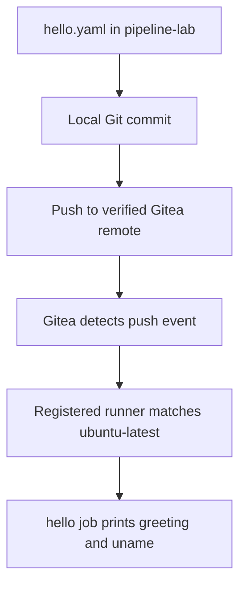

# Part 3 — Creating the First Gitea Workflow: hello.yaml

**Reference date:** 28 September 2026  
**Environment:** Behroox’s Rocky Linux homelab  
**Outcome:** The greeting workflow was committed and pushed to local Gitea. Its eventual successful execution was confirmed; detailed run inspection belongs to Part 4.

## Series roadmap

1. Nexus Docker registry setup and manual smoke test.
2. Nexus CI role, `gitea-ci` user, repository permissions, and credentials.
3. **This file:** Create and understand `.gitea/workflows/hello.yaml`, then commit and push it to local Gitea.
4. Running and verifying the first Gitea Actions job.
5. Building the application image and pushing it to Nexus from CI.

The series groups our work by topic. Historically, the greeting job worked before the Nexus integration was completed. This first workflow does not depend on Nexus.

## Goal and starting point

Our goal was a small, understandable CI test: push a workflow to Gitea and have our registered runner print a greeting and system information.

At this point, Gitea was accessible, login worked, and the runner appeared online in repository runner management. This guide starts from those existing services; it does not reconstruct an unrecorded container installation command.

We encountered two important sources of confusion:

- The workflow was initially created under the runner’s working directory, outside a Git repository.
- We wanted to confirm that a Git push would go to local Gitea rather than the user’s GitHub account.

The corrected procedure below addresses both.



## Environment

| Item | Our value |
|---|---|
| Gitea repository | `behroox/pipeline-lab` |
| Repository URL on desktop | `http://localhost:3000/behroox/pipeline-lab` |
| LAN repository URL | `http://192.168.1.23:3000/behroox/pipeline-lab` |
| Local project directory | `/home/behroox/Behrouz_ghastly_projects/pipeline-lab` |
| Branch | `main` |
| Workflow path relative to Git root | `.gitea/workflows/hello.yaml` |
| Workflow name | `First CI job` |
| Job ID | `hello` |
| Runner container | `gitea-runner` |
| Registered runner name | `rocky-runner` |
| Runner label used | `ubuntu-latest` |

The local path is the one shown in the session. Use your actual clone directory if rebuilding elsewhere.

## Quick command reference

Run on the Rocky desktop, in the existing project clone:

```bash
cd /home/behroox/Behrouz_ghastly_projects/pipeline-lab

git rev-parse --show-toplevel
git status
git branch --show-current
git remote -v
git remote get-url --push --all origin

mkdir -p .gitea/workflows
```

Create the workflow using the complete file in Step 4, then:

```bash
git add .gitea/workflows/hello.yaml
git diff --cached -- .gitea/workflows/hello.yaml
git commit -m "add first Gitea Action workflow"
git push -u origin main
```

Only push after verifying that every push URL for `origin` is the intended Gitea destination. These commands assume the branch is `main` and the file contains new changes; do not recommit an unchanged file merely to reproduce this guide.

## Step 1 — Enable repository Actions and locate the runner

Open your repository in Gitea:

```text
http://localhost:3000/behroox/pipeline-lab
```

From another LAN computer, use the desktop address instead:

```text
http://192.168.1.23:3000/behroox/pipeline-lab
```

In repository settings, open **Actions → General** and ensure **Enable Repository Actions** is selected and saved. In our screenshots, this option appeared selected.

Then open **Settings → Actions → Runners**. The runner-management page showed `rocky-runner` online, with labels including `ubuntu-latest`.

The settings page manages runners and configuration. The repository’s top-level **Actions** tab displays workflow runs. An online runner confirms registration and availability at that moment; it does not establish that any job has succeeded.

Our earlier empty-repository view did not show the expected top-level Actions tab. After the workflow was pushed, the tab and a run appeared. Do not infer a global server configuration fault solely from the earlier view.

## Step 2 — Work inside the application repository

The initial mistaken location was:

```text
/home/behroox/gitea-runner/.gitea/workflows
```

Commands such as `git status` and `git remote -v` returned:

```text
fatal: not a git repository (or any parent up to mount point /)
```

The cause was the directory: the runner’s data/configuration directory was not the application Git repository.

Use:

```bash
cd /home/behroox/Behrouz_ghastly_projects/pipeline-lab
pwd
git rev-parse --show-toplevel
git status
```

The Git root should be the `pipeline-lab` directory. Put the workflow under that root so it becomes part of the repository’s versioned files.

Do not run `git init` inside `gitea-runner` to hide the error. That directory contained runner data and a registration-token file, which do not belong in the application repository.

### If rebuilding and no clone exists

The following is an optional reconstruction route, not a claim about the exact original clone command:

```bash
mkdir -p /home/behroox/Behrouz_ghastly_projects
cd /home/behroox/Behrouz_ghastly_projects

git clone http://localhost:3000/behroox/pipeline-lab.git
cd pipeline-lab
```

Use this only when the destination clone is absent. For an empty repository, check the branch and choose `main` before the first commit. If the repository already contains commits, work with its actual branch and history rather than replacing it.

## Step 3 — Create the workflow directory correctly

From the Git root:

```bash
mkdir -p .gitea/workflows
```

The `-p` option creates missing parent directories and tolerates an existing directory.

The path uses **workflows**, plural. `hello.yaml` is a file, so do not create it with `mkdir`.

| Relative path | Purpose |
|---|---|
| `.gitea/` | Gitea-related repository configuration |
| `.gitea/workflows/` | Workflow files |
| `.gitea/workflows/hello.yaml` | Our greeting workflow |

## Step 4 — Create the complete hello.yaml file

This is the workflow used in our session:

```yaml
name: First CI job

on: [push]

jobs:
  hello:
    runs-on: ubuntu-latest
    steps:
      - name: Say hello
        run: |
          echo "Hello from our Gitea runner!"
          uname -a
```

Create it with your editor:

```bash
vim .gitea/workflows/hello.yaml
```

Or use this equivalent copy-and-paste method:

```bash
cat > .gitea/workflows/hello.yaml <<'YAML'
name: First CI job

on: [push]

jobs:
  hello:
    runs-on: ubuntu-latest
    steps:
      - name: Say hello
        run: |
          echo "Hello from our Gitea runner!"
          uname -a
YAML
```

The heredoc command replaces the named file. Use it to create or intentionally restore this greeting workflow, not to overwrite unrelated work.

Use spaces for YAML indentation, preserving the structure shown. `sudo` is unnecessary when editing your own project files. We had used `sudo vim` earlier; normal user editing avoids unnecessary ownership complications.

Inspect the result:

```bash
cat .gitea/workflows/hello.yaml
```

## Step 5 — Understand every part of the YAML

| Line or key | Meaning |
|---|---|
| `name: First CI job` | Human-readable workflow name |
| `on: [push]` | Run in response to push events; no branch filter is specified |
| `jobs:` | Defines jobs in this workflow |
| `hello:` | Identifier for our one job |
| `runs-on: ubuntu-latest` | Selects a matching runner label |
| `steps:` | Ordered list of operations in the job |
| `name: Say hello` | Label shown for this step in logs |
| `run: \|` | YAML literal block holding a multiline shell script |
| `echo ...` | Prints the greeting |
| `uname -a` | Prints kernel/system information from the execution environment |

### Does ubuntu-latest mean GitHub runs the job?

No. Here it is a label interpreted by our Gitea runner configuration. In our logs, it mapped to:

```text
docker.gitea.com/runner-images:ubuntu-latest
```

The runner executes the job locally using its configured environment. The label does not send the job to GitHub, and it does not upgrade Rocky Linux to Ubuntu.

The Ubuntu-based job container shares the host kernel, so `uname -a` can show the Rocky host’s kernel. To inspect a container’s userspace distribution, `/etc/os-release` is more relevant, although that was not part of our original greeting workflow.

### Why is there no checkout step?

This job only prints text and system information. It does not read application source files, so checkout is unnecessary.

That keeps the first test small. The later build workflow needs the repository’s Dockerfile and HTML file, so it adds a checkout action.

### Does this use Nexus secrets?

No. The greeting job does not authenticate to Nexus, build an application image, or publish anything to the registry. The default job image may still need to be downloaded from its external image registry.

## Step 6 — Verify the Git destination

The user specifically asked how to know the push would go to local Gitea rather than GitHub.

Run:

```bash
git remote -v
```

For our local setup, the intended output was equivalent to:

```text
origin  http://localhost:3000/behroox/pipeline-lab.git (fetch)
origin  http://localhost:3000/behroox/pipeline-lab.git (push)
```

The LAN URL using `192.168.1.23:3000` is also an intended local Gitea destination when that address points to the desktop.

For an explicit check of all effective push URLs:

```bash
git remote get-url --push --all origin
```

This additional verification command is useful because a remote can have separate push URLs or multiple push destinations. Git also expands URL rewrite rules when reporting these URLs.

If the output points to `github.com`, or includes an unexpected extra destination, stop before pushing and correct the remote configuration.

For a simple remote without a separate push URL, this changes its URL:

```bash
git remote set-url origin http://localhost:3000/behroox/pipeline-lab.git
```

If `origin` does not exist, add it instead:

```bash
git remote add origin http://localhost:3000/behroox/pipeline-lab.git
```

These are conditional alternatives, not commands to run blindly. A separately configured push URL may still need correction. Always rerun `git remote get-url --push --all origin` afterward.

Your Git author name/email identifies commits. It does not determine the push destination. Having a GitHub account or GitHub SSH key configured does not cause an explicit push to a local Gitea remote to go to GitHub.

Also remember that `localhost` means the machine executing Git. It is appropriate here because the commands are run on the Rocky desktop hosting Gitea.

## Step 7 — Stage and review the exact file

From the Git root:

```bash
git status
git add .gitea/workflows/hello.yaml
git diff --cached -- .gitea/workflows/hello.yaml
```

Using the explicit path makes it clear which file is being staged. Do not use a broad add command from a directory containing runner credentials.

During the original session, we were already inside `.gitea/workflows`, so the equivalent command was:

```bash
git add hello.yaml
```

Both forms are valid from their respective locations.

## Step 8 — Commit the workflow locally

```bash
git commit -m "add first Gitea Action workflow"
```

Our first commit showed an automatically inferred identity similar to:

```text
Behrouz ShakeriFard <behroox@localhost.localdomain>
```

This was a Git identity warning, not a failed commit and not an instruction to authenticate to GitHub.

If needed, set your preferred identity for this repository only:

```bash
git config user.name "YOUR NAME"
git config user.email "YOUR COMMIT EMAIL"
```

Replace the placeholders. These are optional reference commands, not values confirmed in our session. Repository-local configuration avoids changing your identity in unrelated projects.

An already-created, unpushed commit can be updated deliberately with:

```bash
git commit --amend --reset-author --no-edit
```

Amending changes the commit ID. Do not rewrite an already-pushed commit merely to repeat this guide.

## Step 9 — Push to the verified Gitea remote

Check the branch and destination one more time:

```bash
git branch --show-current
git remote get-url --push --all origin
```

For our `main` branch:

```bash
git push -u origin main
```

This uploads commits to the explicitly named remote and branch. `-u` records the upstream association for later Git operations.

A successful first push may show:

```text
To http://localhost:3000/behroox/pipeline-lab.git
 * [new branch]      main -> main
```

If the server already has commits not present locally, do not force-push to bypass the rejection. Fetch and inspect the divergence first:

```bash
git fetch origin
git log --oneline --graph --decorate --all -n 15
```

The push event starts the workflow. You do not need to run the YAML file with Bash or manually execute the greeting inside the runner container.

## Step 10 — Confirm the file and run appear in Gitea

In **Code**, verify that `.gitea/workflows/hello.yaml` is present on `main`.

Open the repository’s **Actions** tab and find **First CI job**. The run title may reflect the commit message, so inspect the workflow identity and job name as well.

Our run eventually became green and printed the expected greeting. Part 4 covers the initial wait, expanding the logs, the job-image pull, and exactly what that successful result proved.

Do not confuse this greeting workflow with the later **Build and publish image** workflow. Both may run on the same push.

## Troubleshooting reference

| Symptom | Check or correction |
|---|---|
| `not a git repository` | Move into the actual `pipeline-lab` clone; inspect `git rev-parse --show-toplevel` |
| `mkdir` reports missing parent directory | Use `mkdir -p .gitea/workflows` |
| Workflow is not detected | Check the plural directory name, file extension, committed branch, and repository Actions setting |
| Runner is green but no job has succeeded | Runner online status and workflow execution status are different |
| Job stays queued | Check available runner labels against `runs-on` |
| Setup takes a long time | Expand setup logs; first use may require a job-image download |
| Git warns about inferred author identity | Configure repository-local name/email if needed |
| Push target is uncertain | Inspect all effective push URLs before pushing |
| Push reports everything up-to-date | No new commit was uploaded; inspect status and history rather than recreating files |
| Greeting succeeds, build workflow fails | Inspect the failed build workflow separately; they test different capabilities |

## Rollback and cleanup

A stray copy under `gitea-runner/.gitea/workflows` does not drive this repository’s Actions workflow. Verify paths carefully before removing any accidental copy; do not remove runner registration data or tokens.

If you intentionally want to stop the greeting workflow from running on future pushes, remove its tracked file in a new commit:

```bash
git rm .gitea/workflows/hello.yaml
git commit -m "Remove greeting workflow"
git push origin main
```

This is an optional future cleanup, not part of the initial setup. Existing run history is separate from the tracked workflow file. Do not remove the greeting workflow while still using it as your first-run test.

## Lessons learned

- Workflow files belong in the application Git repository, not the runner’s data directory.
- Directory names and YAML indentation matter.
- A workflow definition must reach Gitea through Git before a push-triggered run can use it.
- The remote push URL determines the destination, not the commit author or GitHub account.
- A runner label selects an execution environment; it is not a cloud-provider instruction.
- A simple greeting is enough to test the basic trigger-and-execute path.
- Checkout and Nexus credentials are unnecessary for this first job.
- A green greeting does not establish image build, publication, or deployment success.

## Interview questions

**What is a workflow, job, and step?**  
A workflow defines automation triggered by an event. It contains jobs, and each job contains ordered steps.

**What does on: [push] do?**  
It configures the workflow to respond to push events, without the explicit main-only filter used in our later build workflow.

**What does runs-on select?**  
A matching runner label and its configured execution environment.

**Why can an Ubuntu job report a Rocky-related kernel?**  
Linux containers share the host kernel while providing their own userspace filesystem and programs.

**Why does this workflow omit checkout?**  
Its shell commands do not read source files from the repository.

**How do you know where git push origin main goes?**  
Inspect origin’s effective push URLs and verify that they point to the intended Gitea instance.

**Does git commit trigger this job?**  
Not by itself. The local commit must be pushed to Gitea to produce the configured server-side event.

## Completion checkpoint

- [x] Repository Actions setting checked.
- [x] Registered runner shown online with a matching label.
- [x] Incorrect runner-directory location identified and corrected.
- [x] `.gitea/workflows/hello.yaml` created in the application repository.
- [x] Greeting workflow committed and pushed to local Gitea.
- [x] Workflow run appeared in Gitea Actions.
- [x] Successful greeting execution subsequently confirmed.

**Next file:** Part 4 — running and verifying the first job, reading logs, understanding the initial image-pull delay, and distinguishing runner health from workflow success.

## Official references

- [Gitea Actions quick start](https://docs.gitea.com/usage/actions/quickstart/)
- [Gitea Actions documentation](https://docs.gitea.com/usage/actions/)
- [Git remote command reference](https://git-scm.com/docs/git-remote)
- [Git: working with remotes](https://git-scm.com/book/en/v2/Git-Basics-Working-with-Remotes)
