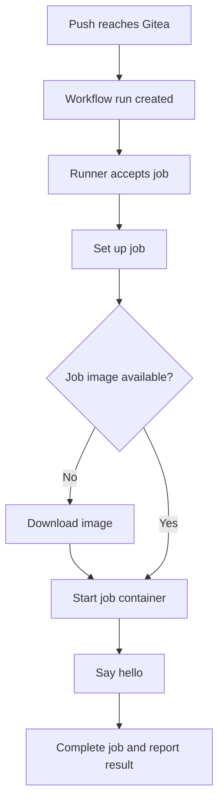

# Part 4 — Running and Verifying Our First Gitea Actions Job

**Reference date:** 28 September 2026  
**Environment:** Behroox’s Rocky Linux homelab  
**Outcome:** The first greeting workflow turned green and printed its greeting through the Gitea runner.

## Series roadmap

1. Nexus Docker registry setup and manual smoke test.
2. Nexus CI role, `gitea-ci` user, repository permissions, and credentials.
3. Create and understand `.gitea/workflows/hello.yaml`, then commit and push it.
4. **This file:** Run the first job, inspect its progress, investigate the initial delay, and verify success.
5. Build the application image and push it to Nexus from CI.

The separate Docker DNS/firewalld guide documents the later checkout failure in the build workflow. That was a different incident from the initial greeting job’s image-pull delay.

## Goal and starting point

Part 3 placed the greeting workflow in `behroox/pipeline-lab` and pushed it to local Gitea. The workflow was configured to run on a push event.

We now wanted evidence that the automation actually executed: Gitea detected the push, the runner picked up the job, the execution environment started, and the shell commands completed.

Our first run remained yellow for several minutes. Rather than treating yellow as success or assuming the workflow YAML was broken, we inspected the runner logs and expanded the setup step. The screenshot showed the runner attempting to pull its job image. The run eventually completed successfully, and the user confirmed the greeting.



This is a conceptual flow. Actual image checks and pull behavior depend on runner configuration, caching, and pull policy.

## Environment

| Item | Our value |
|---|---|
| Gitea repository | `behroox/pipeline-lab` |
| Gitea LAN address | `http://192.168.1.23:3000` |
| Workflow file | `.gitea/workflows/hello.yaml` |
| Workflow name | `First CI job` |
| Job ID | `hello` |
| Step name | `Say hello` |
| Runner container | `gitea-runner` |
| Runner display name | `rocky-runner` |
| Runner version shown | `v2.3.0` |
| Runner container image shown | `gitea/runner:2` |
| Job runner label | `ubuntu-latest` |
| Job image shown in setup logs | `docker.gitea.com/runner-images:ubuntu-latest` |

The runner container and job container are different components. The runner coordinates execution; the job container supplies the environment in which the greeting commands run.

## Quick command reference

Run on the Rocky desktop:

```bash
# Recent runner activity.
docker logs --since 15m --tail 80 gitea-runner

# Broader startup and registration context.
docker logs --tail 100 gitea-runner

# Inventory running and stopped containers.
docker ps -a --format 'table {{.Names}}\t{{.Image}}\t{{.Status}}'
```

Additional useful checks when repeating the procedure:

```bash
# Follow new runner messages; Ctrl+C exits the log view.
docker logs --follow --since 5m gitea-runner

# See whether the exact job image is available to this Docker daemon.
docker image ls docker.gitea.com/runner-images
```

The first three commands were used during our troubleshooting. The last two are supplementary reference checks.

## Step 1 — Know what triggered the run

The workflow used:

```yaml
name: First CI job

on: [push]

jobs:
  hello:
    runs-on: ubuntu-latest
    steps:
      - name: Say hello
        run: |
          echo "Hello from our Gitea runner!"
          uname -a
```

The push from Part 3 created the run. Saving a local file or making a local commit alone does not produce this server-side push event.

If reproducing the setup, push an actual workflow commit using the verified remote. Do not repeatedly delete and recreate the workflow to make it run. If a run already exists and needs another attempt, use Gitea’s rerun control on that run.

## Step 2 — Find the correct run in Gitea

Open the repository on the Rocky desktop:

```text
http://localhost:3000/behroox/pipeline-lab
```

From another LAN computer, use:

```text
http://192.168.1.23:3000/behroox/pipeline-lab
```

Then:

1. Select the repository’s **Actions** tab.
2. Select **First CI job** in the workflow list.
3. Open the run associated with your push.
4. Select the **hello** job.
5. Expand its steps to read the logs.

Runner administration is under **Settings → Actions → Runners**. That page is useful for registration and availability, but job results are in the top-level Actions view.

## Step 3 — Distinguish the different status indicators

| Indicator | What it establishes |
|---|---|
| Runner shown online | Gitea can see an available registered runner at that moment |
| Workflow queued/waiting | A run exists but may not yet be executing |
| Job running/yellow | Work is underway or waiting within an active stage; success is not established |
| Green successful hello job | This job completed successfully |
| Red failed job | Inspect the first failed step and its error |

Read the textual status and expanded logs rather than relying only on color. In our screenshot, the `hello` job was **Running**, while **Set up job** was the active stage.

A green runner registration indicator is not a green workflow result.

## Step 4 — Inspect the runner logs

We ran:

```bash
docker logs --since 15m --tail 80 gitea-runner
```

The output included:

```text
task 1 repo is behroox/pipeline-lab ... http://192.168.1.23:3000
Running job with maxParallel=1 for 1 matrix combinations
NewParallelExecutor: Creating 1 workers for 1 executors
```

These messages established that the runner had accepted a task and started its execution process. They did not establish that the greeting commands had run.

We then inspected a wider log window:

```bash
docker logs --tail 100 gitea-runner
```

That showed registration/startup messages such as successful registration and the runner’s name, version, and labels.

### What about the github.com text in a runner log?

One log line also contained `https://github.com` beside repository/server information. That string alone is not evidence that our Git push went to GitHub or that GitHub hosted the job. We did not establish its exact internal meaning from that line.

The Git remote, actual push destination, local Gitea run, and runner task information are stronger evidence. Part 3 documents how to inspect the effective push URL.

## Step 5 — Inspect container state

We ran:

```bash
docker ps -a --format 'table {{.Names}}\t{{.Image}}\t{{.Status}}'
```

The output showed `gitea-runner` running alongside Gitea and Nexus, plus other homelab containers.

This helps answer:

- Is the runner container running or repeatedly exiting?
- Has a job container appeared?
- Are we looking at the expected Docker environment?

A missing job container is consistent with setup being blocked before container creation, but is not conclusive by itself: job containers may be short-lived and cleaned up after execution. Use the job logs together with the container inventory.

Avoid interpreting unrelated stopped kind or database containers as the cause without evidence.

## Step 6 — Expand Set up job: the actual clue

The expanded Gitea log showed:

```text
Workflow prepared
Starting job container
image: docker.gitea.com/runner-images:ubuntu-latest
...
docker pull image=docker.gitea.com/runner-images:ubuntu-latest
... forcePull=false
```

The run had spent roughly 13 minutes in setup in one screenshot. The greeting step had not started yet.

This identified the operation being waited on: preparing the job image, including its pull. It did not yet identify why the transfer was taking so long. Possible causes in a future occurrence include image size, registry connectivity, DNS, proxy behavior, and bandwidth; none should be declared the root cause without evidence.

In this session the run eventually completed, consistent with the image becoming available and setup proceeding.

### Why download an image when the runner is already running?

The runner image contains the software that coordinates jobs. The job image supplies the tools and userspace for the workflow itself.

| Image | Function |
|---|---|
| `gitea/runner:2` | Runs the registered runner service |
| `docker.gitea.com/runner-images:ubuntu-latest` | Provides our job execution environment |

Having the runner image locally does not mean the job image is already cached.

## Step 7 — Optional image-pull diagnosis for a future occurrence

The following commands are supplemental; the conversation did not record a successful manual pull as the fix for this first delay.

Check for the image:

```bash
docker image ls docker.gitea.com/runner-images
```

If needed, a manual pull can expose layer progress or a concrete network error:

```bash
docker pull docker.gitea.com/runner-images:ubuntu-latest
```

This is useful only when the command targets the same Docker daemon used by the runner. If the runner uses a separate daemon or Docker-in-Docker, pulling on the desktop daemon will not automatically populate the runner’s daemon cache.

Do not start repeated pulls or reruns without inspecting the active operation. If there is a concrete error, preserve it and diagnose that layer first.

## Step 8 — Recognize the successful result

The user reported:

> It's green and it said Hello from Gitea Runner!

The workflow’s configured greeting was:

```text
Hello from our Gitea runner!
```

The step also ran `uname -a`; its exact complete output was not transcribed in the conversation and is not reconstructed here.

A later run-history screenshot showed the original greeting run successful, with a duration of approximately **16 minutes 54 seconds**. That was the total run duration shown, not a precisely measured image-download duration.

The evidence confirmed that the basic Gitea-to-runner execution path worked.

## Step 9 — Understand the limits of that success

| Capability | Proven by this greeting run? |
|---|---|
| Gitea detects the pushed workflow | Yes |
| A registered runner accepts the job | Yes |
| The configured job environment starts | Yes |
| Shell commands run and their output reaches Gitea | Yes |
| An external checkout action can be downloaded | No; this workflow has no checkout action |
| Application source checkout works | No |
| Docker CLI is available inside the job | No |
| The job can access a Docker daemon to build images | No |
| Nexus secrets are correct | No |
| The application image builds and pushes | No |
| Kubernetes deployment works | No |

This was an important first CI milestone. The next workflow deliberately adds more responsibilities, which need their own verification.

## Step 10 — Avoid the later green-run mix-up

When we later added the build workflow, the greeting workflow still ran on pushes. We saw a green run with a commit-message title about building and publishing, but its actual workflow was **First CI job** and its job was **hello**.

The commit message describes the pushed change; it does not tell you which workflow succeeded.

Before declaring image publication successful, check:

1. Workflow name: **Build and publish image**.
2. Workflow file: the build workflow, rather than `hello.yaml`.
3. Job and steps: build/publish operations actually ran.
4. Push logs: publication completed.
5. Nexus: the expected image tag exists.

Keeping the greeting workflow is fine during learning. It simply means multiple workflows can react to the same push.

## Troubleshooting reference

| Symptom | Next useful check |
|---|---|
| Runner online, job waiting | Match the workflow’s runner label and runner scope; check whether the runner is busy |
| Job running but greeting not printed | Expand Set up job; determine the last active operation |
| Log ends at docker pull | Inspect image availability and pull/network progress |
| Setup reports DNS or no-route error | Compare host and affected container-network connectivity |
| Runner logs only say task accepted | Inspect expanded Actions step logs for the specific operation |
| Run is green but no Nexus image exists | Confirm which workflow succeeded; the hello job publishes nothing |
| Rerun behaves differently | Check the exact commit/workflow and whether the image cache changed |
| Container list lacks a job container | Correlate with setup progress and cleanup; do not assume registration failed |

A later build-job failure explicitly reported inability to reach Pi DNS from the runner network. We diagnosed that separately and corrected the `docker0` firewalld zone. Do not retroactively claim that the initial slow greeting run had the same proven cause.

## Rerun and cleanup notes

To repeat an existing run, use Gitea’s rerun control. A rerun normally tests the run’s original commit; a new workflow edit should be committed and pushed to create a run for the new revision.

While reading live logs:

```bash
docker logs --follow --since 5m gitea-runner
```

Press **Ctrl+C** to stop following the logs. This stops the log-viewing command, not the runner container.

Do not delete the runner container, its registration data, or job images merely because a first run takes time. Inspect the current step first. Avoid broad cleanup commands such as `docker system prune -a` during troubleshooting, since they can remove useful caches and affect other lab work.

## Lessons learned

- “Runner online” and “workflow succeeded” are separate observations.
- Yellow is a prompt to inspect status and logs, not automatically an error.
- A first job can wait for an execution image even when the runner itself is healthy.
- The Actions UI can show a more precise failure location than general runner logs.
- A log line ending in a pull operation identifies the current stage, not necessarily the underlying reason for slowness.
- Preserve the first meaningful error instead of repeatedly recreating files.
- Success must be tied to the correct workflow and its actual responsibilities.
- A small greeting job helps isolate basic runner execution before introducing builds and registry credentials.

## Interview questions

**What is the difference between a runner and a job container?**  
The runner coordinates execution and reports results. A job container provides an execution environment for a particular job.

**Why might a first job take much longer than later jobs?**  
It may need to download an uncached job image. Later runs can benefit from cached layers, subject to runner configuration and pull behavior.

**What does a successful echo workflow prove?**  
It proves the trigger, runner selection, environment startup, and shell execution path for that job. It does not prove later build or deployment steps.

**Why is the commit message not enough to identify a successful workflow?**  
Multiple workflows can run for the same commit and display a similar run title. Inspect the workflow file and job steps.

**How do you distinguish a queued job from a running job stuck in setup?**  
Read the textual job status and expanded step logs. A setup log showing image preparation is evidence that execution has progressed beyond merely waiting for assignment.

**Should a DNS failure be fixed by changing Nexus credentials?**  
No. Diagnose the failing network operation first; credentials cannot repair an unreachable DNS server.

## Completion checkpoint

- [x] Push created a Gitea Actions run.
- [x] Runner accepted the greeting job.
- [x] Runner and container-state logs inspected.
- [x] Setup log showed the job-image pull stage during the wait.
- [x] Run eventually turned green.
- [x] User confirmed greeting output.
- [ ] Application build and automatic Nexus publication are a separate Part 5 verification.

**Next file:** Part 5 — the application files, Dockerfile, complete build-and-push workflow, Nexus secrets, and troubleshooting the path from Git push to registry image.

## Official references

- [Gitea Actions quick start](https://docs.gitea.com/usage/actions/quickstart/)
- [Gitea Actions documentation](https://docs.gitea.com/usage/actions/)
- [Docker logs command](https://docs.docker.com/reference/cli/docker/container/logs/)
- [Docker image pull command](https://docs.docker.com/reference/cli/docker/image/pull/)
