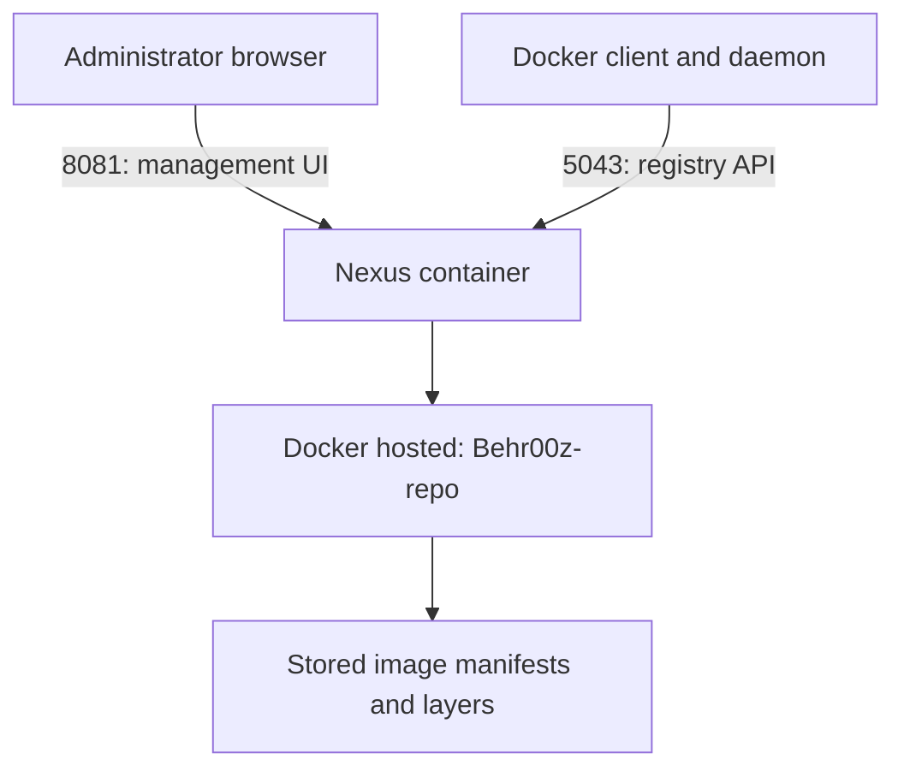

# Part 5 — Setting Up Nexus as Our Homelab Docker Registry

**Reference date:** 28 September 2026  
**Host:** Rocky Linux desktop  
**Outcome:** Docker authentication and a manual image push succeeded.

## Series roadmap

1. Nexus Docker registry setup and manual smoke test.
2. Nexus CI role, `gitea-ci` user, permissions, and credentials.
3. The `.gitea/workflows/hello.yaml` workflow.
4. Running and verifying the first Gitea Actions job.
5. Building the application image and pushing it to Nexus from CI.

The separate Docker DNS/firewalld troubleshooting guide complements Part 5.

## Goal and starting point

We wanted a private registry where our Gitea CI jobs could publish container images, ready for later deployment to Kubernetes.

Nexus was **already running** when this part of the session started. We verified its published ports, created a Docker hosted repository, configured authentication and the Docker client’s HTTP registry access, then pushed a test image.

The original Nexus installation command and storage mount were not recorded in the supplied conversation. This guide does not invent them or ask you to replace the existing container. Our observed Nexus version was `3.88.0-08 (COMMUNITY)` and the Docker client reported `26.1.3` in request logs.



## Environment

| Item | Our value |
|---|---|
| Nexus container | `nexus` |
| Desktop’s intended LAN address | `192.168.1.23` |
| Nexus web UI | `http://192.168.1.23:8081` |
| Docker registry endpoint | `192.168.1.23:5043` |
| Repository format/type | Docker hosted |
| Nexus repository name | `Behr00z-repo` |
| Initial test image | `alpine:latest` |
| Registry test image | `192.168.1.23:5043/lab/alpine:smoke-test` |
| Initial login account | `admin` |
| Later CI account | `gitea-ci` — covered in Part 2 |

The desktop also used `.11` during troubleshooting. We tested that address too, but the reference endpoint in this series is `.23:5043`. Ensure the address actually belongs to your host before reusing it in a rebuilt lab.

## Quick command reference

Run on the Rocky desktop:

```bash
# Inspect the existing Nexus container and port mappings.
docker ps --filter name=nexus \
  --format 'table {{.Names}}\t{{.Status}}\t{{.Ports}}'

# Probe the registry API without using a shell proxy.
curl --noproxy '*' -i --max-time 5 http://127.0.0.1:5043/v2/

# Show only the important authentication headers.
curl --noproxy '*' -sS -D - -o /dev/null \
  http://192.168.1.23:5043/v2/ |
  grep -Ei '^(HTTP/|WWW-Authenticate:|Docker-Distribution-Api-Version:)'

# After configuring HTTP registry access and Nexus realms:
docker login -u admin 192.168.1.23:5043

# Use the local Alpine image for a manual push.
docker image ls alpine
docker tag alpine:latest 192.168.1.23:5043/lab/alpine:smoke-test
docker push 192.168.1.23:5043/lab/alpine:smoke-test
```

A `401 Unauthorized` from the unauthenticated curl probe can be the correct result: the endpoint is reachable and is challenging the client to authenticate.

## Step 1 — Verify the running Nexus service

```bash
docker ps --filter name=nexus \
  --format 'table {{.Names}}\t{{.Status}}\t{{.Ports}}'
```

Our output showed:

```text
nexus   Up 7 hours   0.0.0.0:5043->5043/tcp, :::5043->5043/tcp,
                    0.0.0.0:8081->8081/tcp, :::8081->8081/tcp
```

This established that Docker published both ports. A published port alone does not prove that Nexus has a repository connector listening on it; we verified that separately using `/v2/`.

Open the UI at:

```text
http://192.168.1.23:8081
```

Sign in using the existing Nexus administrator account.

For a future rebuild, Nexus data must persist outside the container’s writable layer. An optional inspection command is:

```bash
docker inspect nexus --format '{{json .Mounts}}'
```

This is an additional reference check, not a mount configuration confirmed during our session. Record and preserve the mount backing `/nexus-data` before replacing any Nexus container.

## Step 2 — Choose the correct repository type

In Nexus administration, open **Repository → Repositories → Create repository** and choose **docker (hosted)**.

| Type | Purpose | Our use |
|---|---|---|
| Hosted | Stores images pushed by us | Yes: CI publication target |
| Proxy | Fetches and caches images from an upstream registry | Possible later use |
| Group | Presents multiple repositories through one endpoint | Possible later pull endpoint |

For our manual and CI pushes, we used the hosted repository’s connector directly.

## Step 3 — Create the hosted repository and HTTP connector

Configure:

| Setting | Value or guidance |
|---|---|
| Name | `Behr00z-repo` |
| Online | Enabled |
| HTTP connector | `5043` |
| HTTPS connector | Not configured in this session |
| Storage/blob store | Select an available store; the exact selection was not recorded |
| Deployment policy | Exact session value not recorded; use unique tags to avoid dependence on overwrite behavior |

Save the repository. We removed an earlier repository and recreated it during setup. That was a one-time setup action, not a step to repeat on an established registry containing images.

### What is special about port 5043?

Nothing intrinsic. It was our chosen TCP port for the Nexus Docker connector. Another available port could work if the Nexus connector, Docker port mapping, firewall access, and client image references all agreed.

- `8081` serves the Nexus administration UI.
- `5043` serves our Docker registry endpoint.
- A port ending in `443` does not automatically enable TLS.

Our connector used **HTTP**. This lab configuration does not encrypt registry credentials or traffic in transit; HTTPS is the appropriate later improvement.

### Repository name versus image name

These are different:

```text
Nexus repository: Behr00z-repo
Docker image:     192.168.1.23:5043/lab/alpine:smoke-test
```

Port `5043` selects the Nexus repository connector. `lab/alpine` is the image path inside that registry. For this connector-based configuration, do not insert `/repository/Behr00z-repo/` into Docker login commands.

## Step 4 — Probe the endpoint and bypass the shell proxy

Our first command was:

```bash
curl -i --max-time 5 http://127.0.0.1:5043/v2/
```

It unexpectedly reported a connection failure to **127.0.0.1 port 2081**, rather than port 5043. The working test bypassed proxy settings:

```bash
curl --noproxy '*' -i --max-time 5 http://127.0.0.1:5043/v2/
```

This returned Nexus headers and a `401 Unauthorized` response. It proved that the registry endpoint was reachable.

`--noproxy '*'` applies only to that curl invocation. It does not configure the Docker daemon’s proxy settings. Shell curl and Docker daemon networking must be diagnosed separately.

## Step 5 — Enable the correct Nexus security realms

Open **Security → Realms**.

Ensure **Docker Bearer Token Realm** is in the active list, and keep the local authentication and authorization realms required for local Nexus users active. Save the configuration.

**The mistake we discovered:** we had selected **Conan Bearer Token Realm** instead of **Docker Bearer Token Realm**. The names look similar, but Conan’s realm does not provide Docker registry token authentication.

After correcting the selection and ensuring local authentication was active, Docker accepted the credentials.

Inspect the challenge:

```bash
curl --noproxy '*' -sS -D - -o /dev/null \
  http://192.168.1.23:5043/v2/ |
  grep -Ei '^(HTTP/|WWW-Authenticate:|Docker-Distribution-Api-Version:)'
```

One observed response was:

```text
HTTP/1.1 401 Unauthorized
Docker-Distribution-Api-Version: registry/2.0
WWW-Authenticate: Bearer realm="http://192.168.1.23:5043/v2/token",service="http://192.168.1.23:5043/v2/token"
```

A Bearer challenge is useful evidence of the authentication flow, but it is not proof that an authenticated login and subsequent access will succeed. We still needed the Docker login test.

## Step 6 — Configure Docker to use our HTTP registry

The initial login failed with:

```text
http: server gave HTTP response to HTTPS client
```

Docker tried HTTPS against our HTTP connector. Writing `http://` in the login command did not substitute for daemon configuration.

Edit the existing daemon configuration:

```bash
sudoedit /etc/docker/daemon.json
```

**Merge** the registry entry into the existing JSON. Do not replace unrelated settings or add a duplicate `insecure-registries` key.

Minimal illustration:

```json
{
  "insecure-registries": [
    "192.168.1.23:5043"
  ]
}
```

During troubleshooting, we also added `192.168.1.11:5043` because we explicitly tested that address. The existing file had older entries as well. They are not required for this guide’s `.23:5043` endpoint.

Validate before applying:

```bash
sudo dockerd --validate --config-file /etc/docker/daemon.json
```

Expected:

```text
configuration OK
```

We then signalled the running Docker daemon to reload:

```bash
sudo systemctl kill -s HUP --kill-who=main docker.service
```

Verify the effective configuration:

```bash
docker info
```

Look for `192.168.1.23:5043` under **Insecure Registries**. This verification is useful when repeating the procedure. If the setting does not take effect, inspect daemon logs and the active configuration before considering a service restart; restarting Docker may affect the other homelab workloads.

## Step 7 — Authenticate using Docker

```bash
docker login -u admin 192.168.1.23:5043
```

Enter the password at the prompt. The successful result is:

```text
Login Succeeded
```

We used the administrator account to establish that the registry worked. Part 2 replaces that account for CI with a scoped role and a dedicated user.

If switching between cached accounts, use:

```bash
docker logout 192.168.1.23:5043
docker login -u admin 192.168.1.23:5043
```

Do not put a password directly into a command argument or commit Docker credentials into Git.

## Step 8 — Understand the 401 investigation

The administrator password worked in the UI but initially failed with Docker. We tested the token endpoint without printing its response body:

```bash
curl --noproxy '*' --user admin --get \
  --data-urlencode 'service=http://192.168.1.23:5043/v2/token' \
  --silent --show-error --output /dev/null \
  --write-out 'Nexus token endpoint: HTTP %{http_code}\n' \
  'http://192.168.1.23:5043/v2/token'
```

Observed:

```text
Nexus token endpoint: HTTP 200
```

That result alone did not prove the complete Docker authentication exchange worked.

Nexus request logs showed:

| Request | Result |
|---|---|
| Initial registry `/v2/` request | 401 |
| Token request identifying `admin` | 200 |
| Subsequent registry `/v2/` request | 401 |

Therefore **Nexus was receiving the login traffic**. We were not dealing with a request that never reached the server. The final failed request directed attention to authentication configuration, and checking the realms exposed the Conan/Docker mix-up.

One diagnostic log command used was:

```bash
docker exec nexus sh -c \
  "tail -n 200 /nexus-data/log/nexus.log | grep -Ei 'bearer|token|unauthor|authentic|Behr00z-repo' | tail -n 30"
```

No matching lines does not establish that no request occurred; Nexus application logs and request/access logs serve different purposes.

We also inspected local routing while comparing the desktop’s addresses:

```bash
ip -4 route get 192.168.1.23
```

The observed route was local, with `.11` as the selected source. Changing between `.11` and `.23` did not solve the authentication issue; correcting the realm did.

## Step 9 — Push a manual smoke-test image

We had an Alpine image locally. Check:

```bash
docker image ls alpine
```

If repeating on a machine without it, fetch it first:

```bash
docker pull alpine:latest
```

This pull is conditional and requires upstream connectivity; it was not the cause of our Nexus login problem.

Tag and push:

```bash
docker tag alpine:latest \
  192.168.1.23:5043/lab/alpine:smoke-test

docker push 192.168.1.23:5043/lab/alpine:smoke-test
```

The image reference contains:

| Part | Meaning |
|---|---|
| `192.168.1.23:5043` | Registry host and connector port |
| `lab/alpine` | Image path |
| `smoke-test` | Tag |

`docker tag` adds another local reference to the existing image; it does not rebuild Alpine. `docker push` uploads the required layers and manifest to Nexus.

The user confirmed the push worked. Later, both `smoke-test` and `ci-smoke-test` were visible in Nexus. The latter belongs to the dedicated-user test in Part 2.

## Step 10 — Verify in Nexus

In the Nexus UI:

1. Open **Browse**.
2. Select **Behr00z-repo**.
3. Find the `lab/alpine` image and its tags.
4. Confirm **smoke-test** exists.

An optional additional read test is:

```bash
docker pull 192.168.1.23:5043/lab/alpine:smoke-test
```

This may reuse locally cached layers, but still tests access to the registry’s image reference. Deleting local images is unnecessary for this basic check.

## Troubleshooting reference

| Symptom | Interpretation / next check |
|---|---|
| curl tries port 2081 instead of 5043 | Check shell proxy behavior; repeat with `--noproxy '*'` |
| Connection refused on 5043 | Check Docker publication and Nexus HTTP connector/listener |
| Unauthenticated `/v2/` returns 401 | Often expected; inspect the authentication challenge |
| HTTP response to HTTPS client | Configure this exact HTTP registry endpoint in Docker’s daemon settings |
| Web UI login works, Docker login fails | Check Docker realm, local authentication, endpoint, and request logs |
| Token endpoint returns 200 but login fails | The full authentication flow is still failing; do not equate HTTP 200 with successful registry access |
| Login works but push is denied | Check repository write permissions and deployment policy; Part 2 covers the CI role |
| Public action checkout fails later in Gitea | Separate runner connectivity problem, not proof of a Nexus failure |

## Lessons learned

- A Docker hosted repository is the destination for our own image pushes.
- Port mapping and an application listener are separate requirements.
- HTTP versus HTTPS is configuration, not a property of port number 5043.
- A 401 challenge can demonstrate a reachable, authentication-protected service.
- Read the exact realm name: Docker and Conan are different protocols.
- Inspect request logs before concluding that the server never received a login.
- Validate JSON before signalling the Docker daemon.
- Scope HTTP registry exceptions to the endpoint you actually need.
- Verify manually before introducing CI credentials and workflow complexity.
- Initial administrator success is a diagnostic milestone; CI should use a dedicated account.

## Interview questions

**What is the difference between a hosted and proxy repository?**  
Hosted stores artifacts we publish; proxy retrieves and caches artifacts from an upstream repository.

**Why can the web UI work while Docker login fails?**  
They use different endpoints and authentication flows. A valid UI password does not establish that Docker token authentication is correctly configured.

**Why does a registry return 401 before login?**  
It challenges the client to authenticate, commonly including information on where to obtain a bearer token.

**Does Docker login prove that push permissions are correct?**  
No. Authentication establishes identity; authorization determines what that identity may do in the repository.

**Why use a smoke-test image first?**  
It isolates registry connectivity and permissions from application build and CI workflow problems.

## Completion checkpoint

- [x] Nexus UI reachable on 8081.
- [x] Docker port 5043 published.
- [x] Docker hosted repository created with HTTP connector 5043.
- [x] Docker HTTP registry access configured.
- [x] Correct Docker Bearer Token Realm and local authentication enabled.
- [x] Docker login succeeded.
- [x] Manual smoke-test image pushed successfully.
- [x] Smoke-test tag subsequently confirmed in Nexus.

**Next file:** Part 2 — create the Nexus CI role and `gitea-ci` user, assign minimum repository privileges, and test a push using that account.

## Official references

- [Sonatype: Docker authentication](https://help.sonatype.com/en/docker-authentication.html)
- [Sonatype: Security realms](https://help.sonatype.com/en/realms.html)
- [Sonatype: Docker repository configuration and client connection](https://support.sonatype.com/hc/en-us/articles/115013153887-Docker-Repository-Configuration-and-Client-Connection)
- [Docker: dockerd configuration](https://docs.docker.com/reference/cli/dockerd/)
- [Docker: docker login](https://docs.docker.com/reference/cli/docker/login/)
- [Docker: daemon proxy configuration](https://docs.docker.com/engine/daemon/proxy/)
