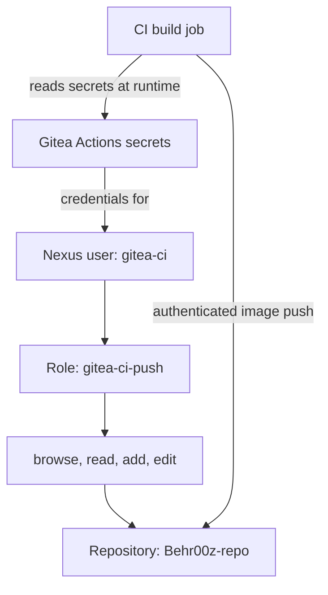

# Part 6 — Creating the Nexus CI Role and gitea-ci User

**Reference date:** 28 September 2026  
**Environment:** Behroox’s Rocky Linux homelab  
**Outcome:** A dedicated Nexus CI account was created and successfully used to push the `ci-smoke-test` image tag.

## Series roadmap

1. Nexus Docker registry setup and manual smoke test.
2. **This file:** Nexus CI role, `gitea-ci` user, repository permissions, and credentials.
3. The `.gitea/workflows/hello.yaml` workflow.
4. Running and verifying the first Gitea Actions job.
5. Building the application image and pushing it to Nexus from CI.

The separate Docker DNS/firewalld troubleshooting guide complements Part 5.

## Goal and starting point

Part 1 established a working Docker hosted registry in Nexus. We could authenticate as `admin` and push an Alpine image.

Our next goal was to give CI its own identity with access to the target repository, without granting Nexus administration rights.

We created a **role** defining repository permissions, created the **user** `gitea-ci`, assigned the role to that user, and tested another push. The user subsequently confirmed both `smoke-test` and `ci-smoke-test` in Nexus.

This guide records the role and account design used in our session. Display-name and email examples below are illustrative where their original values were not recorded. Gitea secret configuration was instructed, but its completion was not independently confirmed in the supplied messages.



## Environment

| Item | Our value |
|---|---|
| Nexus UI | `http://192.168.1.23:8081` |
| Docker registry endpoint | `192.168.1.23:5043` |
| Nexus repository | `Behr00z-repo` |
| Repository type | Docker hosted |
| Role type | Nexus role |
| Role ID | `gitea-ci-push` |
| Role name | `Gitea CI image publisher` |
| Nexus user ID | `gitea-ci` |
| User status | Active |
| Test image | `192.168.1.23:5043/lab/alpine:ci-smoke-test` |
| Gitea repository | `behroox/pipeline-lab` |
| Intended Gitea secrets | `NEXUS_USERNAME`, `NEXUS_PASSWORD` |

`gitea-ci` is a **local Nexus user dedicated to automation**. It does not require a matching Linux user or a Gitea login account, and it is not a Nexus Pro service-account-token feature.

## Quick command reference

Run these on the Rocky desktop after creating the role and user:

```bash
# Remove the existing registry login from this Docker client context.
docker logout 192.168.1.23:5043

# Authenticate as the dedicated CI user; enter its password at the prompt.
docker login -u gitea-ci 192.168.1.23:5043

# Confirm the source image is available locally.
docker image ls alpine

# Tag and push using the dedicated account.
docker tag alpine:latest \
  192.168.1.23:5043/lab/alpine:ci-smoke-test

docker push 192.168.1.23:5043/lab/alpine:ci-smoke-test
```

Optional additional pull verification:

```bash
docker pull 192.168.1.23:5043/lab/alpine:ci-smoke-test
```

These are registry operations. They do not commit files to Git or trigger a Gitea Actions workflow.

## Step 1 — Understand users, roles, and privileges

| Concept | Question it answers | Our example |
|---|---|---|
| User | Who is authenticating? | `gitea-ci` |
| Password | How does the user prove its identity? | Password set on the Nexus user |
| Role | What bundle of permissions does the user receive? | `gitea-ci-push` |
| Privilege | What specific operation is allowed on what resource? | Read images in `Behr00z-repo` |
| Realm | How is authentication processed? | Local authentication and Docker Bearer Token Realm |

**A role has no password.** During our session, uncertainty about the “role password” led to this distinction: credentials belong to the user, while permissions belong to the role.

Authentication and authorization are separate. A successful login does not, by itself, prove permission to push an image.

## Step 2 — Create a Nexus role

Sign in to the Nexus UI as an administrator:

```text
http://192.168.1.23:8081
```

Open **Security → Roles → Create role** and choose **Nexus role**.

Enter:

| Field | Value |
|---|---|
| Role ID | `gitea-ci-push` |
| Role name | `Gitea CI image publisher` |
| Description | `Allow Gitea CI to read and publish Docker images in Behr00z-repo.` |

The description is a suggested descriptive value; its original exact wording was not recorded.

### Does the Role ID need to be a number?

No. It is a unique identifier, and a meaningful string such as `gitea-ci-push` makes its purpose clear.

The **Role ID** identifies the role internally. The **Role name** is the human-readable label. They may differ. Choose a stable ID when creating the role; changing the display name later is different from changing its identity.

## Step 3 — Assign repository-specific privileges

Add these four privileges to the role’s granted/selected privileges:

```text
nx-repository-view-docker-Behr00z-repo-browse
nx-repository-view-docker-Behr00z-repo-read
nx-repository-view-docker-Behr00z-repo-add
nx-repository-view-docker-Behr00z-repo-edit
```

Match the repository name exactly. If rebuilding the lab with a different repository name, select the corresponding privileges for that repository instead.

| Privilege | Purpose in our role |
|---|---|
| `browse` | Repository content visibility |
| `read` | Reading/downloading repository content |
| `add` | Upload operations associated with creating content |
| `edit` | Upload operations that use update/PUT semantics |

### Why both add and edit?

Do not interpret these simply as “new image” versus “overwrite old image.” Sonatype documents their relationship to HTTP methods: `add` allows POST and `edit` allows PUT. Publishing through a repository protocol can require both.

The repository’s deployment policy separately controls redeployment behavior. Granting `edit` does not automatically override that policy. Unique commit-SHA tags are useful later because they distinguish builds without relying on mutable tags.

### What we did not grant

We did not intentionally grant:

- `nx-admin` or `nx-all`.
- Repository administration privileges.
- Repository delete privileges.
- Wildcard access across all repositories.
- User or role management privileges.

This role is scoped to **the whole `Behr00z-repo` repository**, not just `lab/alpine` or `lab/pipeline-lab`. More granular image-path restrictions would require a separate access-control design, such as content selectors.

Save the role.

## Step 4 — Create the local Nexus user

Open **Security → Users → Create local user**.

Set:

| Field | Value or instruction |
|---|---|
| User ID | `gitea-ci` |
| First name | For example, `Gitea` |
| Last name | For example, `CI` |
| Email | Use an appropriate address you control; original value not recorded |
| Password | Set a distinct password for this Nexus account |
| Confirm password | Repeat the same password |
| Status | Active |
| Assigned role | `Gitea CI image publisher` / `gitea-ci-push` |

Save the user. Inspect its assigned roles and avoid accidentally including an administrator role or another broad write role.

Effective access can come from all assigned and inherited roles. A narrow custom role does not cancel broad permissions granted elsewhere.

## Step 5 — If the password is uncertain, reset the user password

The role has no password to inspect. Nexus does not provide the existing user password as readable text in its UI.

As administrator:

1. Open **Security → Users**.
2. Select **gitea-ci**.
3. Choose **Change password**.
4. Set and confirm a new password.
5. Save it in your password manager.

You do not need to delete and recreate the role or user merely because the password was forgotten.

If the password is changed after CI secrets have been configured, update `NEXUS_PASSWORD` in Gitea too. Otherwise, the next job may continue trying the old credential.

## Step 6 — Ensure the required registry configuration still exists

Part 1 already established:

- The Docker hosted connector listens on port `5043`.
- **Docker Bearer Token Realm**, not Conan Bearer Token Realm, is active.
- Local Nexus authentication is active.
- Docker is configured to allow our HTTP registry endpoint.

Do not repeat configuration changes unnecessarily. If login unexpectedly fails, use the same diagnostic probe:

```bash
curl --noproxy '*' -sS -D - -o /dev/null \
  http://192.168.1.23:5043/v2/ |
  grep -Ei '^(HTTP/|WWW-Authenticate:|Docker-Distribution-Api-Version:)'
```

An unauthenticated `401` with a Bearer challenge is expected for an authentication-protected endpoint. It is not a complete test of the CI user’s credentials.

## Step 7 — Log in explicitly as gitea-ci

On the Rocky desktop:

```bash
docker logout 192.168.1.23:5043
docker login -u gitea-ci 192.168.1.23:5043
```

Enter the **Nexus gitea-ci password**, not the administrator password, Gitea browser password, or runner registration token.

Expected:

```text
Login Succeeded
```

Logging out first makes the account change explicit. Use the same Linux user and Docker client context for login and push. Switching between normal commands and `sudo docker ...` can use different credential storage.

The host’s Docker login also does not automatically prove that an isolated CI job has credentials available. We supply CI credentials through Gitea secrets in the later workflow.

## Step 8 — Push an image using the CI account

We reused Alpine, already present locally from the initial smoke test:

```bash
docker image ls alpine
```

Tag it with a distinct tag:

```bash
docker tag alpine:latest \
  192.168.1.23:5043/lab/alpine:ci-smoke-test
```

Push it:

```bash
docker push 192.168.1.23:5043/lab/alpine:ci-smoke-test
```

The distinct tag makes the second test recognizable in Nexus. Layers may already exist from the earlier push; output such as `Layer already exists` is normal. The successful manifest/tag publication is the important result.

This manual push tests the dedicated account’s access independently of Gitea Actions. It does not prove that a runner has Docker access, that checkout works, or that the application Dockerfile builds.

## Step 9 — Verify the tag in Nexus

Using the Nexus administrator UI:

1. Open **Browse**.
2. Select **Behr00z-repo**.
3. Find `lab/alpine` and its tags.
4. Confirm both tags:
   - `smoke-test`: the earlier administrator test.
   - `ci-smoke-test`: the dedicated CI user test.

**Observed in our session:** the user explicitly confirmed both tags were present.

An optional independent read check is:

```bash
docker pull 192.168.1.23:5043/lab/alpine:ci-smoke-test
```

Successful publication and tag visibility were confirmed. This additional pull command is reference verification, not a separately recorded session result.

## Step 10 — Prepare the credentials for Gitea Actions

In the Gitea repository **behroox/pipeline-lab**, open:

**Settings → Actions → Secrets**

Create these repository secrets:

| Secret name | Value |
|---|---|
| `NEXUS_USERNAME` | `gitea-ci` |
| `NEXUS_PASSWORD` | Password of the Nexus `gitea-ci` user |

Use the names exactly, including capitalization. Keep credentials out of the Dockerfile, repository files, image tags, and Git commit messages.

This was the intended secret configuration in our session; saving both secrets was not independently confirmed in the messages. Check their names in Gitea before attempting the build-and-push workflow.

The following is a **workflow fragment**, not a complete standalone workflow. Part 5 supplies the full job:

```yaml
- name: Log in to Nexus
  env:
    NEXUS_USERNAME: ${{ secrets.NEXUS_USERNAME }}
    NEXUS_PASSWORD: ${{ secrets.NEXUS_PASSWORD }}
  run: |
    set -eu
    printf '%s' "$NEXUS_PASSWORD" | docker login 192.168.1.23:5043 \
      --username "$NEXUS_USERNAME" --password-stdin
```

`--password-stdin` supplies the password through standard input instead of a password command-line argument. Do not enable shell tracing (`set -x`) around credentials.

Our registry still uses HTTP as established in Part 1. Secret storage and stdin handling do not encrypt registry traffic; HTTPS remains a separate improvement.

## Troubleshooting reference

| Symptom | Check |
|---|---|
| “What password did I set for the role?” | Roles have no passwords; inspect/reset the `gitea-ci` user |
| Docker login returns 401 | User status, password, endpoint, Docker realm, and local authentication |
| Login works but push fails | Assigned role, exact repository privileges, and deployment policy |
| Push succeeds as admin only | Ensure the CI account actually has the required repository privileges |
| UI privileges appear broader than intended | Check all assigned and inherited roles |
| CLI works but CI login fails | Check Gitea secret names and values, runner networking, and the actual CI endpoint |
| CI fails after a password reset | Update Gitea’s `NEXUS_PASSWORD` and rerun |
| Image layers already exist | Usually normal; check whether the final manifest/tag push succeeds |
| Registry responds HTTP to an HTTPS client | Revisit Docker daemon HTTP registry configuration in Part 1 |

Do not solve a push denial by immediately granting `nx-admin` or `nx-all`. Determine whether the failure is authentication, repository authorization, deployment policy, or connectivity.

## Rollback and credential cleanup

These are reference options, not steps we needed to perform during the successful setup:

- To remove the local cached registry login:

  ```bash
  docker logout 192.168.1.23:5043
  ```

- To stop future CI use, disable the Nexus user through its status setting and remove/update the Gitea secrets. Do not assume this instantly revokes every already-issued token.
- To rotate the password, reset it in Nexus, update Gitea’s secret, then test a fresh login.
- Deleting a Gitea secret does not delete the Nexus account or any images.
- Removing a role assignment changes authorization; it does not remove uploaded artifacts.

## Lessons learned

- A user is an identity; a role is a permission bundle.
- A Role ID can be a descriptive string; it does not need to be numeric.
- The Nexus CI account is separate from Linux, Gitea, and runner registration identities.
- A login test and a push test establish different things.
- Repository-scoped permissions reduce the reach of the automation account.
- `add` and `edit` must be understood in terms of repository operations, not simply old versus new files.
- A manual CI-user smoke test isolates permissions from workflow problems.
- Credential rotation must update both Nexus and the secret consumed by CI.
- Administrator credentials are unnecessary for routine image publication.

## Interview questions

**What is the difference between authentication and authorization?**  
Authentication verifies identity. Authorization determines which resources and operations that identity may access.

**Does a Nexus role have a password?**  
No. The user has credentials and receives permissions through roles.

**Why create a dedicated CI user?**  
It separates automation from a personal administrator account, allows scoped access, and makes rotation and auditing easier.

**Does this role restrict pushes to lab/pipeline-lab?**  
No. It grants the listed privileges across `Behr00z-repo`. A narrower image-path restriction requires additional design.

**Why might edit be needed when uploading a new image?**  
The registry protocol uses multiple HTTP operations. Nexus’s add/edit privileges relate to those operations, including POST and PUT.

**Why can a manual push succeed while the CI job fails?**  
The job can have different credentials, Docker access, network routing, DNS, and execution environment.

**Where should the Nexus password go in Gitea?**  
In a repository Actions secret referenced by the workflow, not in committed YAML as a literal value.

## Completion checkpoint

- [x] Custom Nexus role created for CI image publication.
- [x] Repository-scoped browse/read/add/edit permissions selected.
- [x] Dedicated local user `gitea-ci` created and assigned the role.
- [x] Dedicated-account registry push succeeded.
- [x] `ci-smoke-test` and `smoke-test` tags confirmed in Nexus.
- [ ] Confirm both intended Gitea Actions secrets are saved before Part 5.

**Next file:** Part 3 — create and understand `.gitea/workflows/hello.yaml`, including repository layout, YAML explanation, and Git commands.

## Official references

- [Sonatype: Roles](https://help.sonatype.com/en/roles.html)
- [Sonatype: Privileges](https://help.sonatype.com/en/privileges.html)
- [Sonatype: Users and password changes](https://help.sonatype.com/en/users.html)
- [Sonatype: Add versus edit privileges](https://support.sonatype.com/hc/en-us/articles/360013609554-What-is-the-difference-between-add-and-edit-privileges-for-repositories)
- [Sonatype: Docker authentication](https://help.sonatype.com/en/docker-authentication.html)
- [Docker: docker login](https://docs.docker.com/reference/cli/docker/login/)
