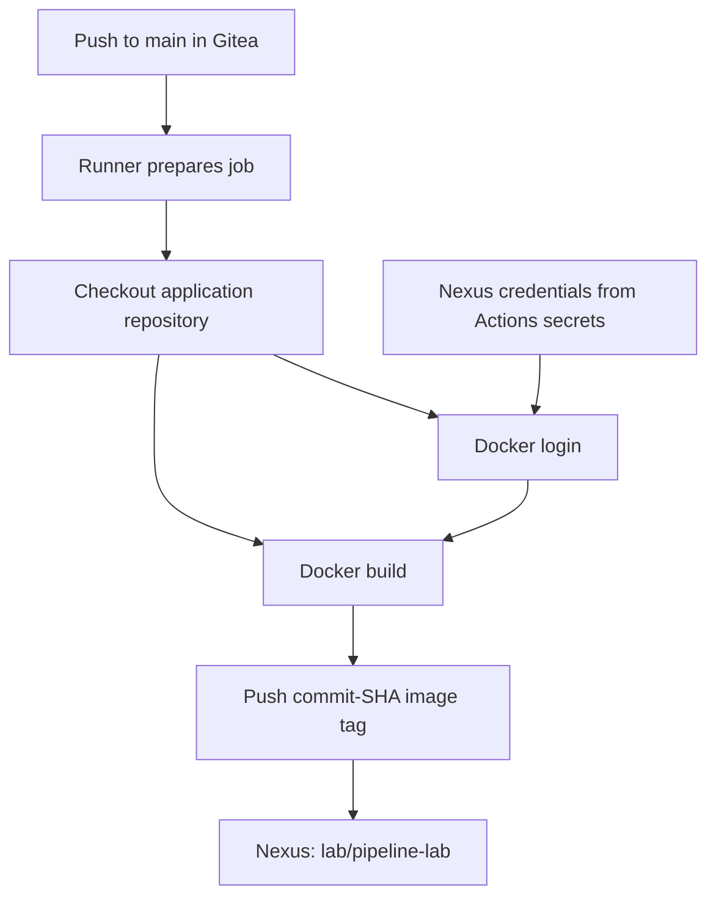

# Part 5 — Building an Application Image and Pushing It to Nexus

**Reference date:** 28 September 2026  
**Environment:** Behroox’s Rocky Linux homelab  
**Status:** Local application image worked. The CI build workflow failed during checkout preparation because the runner could not reach DNS. A firewall correction was applied and the job was rerun; the final automatic publication result has not yet been confirmed.

## Series roadmap

1. Nexus Docker registry setup and manual smoke test.
2. Nexus CI role, `gitea-ci` user, repository permissions, and credentials.
3. Create `.gitea/workflows/hello.yaml` and push it to local Gitea.
4. Run and verify the first greeting job.
5. **This file:** Build our application image and publish it to Nexus through Gitea Actions.

The separate `gitea-runner-docker-dns-firewall-guide.md` contains an expanded explanation of the network incident summarized here.

## Goal and starting point

We already had a working Gitea repository, a runner that could execute the greeting job, and a Nexus hosted Docker registry. Manual pushes as the dedicated `gitea-ci` user succeeded.

Our next goal was to automate a real artifact build: check out the repository, build a small nginx application image, tag it with the source commit, and push it to Nexus.

This is the image-publication portion of CI. It does not deploy to Kubernetes. Argo CD and deployment manifests remain a later stage.



## Environment

| Item | Our value |
|---|---|
| Project clone | `/home/behroox/Behrouz_ghastly_projects/pipeline-lab` |
| Gitea repository | `behroox/pipeline-lab` |
| Branch | `main` |
| Local application image | `pipeline-lab:local` |
| Local test container | `pipeline-lab-test` |
| Local test port | `8090` mapped to container port `80` |
| Nexus registry | `192.168.1.23:5043` |
| Nexus hosted repository | `Behr00z-repo` |
| Published image path | `lab/pipeline-lab` |
| Tag strategy | Full Git commit SHA |
| Nexus user | `gitea-ci` |
| Actions secrets | `NEXUS_USERNAME`, `NEXUS_PASSWORD` |
| Runner | `gitea-runner` / registered name `rocky-runner` |
| Build workflow | `.gitea/workflows/build-image.yaml` |

The workflow was also referred to conversationally as `build-and-push.yaml`. The failed-run screenshots identified `build-image.yaml`; this guide consistently uses that name. Avoid creating duplicate build workflows under both names.

## Quick command reference

From the project root, after creating the files below:

```bash
cd /home/behroox/Behrouz_ghastly_projects/pipeline-lab

# Build and test the application locally.
docker build -t pipeline-lab:local .
docker run --rm -d --name pipeline-lab-test -p 8090:80 pipeline-lab:local
curl --noproxy '*' http://127.0.0.1:8090/
docker stop pipeline-lab-test

# Review, commit, and push the intended files.
git add index.html Dockerfile .gitea/workflows/build-image.yaml
git diff --cached
git commit -m "Build and Publish pipeline-lab image"
git remote -v
git remote get-url --push --all origin
git push origin main
```

Confirm the remote is local Gitea before pushing. Do not rerun the container command if a test container with that name is already running; inspect and stop the old test instance first if appropriate.

## Step 1 — Create the HTML application

At the Git repository root, create `index.html`:

```html
<!doctype html>
<html>
  <body><h1>Hello from the homelab CI/CD pipeline!</h1></body>
</html>
```

A copy-and-paste creation command is:

```bash
cat > index.html <<'HTML'
<!doctype html>
<html>
  <body><h1>Hello from the homelab CI/CD pipeline!</h1></body>
</html>
HTML
```

This writes the complete file and replaces any existing contents at that path. Use it only when deliberately creating/restoring this test application.

## Step 2 — Create the Dockerfile

Create `Dockerfile` beside `index.html`:

```dockerfile
FROM nginx:alpine
COPY --chmod=0644 index.html /usr/share/nginx/html/index.html
```

Equivalent creation command:

```bash
cat > Dockerfile <<'DOCKERFILE'
FROM nginx:alpine
COPY --chmod=0644 index.html /usr/share/nginx/html/index.html
DOCKERFILE
```

| Instruction | Purpose |
|---|---|
| `FROM nginx:alpine` | Use an nginx image as the application base |
| `COPY ... index.html ...` | Copy our page into nginx’s document root inside the image |
| `--chmod=0644` | Ensure the page is readable by the nginx worker process |

### Do we need nginx installed on Rocky?

No. nginx is inside the container image. `/usr/share/nginx/html/` in the Dockerfile is an image/container path, not a directory we need to populate on the host.

The source `index.html` comes from the Docker build context. That is why we build from the repository root with `.` as the final argument.

### Why explicitly set permissions?

Our first HTTP test returned `403 Forbidden`. After correcting the file permissions through the Dockerfile, the page worked.

An earlier `umask 077` was a plausible reason for a newly created file being readable only by its owner. We did not capture a definitive permission listing for the original failing file, so that exact cause remains an inference.

`0644` gives the owner read/write permission and everyone else read permission. This is appropriate for a public static HTML page. It is not a permission recommendation for passwords or runner tokens.

For future reproducibility, pin the base image to an approved version or digest. `nginx:alpine` was the moving tag used in this learning exercise.

## Step 3 — Build the image locally

```bash
docker build -t pipeline-lab:local .
```

| Argument | Meaning |
|---|---|
| `-t pipeline-lab:local` | Assign a local image name and tag |
| `.` | Use the current directory as the build context |

A successful local build establishes that the files and Dockerfile can produce an image on this host. It does not yet test the CI job’s Docker access or Nexus credentials.

## Step 4 — Run the local HTTP smoke test

```bash
docker run --rm -d --name pipeline-lab-test -p 8090:80 pipeline-lab:local
curl --noproxy '*' http://127.0.0.1:8090/
```

Expected output, confirmed by the user:

```html
<!doctype html>
<html>
  <body><h1>Hello from the homelab CI/CD pipeline!</h1></body>
</html>
```

The command maps host port 8090 to the container’s nginx port 80. `--rm` removes the test container after it stops; it does not remove the image.

Our recorded command publishes on the host’s default interfaces. For a future test intended only for the local machine, the narrower equivalent is:

```bash
docker run --rm -d --name pipeline-lab-test \
  -p 127.0.0.1:8090:80 pipeline-lab:local
```

Choose one run command, not both.

When finished:

```bash
docker stop pipeline-lab-test
```

Stopping the test instance was recommended; the session did not explicitly confirm that cleanup command was run.

### If the container returns 403 again

Inspect the targeted test container rather than installing nginx on the host:

```bash
docker logs pipeline-lab-test
docker exec pipeline-lab-test ls -l /usr/share/nginx/html/index.html
```

These are additional reference checks. Rebuild after changing the Dockerfile, then recreate the test container so it uses the new image. An already-running container does not automatically change when its image tag is rebuilt.

## Step 5 — Verify the Nexus secrets

In Gitea, open **behroox/pipeline-lab → Settings → Actions → Secrets**.

| Name | Value |
|---|---|
| `NEXUS_USERNAME` | `gitea-ci` |
| `NEXUS_PASSWORD` | Password of the Nexus `gitea-ci` user |

Part 2 explains the role, user, and successful manual permission test. Saving these exact secrets was instructed but not independently confirmed in the supplied messages.

Do not use the runner registration token or Gitea login password as the Nexus password.

## Step 6 — Understand the CI Docker prerequisites

The build step requires both:

1. A Docker CLI available inside the job environment.
2. Access to a Docker daemon that can build images and reach Nexus.

A successful greeting job proves neither. Our workflow starts its publication script with `docker version` to reveal missing CLI or daemon access early.

The Docker daemon used by the job must allow our HTTP registry endpoint, as configured in Part 1. If the runner uses a different daemon from the host, the host’s registry settings and image cache do not automatically apply to that other daemon.

We did not reach this step in the captured failed run. Therefore this guide does not claim the CI Docker socket/access configuration has been verified. Do not introduce an unauthenticated remote Docker API to bypass an access error; inspect the runner setup first.

## Step 7 — Create the complete build-image.yaml workflow

Create `.gitea/workflows/build-image.yaml`:

```yaml
name: Build and publish image

on:
  push:
    branches: [main]

jobs:
  publish:
    runs-on: ubuntu-latest
    steps:
      - name: Check out code
        uses: https://gitea.com/actions/checkout@v4

      - name: Build and push to Nexus
        env:
          NEXUS_USERNAME: ${{ secrets.NEXUS_USERNAME }}
          NEXUS_PASSWORD: ${{ secrets.NEXUS_PASSWORD }}
        run: |
          set -eu
          IMAGE="192.168.1.23:5043/lab/pipeline-lab:${{ gitea.sha }}"
          docker version
          printf '%s' "$NEXUS_PASSWORD" | docker login 192.168.1.23:5043 \
            --username "$NEXUS_USERNAME" --password-stdin
          docker build -t "$IMAGE" .
          docker push "$IMAGE"
          docker logout 192.168.1.23:5043
```

This is the workflow supplied in our session. It is a documented starting point, not a claim that its full execution has passed.

### What each section does

| Section | Purpose |
|---|---|
| `on.push.branches: [main]` | Run this build workflow for pushes to main |
| `publish` | Job identifier |
| `runs-on: ubuntu-latest` | Match the registered runner label |
| Absolute checkout URL | Retrieve the checkout action from public gitea.com |
| Checkout step | Put the source repository into the job workspace |
| `env` | Supply Nexus credentials from repository secrets |
| `set -eu` | Stop on command failure or use of an unset shell variable |
| `gitea.sha` | Tag the image with the event’s source commit SHA |
| `docker version` | Check Docker client/daemon availability |
| `--password-stdin` | Pass the password through stdin |
| `docker build` | Build from the checked-out source |
| `docker push` | Publish layers and manifest to Nexus |
| `docker logout` | Remove that registry login from the job’s client configuration on the successful path |

Because `set -e` exits after a failed command, the final logout is not guaranteed to run on failure. This simple workflow can later be improved with guaranteed cleanup and isolated credential storage. It also does not yet perform an automated HTTP application test; the test in Step 4 was manual.

The checkout action reference is a version tag. Pinning an reviewed immutable action commit is a later reproducibility improvement; no particular commit is invented here.

### Why tag with a commit SHA?

A tag such as:

```text
192.168.1.23:5043/lab/pipeline-lab:<full-commit-sha>
```

connects an image to the source revision used by the job. It is more traceable than a single moving `latest` tag. A SHA-shaped tag is still a registry tag; repository policy must prevent overwrites if strict immutability is required.

### Why does local CI contact public Gitea?

Our source repository is local, but the checkout action’s implementation is hosted at `https://gitea.com/actions/checkout`. The runner retrieves that external dependency during setup. The job image and nginx base image can also require external registry access.

Local CI does not automatically mean offline CI.

## Step 8 — Review and push the three files

From the repository root:

```bash
git status
git add index.html Dockerfile .gitea/workflows/build-image.yaml
git diff --cached
git commit -m "Build and Publish pipeline-lab image"
git remote -v
git remote get-url --push --all origin
git push origin main
```

Verify that all effective push URLs point to your intended local Gitea repository. Do not commit passwords, runner tokens, or Docker credential files.

The user deleted and recreated the application/build files during troubleshooting. That history generated additional runs. Deletion/recreation is not required when repeating the setup: edit the intended files, review the diff, and commit the correction normally.

## Step 9 — Select the correct workflow result

Both `hello.yaml` and `build-image.yaml` can react to the same push.

A green run titled with the commit message “Build and Publish pipeline-lab image” initially belonged to **First CI job**, with job **hello**. It had not built an image.

For the actual image result, inspect:

- Workflow: **Build and publish image**.
- File: `build-image.yaml`.
- Job: **publish**.
- Steps: checkout and **Build and push to Nexus**.

Do not equate a successful greeting run with a successful image publication.

## Step 10 — The failure we actually observed

The build job failed during **Set up job**, while preparing its checkout action:

```text
Unable to clone https://gitea.com/actions/checkout refs/heads/v4
lookup gitea.com on 192.168.1.24:53
read udp 172.17.0.3:45358->192.168.1.24:53:
read: no route to host
```

At this point, the application build and Nexus login/push had not started. Changing Nexus credentials would not repair this error.

### Compare host and runner-network DNS

On Rocky:

```bash
nslookup gitea.com 192.168.1.24

docker run --rm --pull=never \
  --network container:gitea-runner \
  alpine:latest nslookup gitea.com 192.168.1.24
```

**Observed:** host DNS succeeded; the runner-network test reported `Host is unreachable`.

### Inspect routing, forwarding, zones, and NAT

```bash
docker run --rm --pull=never \
  --network container:gitea-runner \
  alpine:latest ip route

sysctl net.ipv4.ip_forward
sudo firewall-cmd --get-active-zones
sudo iptables -S FORWARD
sudo iptables -S DOCKER-USER
sudo iptables -t nat -S POSTROUTING
```

Observed findings:

| Check | Result |
|---|---|
| Runner default route | Present via `172.17.0.1` |
| IP forwarding | Enabled: `1` |
| Docker-user rules | No custom blocking rule shown |
| Docker masquerading | Present for `172.17.0.0/16` |
| firewalld assignment | `docker0` was in `public` rather than `docker` |

### Apply the targeted correction

```bash
sudo firewall-cmd --zone=docker --change-interface=docker0
```

Retest:

```bash
docker run --rm --pull=never \
  --network container:gitea-runner \
  alpine:latest nslookup gitea.com 192.168.1.24
```

After a successful test, persist:

```bash
sudo firewall-cmd --permanent --zone=docker --change-interface=docker0
```

This places the Docker bridge in the zone expected by Docker’s firewalld integration. The physical LAN interface is not moved. Applying both runtime and permanent changes separately avoids needing a firewall reload for this correction.

The user reported implementing the changes and rerunning the job. The final DNS retest output and workflow result had not yet been provided when this guide was created. The before/after test is what should confirm the diagnosis.

## Step 11 — Verify the rerun and image publication

These are the remaining verification steps, not results already observed:

1. Open the rerun of the build workflow.
2. Confirm **Set up job** passes the previous checkout-action download failure.
3. Confirm **Check out code** succeeds.
4. Expand **Build and push to Nexus**.
5. Verify Docker availability, login success, build completion, and push completion.
6. In Nexus, browse **Behr00z-repo → lab/pipeline-lab** and find the expected commit-SHA tag.

Optional independent pull test:

```bash
docker login -u gitea-ci 192.168.1.23:5043
docker pull 192.168.1.23:5043/lab/pipeline-lab:REPLACE_WITH_ACTUAL_COMMIT_SHA
```

Use the commit attached to the successful run, not automatically your newest local HEAD. A rerun may be executing an older commit.

A further application check can run that exact published image on an unused local port and curl it, as in Step 4. This is stronger evidence than merely seeing a tag: it confirms the image serves the expected content.

## Troubleshooting reference

| Failure | Most relevant check |
|---|---|
| Local nginx returns 403 | File content and permissions inside the test container; rebuild and recreate after changes |
| Checkout preparation cannot resolve gitea.com | Runner-network DNS reachability and firewall path |
| Checkout tries localhost and fails | Localhost inside a job is not necessarily the Gitea host; inspect the configured repository/server URL |
| `docker: command not found` | Docker CLI availability in the job image |
| Cannot connect to Docker daemon | Runner/job daemon connection and permissions |
| HTTP response to HTTPS client | HTTP registry configuration on the daemon actually used by the job |
| Nexus login 401 | Secrets, account status, endpoint, and Docker authentication realm |
| Login succeeds but push is denied | Repository role privileges and deployment policy |
| Build cannot find index.html | Git tracking, checkout, and build context |
| Green greeting but no application image | Inspect the build workflow, not the hello workflow |

Preserve the first meaningful error from the first failed step. A different failure after the firewall correction can mean the job has advanced to a new stage.

## Rollback and cleanup notes

- Stop the local test container when finished: `docker stop pipeline-lab-test`.
- Correct application or workflow mistakes through ordinary Git commits; avoid force-pushing as a troubleshooting shortcut.
- Do not delete repository images just to make a workflow rerun. Identify the tag and deployment policy first.
- The firewall guide documents how to restore the previous zone assignment if required. Reverting may reproduce the original failure.
- This workflow has not deployed anything to Kubernetes, so there is no Kubernetes rollout to undo at this stage.

## Lessons learned

- A containerized web server does not require nginx installed on the host.
- File permissions copied into an image can affect HTTP behavior.
- Test the application locally before combining build, credentials, and registry operations.
- An echo job and a build job exercise different capabilities.
- A workflow’s commit-message title does not identify which job succeeded.
- Checkout actions are dependencies that may require internet access.
- Host networking success does not establish container-network success.
- Scope fixes to the failing layer; do not change registry credentials for a DNS error.
- Commit-based tags improve traceability, but successful publication still needs verification.
- Image publication is not deployment; CD is the next separate capability.

## Interview questions

**Why does the Dockerfile copy into /usr/share/nginx/html when that path is empty on the host?**  
The destination is inside the image. The nginx base image supplies the web server and document-root structure.

**Why did we use COPY --chmod=0644?**  
To ensure the static page is readable by the web-server process regardless of restrictive source-file permissions.

**Why is checkout necessary here but absent from hello.yaml?**  
The build needs the repository’s Dockerfile and HTML file. The greeting only prints text and system information.

**What does the final dot in docker build mean?**  
It selects the current directory as the build context.

**Why use a full commit SHA as an image tag?**  
It connects the published artifact to a source revision and distinguishes builds.

**Does installing a Docker CLI inside the job guarantee builds work?**  
No. The CLI must also reach an appropriately configured Docker daemon.

**When can we call this CI publication step complete?**  
When the correct workflow builds and pushes successfully and the expected application image is verified in Nexus.

## Completion checkpoint

- [x] HTML application created.
- [x] Dockerfile created and permissions corrected.
- [x] Local image built and served the expected page.
- [x] Build workflow committed and pushed to Gitea.
- [x] Correct failed build run identified.
- [x] Runner-network DNS failure reproduced separately from host DNS.
- [x] User reported applying firewall correction and rerunning the job.
- [ ] Successful DNS retest confirmed.
- [ ] CI Docker CLI/daemon access confirmed.
- [ ] CI Nexus login, build, and push completed successfully.
- [ ] Commit-SHA application image verified in Nexus.
- [ ] Automated application smoke test added in a later improvement.
- [ ] Argo CD deployment configured separately.

## Official references

- [Gitea Actions quick start](https://docs.gitea.com/usage/actions/quickstart/)
- [Gitea Actions compatibility and absolute action URLs](https://docs.gitea.com/usage/actions/comparison/)
- [Dockerfile reference](https://docs.docker.com/reference/dockerfile/)
- [Docker login](https://docs.docker.com/reference/cli/docker/login/)
- [Docker packet filtering and firewalls](https://docs.docker.com/engine/network/packet-filtering-firewalls/)
- [Sonatype: pushing images](https://help.sonatype.com/en/pushing-images.html)
