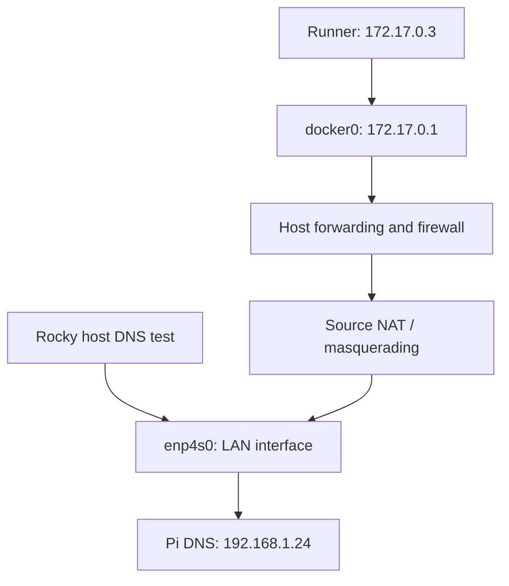

# Gitea Runner: Troubleshooting Docker DNS and firewalld on Rocky Linux

**Date:** 28 September 2026  
**Environment:** Behroox’s homelab, Rocky Linux 8.10  
**Status:** Firewall correction reported applied; build workflow rerun started. Final DNS retest and successful image publication have not yet been confirmed in the conversation.

## 1. What this guide covers

This is a reference for the networking failure encountered while connecting our working Gitea CI runner to the image build-and-push workflow. It documents the evidence, commands, reasoning, correction, and remaining verification. It is not a fresh installation guide for Gitea or Nexus.

The immediate goal was to let the runner download the checkout action, check out the application repository, build an image, and publish it to Nexus.

## 2. Environment and addresses

| Component | Address or name | Purpose |
|---|---|---|
| Rocky desktop | Intended LAN address `192.168.1.23` | Docker host |
| Raspberry Pi | `192.168.1.24` | Local DNS and public DNS forwarding |
| Gitea server | `http://192.168.1.23:3000` | Source repository and Actions UI |
| Repository | `behroox/pipeline-lab` | Application and workflows |
| Runner container | `gitea-runner` | Receives and executes CI jobs |
| Registered runner | `rocky-runner`, v2.3.0 | Runner shown in Actions logs |
| Runner address during failure | `172.17.0.3` | Container address, not a permanent identifier |
| Docker bridge gateway | `docker0`, `172.17.0.1` | Gateway for the default Docker bridge |
| Rocky LAN interface | `enp4s0` | Connection to home LAN |
| Nexus UI | `http://192.168.1.23:8081` | Repository administration |
| Nexus Docker endpoint | `192.168.1.23:5043` | Image push/pull endpoint |
| Nexus hosted repository | `Behr00z-repo` | Stores Docker images |

The desktop previously also used `192.168.1.11`. Use current interface output when diagnosing addresses; do not assume every old address was removed.

## 3. Command cheat sheet

Run these commands on the **Rocky desktop**, not on the Raspberry Pi.

### Compare host DNS with runner-network DNS

```bash
nslookup gitea.com 192.168.1.24

docker run --rm --pull=never \
  --network container:gitea-runner \
  alpine:latest nslookup gitea.com 192.168.1.24
```

### Inspect routing and firewall state

```bash
docker run --rm --pull=never \
  --network container:gitea-runner \
  alpine:latest ip route

sysctl net.ipv4.ip_forward
sudo firewall-cmd --get-active-zones
sudo iptables -S FORWARD
sudo iptables -S DOCKER-USER
sudo iptables -t nat -S POSTROUTING
```

### Apply the targeted correction and retest

```bash
sudo firewall-cmd --zone=docker --change-interface=docker0

docker run --rm --pull=never \
  --network container:gitea-runner \
  alpine:latest nslookup gitea.com 192.168.1.24
```

**After a successful retest**, save the assignment:

```bash
sudo firewall-cmd --permanent --zone=docker --change-interface=docker0
```

The first command changes the running configuration. The second saves the corresponding permanent configuration. Because both are applied separately, no firewall reload is needed for this correction.

## 4. How we recognized the real failure

There were two workflows:

- `hello.yaml`: a short job printing a greeting.
- `build-image.yaml`: the image build-and-publish workflow. The file was also referred to conversationally as build-and-push.yaml; the failed run’s screenshot identified `build-image.yaml`.

A green greeting job did not prove that the image workflow worked. Both could run for the same push, and their run titles could use the same commit message.

The relevant failed run was the **publish** job in **Build and publish image**. It failed during **Set up job**, while preparing the checkout action:

```text
Unable to clone https://gitea.com/actions/checkout refs/heads/v4
lookup gitea.com on 192.168.1.24:53
read udp 172.17.0.3:45358->192.168.1.24:53:
read: no route to host
```

The significant details were:

- The runner was trying to retrieve an action from public `gitea.com`.
- It tried to resolve that name using our Raspberry Pi DNS.
- The request originated from the runner container’s network.
- Checkout preparation failed before application checkout and before image publication.

Consequently, the screenshot did not implicate the Dockerfile, Nexus password, or Nexus repository permissions. Those later stages had not been reached.

A “no route to host” message is not proof that a route is absent. A firewall rejection can also cause an unreachable error.

## 5. Understanding the network path



A container has its own network namespace, including interfaces and routing information. The runner’s default gateway is the Docker bridge on Rocky.

For container traffic to reach the Pi:

1. The container sends the packet to its gateway.
2. Rocky forwards it from the Docker bridge toward the LAN.
3. Firewall rules must permit the forwarded traffic.
4. Docker’s masquerading rule rewrites the source address to an appropriate host address.
5. The Pi replies, and connection tracking translates the reply back to the container.

Masquerading prevents the Pi from needing a special route back to Docker’s private `172.17.0.0/16` network.

A DNS request originating on Rocky itself does not traverse the same forwarding path. Therefore, a successful host lookup does not establish that containers can reach DNS.

## 6. Step-by-step diagnosis and observed results

### Step A — Test DNS directly from Rocky

```bash
nslookup gitea.com 192.168.1.24
```

**Observed:** the Pi returned IPv4 and IPv6 answers.

This established that the Pi was reachable from the host and could resolve this public domain at that time. The returned public addresses are not fixed values to copy into configuration.

### Step B — Test from the runner’s network position

```bash
docker run --rm --pull=never \
  --network container:gitea-runner \
  alpine:latest nslookup gitea.com 192.168.1.24
```

**Observed:**

```text
nslookup: write to '192.168.1.24': Host is unreachable
;; connection timed out; no servers could be reached
```

Command explanation:

| Option | Meaning |
|---|---|
| `--rm` | Remove the temporary diagnostic container when it exits |
| `--pull=never` | Use the locally cached Alpine image; avoid depending on a registry download |
| `--network container:gitea-runner` | Share the runner’s network namespace |
| Explicit DNS address | Test the same Pi DNS server as the failing workflow |

This shares networking, not the runner’s filesystem or every aspect of its environment. Specifying the DNS server explicitly makes the network comparison useful without depending on the test container’s resolver file.

### Step C — Verify the route

```bash
docker run --rm --pull=never \
  --network container:gitea-runner \
  alpine:latest ip route
```

**Observed:**

```text
default via 172.17.0.1 dev eth0
172.17.0.0/16 dev eth0 scope link src 172.17.0.3
```

The runner had a default route. We did not need to invent a new route to the Pi inside the container.

### Step D — Verify host IP forwarding

```bash
sysctl net.ipv4.ip_forward
```

**Observed:**

```text
net.ipv4.ip_forward = 1
```

Forwarding was already enabled. No sysctl change was necessary.

### Step E — Inspect firewalld zones

```bash
sudo firewall-cmd --get-active-zones
```

**Observed:** `docker0` was listed under `public`, together with `enp4s0` and one other Docker bridge. Other bridges were already in `docker`.

This was the key configuration mismatch. Docker’s documented firewalld integration places its bridge interfaces in the `docker` zone, whose target is `ACCEPT`.

We targeted `docker0` because the failing runner used that bridge. We did not move the physical LAN interface into the Docker zone or change every bridge indiscriminately.

### Step F — Inspect forwarding rules

```bash
sudo iptables -S FORWARD
sudo iptables -S DOCKER-USER
```

The forwarding chain contained Docker rules accepting traffic from `docker0`. The user chain contained:

```text
-N DOCKER-USER
-A DOCKER-USER -j RETURN
```

There was no custom blocking rule in this chain. However, an ACCEPT in the displayed iptables rules does not establish that no other firewall processing can reject the packet. firewalld’s backend and other hooks also matter.

### Step G — Inspect source NAT

```bash
sudo iptables -t nat -S POSTROUTING
```

The output included:

```text
-A POSTROUTING -s 172.17.0.0/16 ! -o docker0 -j MASQUERADE
```

The expected masquerading rule for the runner’s subnet was present. We did not add a duplicate NAT rule.

## 7. Correction applied

Move only the affected bridge into Docker’s zone:

```bash
sudo firewall-cmd --zone=docker --change-interface=docker0
```

Then repeat the runner-network lookup:

```bash
docker run --rm --pull=never \
  --network container:gitea-runner \
  alpine:latest nslookup gitea.com 192.168.1.24
```

If it now returns addresses, persist the assignment:

```bash
sudo firewall-cmd --permanent --zone=docker --change-interface=docker0
```

This restores the bridge’s expected Docker/firewalld integration. It does not change the runner IP, the DNS server, the application code, or the Nexus credentials. The Docker zone is permissive by design; apply it to the Docker bridge, not indiscriminately to physical interfaces.

**Evidence boundary:** the user reported implementing the changes and rerunning the workflow. At the time this guide was prepared, the rerun’s outcome had not been supplied. The zone mismatch is a strong suspected cause; a successful before/after DNS test is the next confirmation.

## 8. Verification after the correction

These are follow-up verification commands, not results already observed:

```bash
sudo firewall-cmd --get-zone-of-interface=docker0
sudo firewall-cmd --permanent --get-zone-of-interface=docker0
```

Both should report `docker` when runtime and permanent assignments are in place.

In Gitea, open the failed **Build and publish image** run and rerun it. Watch:

1. **Set up job:** action preparation should get past the previous DNS error.
2. **Check out code:** the application repository should be retrieved.
3. **Build and push to Nexus:** the image should build and upload successfully.

If it fails, expand the first failed step and capture its first meaningful error. A new error may represent progress to a later stage, not failure of the networking correction.

Only after a successful publish, inspect Nexus **Browse → Behr00z-repo → lab/pipeline-lab** and confirm the tag produced by the workflow. Our intended image naming uses the full Git commit SHA:

```text
192.168.1.23:5043/lab/pipeline-lab:<full-commit-sha>
```

Check the actual workflow file to confirm the exact repository path and tagging scheme. An optional independent pull test is:

```bash
docker login -u gitea-ci 192.168.1.23:5043
docker pull 192.168.1.23:5043/lab/pipeline-lab:REPLACE_WITH_ACTUAL_TAG
```

The login prompts for a password. Never place the password directly in a command or paste it into logs.

## 9. Useful runner logs

These commands were used during troubleshooting:

```bash
docker logs --since 15m --tail 80 gitea-runner
docker logs --tail 100 gitea-runner

docker ps -a --format 'table {{.Names}}\t{{.Image}}\t{{.Status}}'
```

The Actions UI’s expanded job steps can contain more specific errors than the runner’s general daemon log.

## 10. Rollback and unsuccessful tests

To restore the previous runtime placement, if the correction must be undone:

```bash
sudo firewall-cmd --zone=public --change-interface=docker0
```

If the permanent placement was also changed, restore it separately:

```bash
sudo firewall-cmd --permanent --zone=public --change-interface=docker0
```

This returns to the previous configuration, which may reproduce the original failure. It is a rollback option, not a recommended final configuration.

If DNS still fails, preserve the new output and inspect the Docker zone, current active zones, and any additional firewall processing before making more changes. Do not disable firewalld, flush iptables, or restart Docker as a first response. Docker restarts can affect Nexus, Gitea, and kind workloads.

## 11. Would a VM avoid this?

| Architecture | Consequence |
|---|---|
| Move Gitea server only into a VM | Does not fix the runner’s existing container network path |
| Run the runner in Docker inside a VM | Docker forwarding and firewall integration still apply inside the VM |
| Run the runner process directly in a bridged VM | Removes this Docker bridge hop for the runner process’s own downloads |
| Execute CI jobs in Docker containers in that VM | Job containers still require working container networking |

The failing component was the runner fetching a public action, not the local Gitea web server. A VM changes the network boundaries; it does not eliminate routing or firewall requirements.

## 12. Lessons learned

- Identify the exact workflow and failed step before troubleshooting.
- A successful greeting job is not evidence of a successful image build.
- Compare host and container connectivity using the same destination.
- Test from the affected network namespace rather than a random container network.
- Check routes, forwarding, firewall zones, and NAT as distinct layers.
- An unreachable error can indicate a firewall rejection.
- A local CI server can still depend on external action repositories and image registries.
- Apply one targeted change, retest, and then persist it.
- Separate observed success from expected results in operational notes.

## 13. Interview questions

**Why can DNS work on a host but fail in a container?**  
The requests traverse different network paths. Container traffic may require host forwarding, firewall permission, and source NAT.

**What is docker0?**  
The Linux bridge normally used by Docker’s default bridge network. It provides the container-side gateway on the host.

**What does IP forwarding enable?**  
It allows the kernel to route packets between interfaces. It does not override firewall rules.

**Why does Docker use masquerading?**  
It lets containers communicate using a host source address, allowing return traffic without a LAN route to the private container subnet.

**What is the difference between runtime and permanent firewalld configuration?**  
Runtime configuration controls the active firewall. Permanent configuration is stored for future activation. Updating one does not generally update the other automatically.

**Why use --pull=never for a diagnostic container?**  
It avoids making the test depend on internet access or registry downloads. It requires the image to exist locally.

**Does a green workflow prove the application is deployed?**  
Only if that workflow actually performs and verifies deployment. Our current workflow’s intended result is an image in Nexus; Argo CD deployment remains a later stage.

## 14. Official references

- [Docker packet filtering and firewalls](https://docs.docker.com/engine/network/packet-filtering-firewalls/)
- [Docker networking](https://docs.docker.com/engine/network/)
- [Docker with iptables](https://docs.docker.com/engine/network/firewall-iptables/)
- [firewall-cmd manual](https://firewalld.org/documentation/man-pages/firewall-cmd)

## 15. Completion checklist

- [x] Host successfully queried Pi DNS.
- [x] Runner-network test reproduced the unreachable error.
- [x] Default route, forwarding, and NAT rules inspected.
- [x] docker0 found in the public zone.
- [x] User reported applying the correction and rerunning the workflow.
- [ ] Successful runner-network DNS retest confirmed.
- [ ] Runtime and permanent Docker zone assignments verified.
- [ ] Build-and-publish workflow completed successfully.
- [ ] New application image tag verified in Nexus.
- [ ] CD deployment through Argo CD implemented separately.
