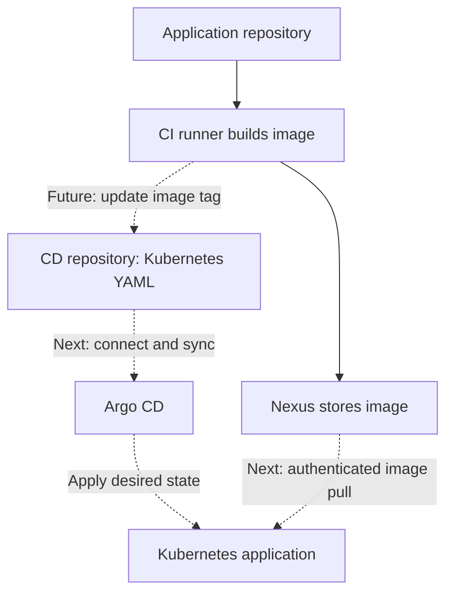
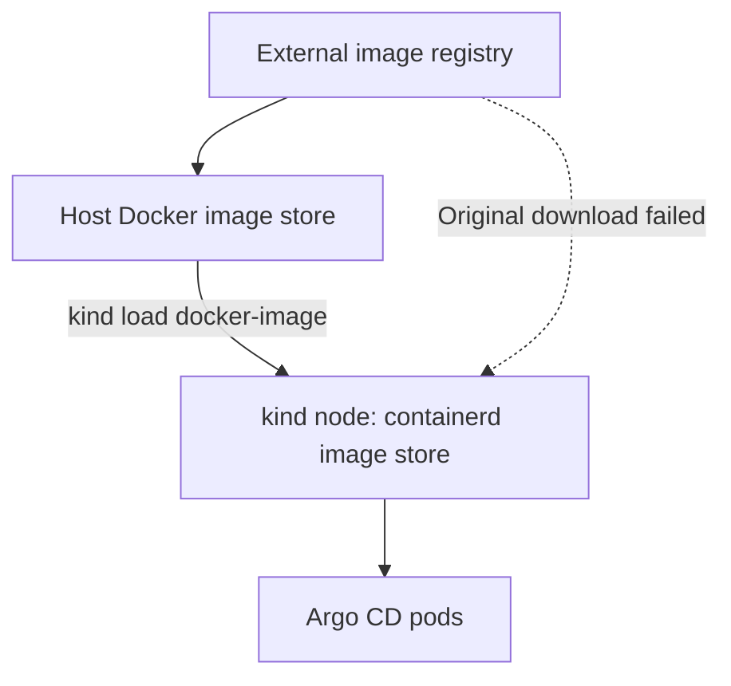
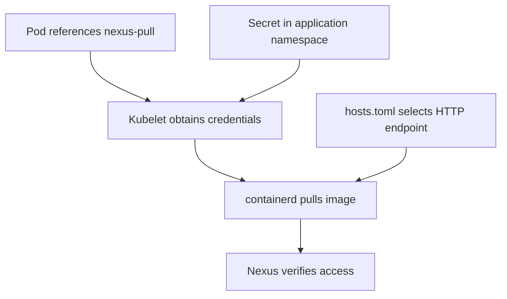

# 🚀 Behroox’s HomeLab — CD Progress Guide

**Checkpoint: 30 September 2026 · Argo CD installed, manifests pushed, registry transport configured**

> 🧭 **Start here:** Argo CD is running and its dashboard works. Our application instructions are in Gitea. We have configured the kind node to contact Nexus over HTTP. We have **not yet deployed the application through Argo CD**.
>
> This is a reproducible guide to our progress so far, with the remaining work clearly marked. Read one numbered step at a time; you do not need to memorize the whole document.

## 🗺️ The big picture



**CI produces the image. CD puts that image into service.** Git holds the desired application configuration; Nexus holds the container image. Argo CD reads Git and tells Kubernetes what should run. The Kubernetes node downloads the image from Nexus.

Argo CD does not automatically deploy an image merely because it appeared in Nexus. Our intended automation will update the image reference in the CD repository.

## ✅ Where we stopped

| Milestone | Status at this checkpoint |
|---|---|
| kind node ready | ✅ Confirmed |
| Argo CD installed; images loaded into kind | ✅ Confirmed |
| Argo CD dashboard login | ✅ Confirmed |
| CD repository with Deployment and Service | ✅ Pushed to Gitea |
| Nexus reachable from inside kind node | ✅ HTTP 401 response received |
| containerd HTTP registry configuration | ✅ Steps followed; node and Argo CD healthy afterward |
| Actual authenticated application image pull | ⏳ Not yet verified |
| Nexus `k8s-pull` account and application namespace | ⏳ Instructions given; completion not yet confirmed |
| Kubernetes `nexus-pull` Secret | ⏳ Not created in the recorded session |
| Argo CD repository connection and Application | ⏳ Pending |
| First sync and application verification | ⏳ Pending |
| Automatic sync and CI update of CD repository | ⏳ Pending |

> 📍 **Resume point:** Create/verify the read-only Nexus account and `pipeline-lab` namespace, then create the pull Secret. Do not repeat the completed installation just to resume.

## ⚡ Quick reference — inspection commands

Run these on the **Rocky desktop**, unless otherwise stated.

```bash
kubectl config current-context
kubectl get nodes -o wide
kubectl get pods -n argocd
kubectl get ns

docker exec behrouz-first-control-plane systemctl is-active containerd

git status
git remote -v
git log -1 --oneline
```

Expected context: `kind-behrouz-first`. Expected node: `behrouz-first-control-plane`, with status `Ready`. Argo CD pods should show all containers ready, such as `1/1 Running`.

The Git commands must run inside `pipeline-lab-deploy` to inspect the CD repository.

## 🧰 Our environment and prerequisites

| Item | Value used in this session |
|---|---|
| Host | Rocky Linux desktop, `192.168.1.23` |
| Kubernetes distribution | kind; this is the desktop cluster |
| kind cluster name | `behrouz-first` |
| kubectl context | `kind-behrouz-first` |
| Node container | `behrouz-first-control-plane` |
| Kubernetes version shown | `v1.36.1` |
| Other cluster | k3s on the laptop; not used in these steps |
| Gitea | `http://192.168.1.23:3000` |
| Application repository | `behroox/pipeline-lab` |
| CD repository | `behroox/pipeline-lab-deploy` |
| CD branch and directory | `main`, **`manifest/`** — singular |
| Nexus UI | `http://192.168.1.23:8081` |
| Nexus Docker endpoint | `192.168.1.23:5043`, serving HTTP |
| Nexus hosted repository | `Behr00z-repo` |
| Argo CD namespace | `argocd` |
| Planned application namespace | `pipeline-lab` |
| Planned pull Secret | `nexus-pull` |

Before reproducing: Docker, kind, kubectl, and Git must work; the cluster must exist; Gitea and Nexus must be available; and the application image must already have been published by CI. This guide starts after that CI setup.

**Application image used:**

```text
192.168.1.23:5043/lab/pipeline-lab:28a66a24fe707319c05423c88e141ec93644e0f0
```

That long tag is the application’s full Git commit SHA. It connects an image to its source revision. The local Docker image ID, `7ea18fae93e5`, is a different identifier. The SHA naming convention is useful, but tags are only immutable if registry policy prevents overwriting them.

## 1. 🔎 Check the cluster before installation

```bash
kubectl config current-context
kubectl get nodes -o wide
kubectl get pods -n argocd
kubectl get ns
```

We saw a Ready kind node and no `argocd` namespace or pods.

### What does a context do?

A context selects a Kubernetes cluster, credentials, and an optional default namespace. `--context kind-behrouz-first` selects it for a single command without changing the default.

We omitted that flag afterward at Behroox’s request because the desktop’s current context was already correct. Commands still follow the selected kubeconfig context; the physical location of another cluster does not itself prevent access to it.

## 2. 📦 Install Argo CD

**Fresh installation only:** create the namespace if it does not already exist.

```bash
kubectl create namespace argocd
```

The command used in our session was:

```bash
kubectl apply --server-side -n argocd \
  -f https://raw.githubusercontent.com/argoproj/argo-cd/stable/manifests/install.yaml
```

### What does this do?

- `apply` creates or updates objects from YAML.
- `-n argocd` places namespaced components in `argocd`. The bundle also contains cluster-scoped objects such as CRDs and permissions.
- `--server-side` asks the API server to manage application of the configuration. It avoids the large last-applied annotation used by client-side apply, which can cause problems with large CRDs.
- `-f` specifies the manifest location.

**For reproducing the observed version later**, use the versioned manifest instead of the moving `stable` reference:

```bash
kubectl apply --server-side -n argocd \
  -f https://raw.githubusercontent.com/argoproj/argo-cd/v3.5.3/manifests/install.yaml
```

This is a reproduction alternative, not a second installation command to run now. Review compatibility when rebuilding on a different Kubernetes release. Do not repeatedly apply the moving `stable` manifest just to check status: it may upgrade the installation.

Watch startup:

```bash
kubectl get pods -n argocd -w
```

`Ctrl+C` stops the watch only; it does not stop the pods.

## 3. 🚚 Fix the image availability problem

The cluster could not download required images. The underlying download failure was not diagnosed conclusively. We worked around it by downloading images on the host and loading them into kind.



**Why loading was necessary:** kind nodes are containers, and Kubernetes inside them uses its own containerd image store. A successful host `docker pull` does not automatically populate that store.

If rebuilding and these images are absent on the host:

```bash
docker pull quay.io/argoproj/argocd:v3.5.3
docker pull public.ecr.aws/docker/library/redis:8.2.3-alpine
```

Load the images we obtained:

```bash
kind load docker-image \
  quay.io/argoproj/argocd:v3.5.3 \
  public.ecr.aws/docker/library/redis:8.2.3-alpine \
  --name behrouz-first
```

`--name` takes the **kind cluster name**, not the kubeconfig context name.

Then check:

```bash
kubectl get pods -n argocd -w
```

✅ All Argo CD pods eventually ran. These two images were the ones manually loaded in our session; they are not a complete list of every image a fresh installation may need.

To list regular and init-container images and pull policies:

```bash
kubectl get pods -n argocd \
  -o custom-columns='POD:.metadata.name,IMAGES:.spec.containers[*].image,POLICY:.spec.containers[*].imagePullPolicy,INIT_IMAGES:.spec.initContainers[*].image,INIT_POLICY:.spec.initContainers[*].imagePullPolicy'
```

Names and tags must match exactly. `IfNotPresent` allows a cached image to be used. `Always` may still require contacting the registry to resolve the reference.

For a stuck pod, replace `POD_NAME` with its real name:

```bash
kubectl describe pod POD_NAME -n argocd
```

Read the **Events** section before deciding whether the cause is a missing image, connectivity, or authentication.

## 4. 🌐 Open the dashboard

Run and keep this terminal open:

```bash
kubectl port-forward -n argocd svc/argocd-server 8080:443
```

Open **https://localhost:8080** in a browser on the desktop. The initial self-signed certificate causes a browser warning for this local endpoint.

| Part | Meaning |
|---|---|
| `8080` | Listening port on your desktop |
| `443` | Argo CD Service port |
| `svc/argocd-server` | Service receiving forwarded traffic |

If port 8080 is occupied, use `8082:443` and browse to `https://localhost:8082`.

In another terminal, retrieve the initial password:

```bash
kubectl -n argocd get secret argocd-initial-admin-secret \
  -o jsonpath='{.data.password}' | base64 -d
printf '\n'
```

Log in as **`admin`**, using the output privately. The session confirmed dashboard access. Changing the password via **User Info → Update Password** was instructed, but not explicitly confirmed.

After changing it and confirming the new login works, the initial Secret can be removed:

```bash
kubectl -n argocd delete secret argocd-initial-admin-secret
```

That cleanup was not recorded as completed. The initial password is not a way to retrieve a subsequently changed password.

> 💡 Port-forwarding is temporary. Restart it when returning to the dashboard. It binds to localhost by default; it does not expose the UI across the LAN.

## 5. 📂 Create the CD repository

In Gitea, we instructed creation of:

| Setting | Value |
|---|---|
| Owner | `behroox` |
| Name | `pipeline-lab-deploy` |
| Visibility | Private |
| Initial README | Yes |
| Default branch | `main` |

Clone alongside the application repository, only if a clone does not already exist:

```bash
cd /home/behroox/Behrouz_ghastly_projects
git clone http://192.168.1.23:3000/behroox/pipeline-lab-deploy.git
cd pipeline-lab-deploy
mkdir -p manifest
```

Use your actual parent directory if different. The repository and push are confirmed; private visibility was requested but not separately inspected.

**Our actual committed directory is `manifest/`, singular.** Early instructions used `manifests/`; we adapted to the directory you created. Argo CD must later use `manifest` as its source path.

## 6. 📝 Write the desired application state

The following is the YAML supplied during our session. The Git output confirmed both files were committed; their on-disk contents were not independently read back. These are the intended definitions for reproduction.

### `manifest/deployment.yaml`

```yaml
apiVersion: apps/v1
kind: Deployment
metadata:
  name: pipeline-lab
spec:
  replicas: 1
  selector:
    matchLabels:
      app: pipeline-lab
  template:
    metadata:
      labels:
        app: pipeline-lab
    spec:
      imagePullSecrets:
        - name: nexus-pull
      containers:
        - name: nginx
          image: 192.168.1.23:5043/lab/pipeline-lab:28a66a24fe707319c05423c88e141ec93644e0f0
          imagePullPolicy: IfNotPresent
          ports:
            - name: http
              containerPort: 80
          resources:
            requests:
              cpu: 50m
              memory: 32Mi
            limits:
              cpu: 250m
              memory: 128Mi
          readinessProbe:
            httpGet:
              path: /
              port: http
            initialDelaySeconds: 3
            periodSeconds: 5
```

| Field | Plain-language meaning |
|---|---|
| `replicas: 1` | Keep one application pod running |
| Selector and pod labels | Identify the pods belonging to this Deployment |
| `image` | Exact registry, repository path, and tag to run |
| `imagePullSecrets` | Reference credentials Kubernetes should use to pull the image |
| `containerPort` | Describe the application port; this alone does not expose it externally |
| CPU request `50m` | Scheduling request of 0.05 CPU |
| CPU limit `250m` | CPU usage cap of 0.25 CPU |
| Memory request / limit | Schedule for 32 MiB; enforce a 128 MiB limit |
| Readiness probe | Check `/` on port 80 before routing Service traffic to the pod |

A readiness failure removes the pod from ready Service endpoints; it does not itself restart the container. We did not add a liveness probe in this example.

### `manifest/service.yaml`

```yaml
apiVersion: v1
kind: Service
metadata:
  name: pipeline-lab
spec:
  type: ClusterIP
  selector:
    app: pipeline-lab
  ports:
    - name: http
      port: 80
      targetPort: http
```

This creates a stable internal endpoint. The selector finds our application pods, and `targetPort: http` refers to the named container port in the Deployment.

Neither file specifies a namespace. We will configure Argo CD’s destination namespace as `pipeline-lab`. Applying these files manually without `-n` would use kubectl’s default namespace, so leave their deployment to Argo CD for this exercise.

## 7. 📤 Commit and push

Inside the CD repository:

```bash
git add manifest/deployment.yaml manifest/service.yaml
git diff --cached
git commit -m "Add pipeline-lab deployment & service"
git push origin main
```

What happened:

| Action | Result |
|---|---|
| `git add` | Select changes for the next commit |
| `git diff --cached` | Review exactly what will be committed |
| `git commit` | Save the snapshot locally |
| `git push` | Send the commit to Gitea |

✅ Recorded commit: **`7534e4e`**, with **2 files changed, 48 insertions**. Remote branch `main` advanced from `34cc82e` to `7534e4e`.

Git reported an automatically selected identity, `Behrouz ShakeriFard <behroox@desktop.home.arpa>`. This did not prevent the commit. For future commits, you can set your preferred identity inside the repository:

```bash
git config user.name "Behrouz ShakeriFard"
git config user.email "YOUR_PREFERRED_EMAIL"
```

Replace the email placeholder. Add `--global` only if you want that identity for all repositories. There is no need to amend the already pushed commit for this lab.

The `canberra-gtk-module` warning did not block the push either.

> 🔍 The CD commit `7534e4e` describes deployment configuration. The image tag identifies a separate application-source commit. They need not match.

## 8. 🔌 Test Nexus from inside the node

```bash
docker exec behrouz-first-control-plane \
  curl --noproxy '*' -sS -i --connect-timeout 5 --max-time 10 \
  http://192.168.1.23:5043/v2/
```

### Read the command slowly

- `docker exec`: run a command inside an existing container.
- `behrouz-first-control-plane`: the kind node container.
- `--noproxy '*'`: avoid proxy routing for this test.
- `-sS -i`: show errors and HTTP headers without the progress meter.
- Timeouts: prevent an unreachable endpoint from hanging indefinitely.
- `/v2/`: the container registry API endpoint.

We received:

```text
HTTP/1.1 401 Unauthorized
Docker-Distribution-Api-Version: registry/2.0
WWW-Authenticate: Bearer realm="http://192.168.1.23:5043/v2/token",...
```

**That was useful success:** the node reached the registry over HTTP, and Nexus asked for credentials. It did not prove that a login or image pull would succeed.

| Result | Interpretation |
|---|---|
| `200` | Endpoint reachable; this request permitted anonymously |
| `401` | Endpoint reachable; authentication required |
| Timeout | Investigate routing, firewall, or service availability |
| Connection refused | Investigate listener, port mapping, or service state |

## 9. 🧠 Understand the three pieces of registry access



| Question | Configuration responsible |
|---|---|
| Can the node reach Nexus? | Networking and registry listener |
| Should it connect using HTTP or HTTPS? | containerd registry configuration |
| Which credentials and permissions apply? | Pull Secret and Nexus account |

A pull Secret cannot fix an HTTPS-to-HTTP mismatch. A correct HTTP endpoint cannot grant permission to a private image. Both pieces are needed.

Our HTTP setup is specific to this lab. HTTP does not encrypt registry credentials/tokens or traffic; a production-style setup should use trusted TLS.

## 10. 🔧 Inspect containerd before editing

We ran:

```bash
docker exec behrouz-first-control-plane \
  sh -c 'containerd config dump | grep -A 8 -B 2 config_path'
```

The effective output included:

```toml
[plugins.'io.containerd.cri.v1.images'.registry]
  config_path = ''
```

An empty `config_path` meant this registry-host configuration directory was not set. It did **not** mean containerd could never pull public images; it meant it was not configured to read our planned `hosts.toml` directory.

We then inspected the stored file:

```bash
docker exec behrouz-first-control-plane \
  sh -c 'head -n 25 /etc/containerd/config.toml; grep -n -A 12 -B 3 registry /etc/containerd/config.toml'
```

It began with:

```toml
version = 2
```

and used sections named:

```toml
[plugins."io.containerd.grpc.v1.cri"]
```

### Why were the names different?

The installed containerd reads this older v2 format and converts it internally. `config dump` displays the effective configuration using newer plugin names. We therefore added the **v2 section matching the stored file**, rather than mixing formats.

## 11. 🛠️ Configure HTTP access to Nexus

These are **node configuration changes**, not files for the CD repository. Run them from the desktop; `docker exec` places the changes inside the kind node.

### A. Back up first

For the initial change we used:

```bash
docker exec behrouz-first-control-plane \
  cp -a /etc/containerd/config.toml /etc/containerd/config.toml.before-nexus
```

**Do not overwrite this backup when repeating the guide after the change.** It must retain the pre-change configuration. For another future change, choose a different backup filename.

### B. Set the registry configuration directory

Only append this if the registry table does not already exist. If it exists, edit its `config_path` instead; duplicate TOML tables cause errors.

```bash
docker exec -i behrouz-first-control-plane \
  sh -c 'cat >> /etc/containerd/config.toml' <<'EOF'

[plugins."io.containerd.grpc.v1.cri".registry]
  config_path = "/etc/containerd/certs.d"
EOF
```

`-i` keeps standard input open so Docker can pass the block into the container. `>>` appends. The quoted `EOF` marker prevents the host shell from expanding anything inside the block.

### C. Add the registry’s host file

```bash
docker exec behrouz-first-control-plane \
  mkdir -p /etc/containerd/certs.d/192.168.1.23:5043
```

```bash
docker exec -i behrouz-first-control-plane \
  sh -c 'cat > /etc/containerd/certs.d/192.168.1.23:5043/hosts.toml' <<'EOF'
server = "http://192.168.1.23:5043"

[host."http://192.168.1.23:5043"]
  capabilities = ["pull", "resolve"]
EOF
```

Here `>` writes the complete file, replacing it if it exists. Preserve any existing custom configuration before using this block on a different setup.

| Setting | Meaning |
|---|---|
| Directory `192.168.1.23:5043` | Match the registry hostname/IP and port in the image reference |
| `server` and `host` URL | Select the HTTP registry endpoint |
| `pull` | Allow this endpoint to supply image content |
| `resolve` | Allow this endpoint to resolve a tag to an image digest |

These capabilities describe how containerd uses the endpoint. They do not grant Nexus repository permissions. No password goes in this file.

### D. Validate before restarting

```bash
docker exec behrouz-first-control-plane \
  containerd config dump > /dev/null
```

Immediately check the exit status if uncertain:

```bash
echo $?
```

`0` indicates that command completed successfully. `> /dev/null` hides normal output; warnings written to standard error remain visible. Parsing successfully does not yet prove a successful registry pull.

We saw the following warnings:

| Warning | Meaning in our session |
|---|---|
| `Configuration migrated from version 2` | Older format converted internally |
| `Ignoring unknown key ... tolerate_missing_hugepages_controller` | This old option is ignored by the installed runtime |

They were already present before our change. We did not migrate or rewrite the complete configuration merely to remove them. If you see a TOML parse error or nonzero exit code, fix or restore the file before restarting.

### E. Restart and inspect

```bash
docker exec behrouz-first-control-plane \
  systemctl restart containerd
```

```bash
docker exec behrouz-first-control-plane \
  systemctl is-active containerd

kubectl get nodes
kubectl get pods -n argocd
```

Restarting loads the changed main configuration and can briefly interrupt runtime operations. Expected service output is `active`.

✅ The user’s subsequent output showed the node **Ready** and all seven Argo CD pods **1/1 Running**, with zero restarts. The `is-active` output itself was not pasted, and an authenticated Nexus image pull remains untested.

Optional effective-setting verification:

```bash
docker exec behrouz-first-control-plane \
  sh -c 'containerd config dump | grep -A 3 "images.*registry"'
```

Look for `/etc/containerd/certs.d` in the effective registry section.

### 🛟 Recovery if the runtime fails after your edit

Inspect the service log:

```bash
docker exec behrouz-first-control-plane \
  journalctl -u containerd -n 60 --no-pager
```

If the newly edited configuration caused the failure, restore the known pre-change backup:

```bash
docker exec behrouz-first-control-plane \
  cp -a /etc/containerd/config.toml.before-nexus /etc/containerd/config.toml

docker exec behrouz-first-control-plane \
  systemctl restart containerd
```

Recheck service status and node readiness. This removes the new main-file setting; the unused `hosts.toml` can remain while you investigate. Recovery was not needed in our session.

> 💾 These changes and loaded images live inside the existing kind node. Deleting and recreating the cluster loses them unless you reproduce or automate the setup. A routine service restart does not delete them.

## 12. 🔐 Next step: read-only Nexus access — not yet confirmed complete

### Why create another account?

`gitea-ci` publishes images and needs push permissions. Kubernetes only downloads them. A separate `k8s-pull` account gives the cluster only the access it needs.

In **Nexus → Security → Roles → Create role → Nexus role**:

| Field | Value |
|---|---|
| Role ID | `k8s-pull` |
| Role name | `Kubernetes image reader` |

Add these repository privileges:

```text
nx-repository-view-docker-Behr00z-repo-browse
nx-repository-view-docker-Behr00z-repo-read
```

In **Security → Users → Create local user**:

- User ID: `k8s-pull`.
- Status: Active.
- Assign `Kubernetes image reader`.
- Set a private password and fill in required name/email fields.
- Avoid unrelated roles granting write or administration access.

Then inspect whether the application namespace already exists:

```bash
kubectl get namespace pipeline-lab
```

If it returns `NotFound`, create it:

```bash
kubectl create namespace pipeline-lab
```

### What is `nexus-pull`?

It will be a Kubernetes Secret of type `kubernetes.io/dockerconfigjson`, containing registry authentication information. The Deployment refers to it through `imagePullSecrets`.

| Name | What it identifies |
|---|---|
| `k8s-pull` | Nexus login account; also our chosen role ID |
| `nexus-pull` | Kubernetes Secret name |
| `pipeline-lab` | Namespace containing the application and Secret |
| `argocd` | Namespace containing Argo CD components |

The kubelet uses the Secret when requesting an image pull from containerd. The Secret must be in the **same namespace as the application pod**. The application does not need it mounted as a file.

Base64 encoding is not encryption. Keep credentials out of Git, screenshots, and shared command output. We have not yet issued the Secret-creation procedure in this session; that is our next hands-on step after account creation is confirmed.

## 🧭 Remaining route to a complete pipeline

1. Confirm the Nexus read-only account and `pipeline-lab` namespace.
2. Create `nexus-pull` privately and verify an authenticated image pull.
3. Connect Argo CD to the private Gitea CD repository using repository credentials, distinct from Nexus credentials.
4. Create an Argo CD Application targeting branch `main`, path `manifest`, and namespace `pipeline-lab`.
5. Manually sync and verify the application through its Service.
6. Enable automated synchronization once the manual deployment works.
7. Extend CI to update the image reference in the CD repository after publishing an image.
8. Test a code change end to end and practice a Git-based rollback.

For our lab, manual Sync is the deployment approval point. Automatic Sync removes that manual step for changes in Git. A full continuous-deployment pipeline also needs the upstream build, checks, image publication, and Git update to be automated.

## 🩺 Troubleshooting at a glance

| Symptom | First check / lesson |
|---|---|
| Image exists in Docker but pod cannot use it | Load it into kind; the stores are separate |
| `ImagePullBackOff` | Read pod Events; verify exact image/tag, credentials, transport, and network |
| `HTTP response to HTTPS client` | Check the node’s HTTP registry configuration |
| Registry `/v2/` returns 401 without credentials | Reachability confirmed; authentication still needed |
| `FailedToRetrieveImagePullSecret` | Check Secret name and namespace |
| Argo CD dashboard unavailable | Verify pods and restart local port-forward |
| TOML duplicate-table error | Registry block may have been appended more than once |
| Config migration warnings | Separate known compatibility warnings from actual parse failures |
| Argo CD cannot find manifests later | Source path must be `manifest`, singular |
| Git push succeeds with GTK warnings | The warning did not invalidate the recorded push |

## 🎓 Lessons worth keeping

- A successful test proves only what it tested: HTTP 401 proves connectivity, not pull authorization.
- Git records desired state; a pushed YAML file does not deploy itself.
- Argo CD’s Git credentials and Kubernetes’ registry credentials serve different purposes.
- A running container and its image cache belong to a particular runtime environment.
- Inspect the configuration stored on disk before copying plugin sections from effective output.
- Back up once before changing a runtime configuration, then validate before restarting.
- Readiness checks and health output are useful checkpoints, but the application’s actual image pull and deployment must still be tested.

## 📚 Reference documentation

These references explain the mechanisms used here; this guide records our specific session values and checkpoint.

- [Argo CD getting started](https://argo-cd.readthedocs.io/en/stable/getting_started/)
- [kind: loading an image into a cluster](https://kind.sigs.k8s.io/docs/user/quick-start/#loading-an-image-into-your-cluster)
- [containerd registry host configuration](https://github.com/containerd/containerd/blob/main/docs/hosts.md)
- [containerd CRI registry configuration](https://github.com/containerd/containerd/blob/main/docs/cri/registry.md)
- [Kubernetes: pulling from a private registry](https://kubernetes.io/docs/tasks/configure-pod-container/pull-image-private-registry/)

---

**🏁 Checkpoint saved:** infrastructure prepared; first Argo CD application deployment still ahead. Resume at the read-only Nexus account and pull Secret.
