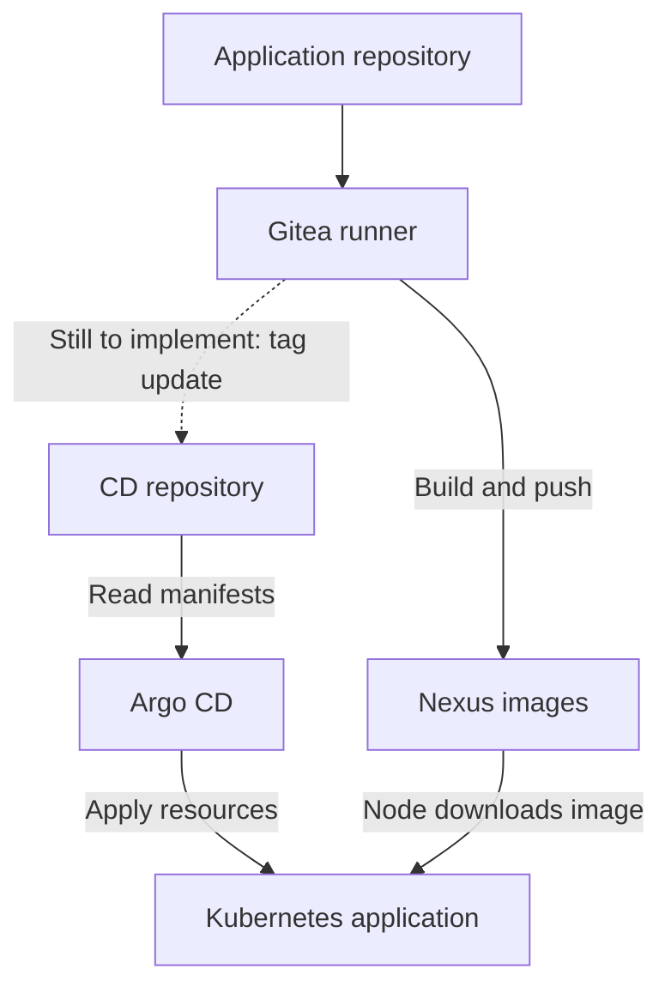

# 🚀 Behroox’s HomeLab CD — Part 2: From Credentials to Automatic Sync

**Technical reproduction guide · checkpoint: 1 October 2026**

> ✅ **What we achieved:** Kubernetes runs `pipeline-lab`; Argo CD reports **Synced & Healthy**; its connection to Gitea works; automatic sync and self-healing are enabled.
>
> 🔧 **What is still missing:** the CI workflow must update the image tag in the CD repository after pushing a new image. An end-to-end automated update has not yet been tested.

This replaces the brief second-stage summary with executable procedures. It includes the work after containerd configuration: Nexus access, the pull Secret, repository connection, the Argo CD Application, first synchronization, browser access, and automatic synchronization. A rebuild appendix covers prerequisites on another machine.

## 🗺️ Understand the connections



The Git connection delivers **instructions**. The Nexus connection delivers **image content**. They use different credentials. Argo CD does not need the Nexus password to read your Deployment YAML.

## 🧭 Values to preserve or replace

Commands below use our exact values. On another machine, replace the addresses, node container name, repository owner, paths, and image tag where appropriate. The workstation running kubectl must have access to the intended cluster.

| Setting | Our value |
|---|---|
| Desktop / registry host | `192.168.1.23` |
| kind cluster / node | `behrouz-first` / `behrouz-first-control-plane` |
| Current kubeconfig context | `kind-behrouz-first` |
| Gitea | `http://192.168.1.23:3000` |
| CD repository | `http://192.168.1.23:3000/behroox/pipeline-lab-deploy.git` |
| Source branch / directory | `main` / **`manifest`**, singular |
| Nexus UI / registry | port `8081` / port `5043` |
| Nexus hosted repository | `Behr00z-repo` |
| Nexus read-only account | `k8s-pull` |
| Application namespace / name | `pipeline-lab` / `pipeline-lab` |
| Registry Secret | `nexus-pull` |
| Argo CD namespace | `argocd` |
| Argo CD version observed | `v3.5.3` |

Exact image:

```text
192.168.1.23:5043/lab/pipeline-lab:28a66a24fe707319c05423c88e141ec93644e0f0
```

The tag names the application-source commit. The initial CD configuration commit was `7534e4e`; it belongs to a different repository.

## ⚡ Safe inspection cheat sheet

```bash
kubectl config current-context
kubectl get nodes
kubectl get pods -n argocd
kubectl get secret nexus-pull -n pipeline-lab
kubectl get application pipeline-lab -n argocd
kubectl get deployment,pods,service -n pipeline-lab
kubectl get events -n pipeline-lab --sort-by=.metadata.creationTimestamp
```

Run these as status checks; they do not print Secret contents. A missing resource is expected before its creation step.

## 1. 🔌 Verify the prerequisites

Before starting Part 2, Argo CD must be installed and reachable; the CD repository must contain the manifests; and the node must be able to contact Nexus.

```bash
kubectl get nodes
kubectl get pods -n argocd
```

Expected: node `Ready`, Argo CD pods `1/1 Running`.

For our kind node:

```bash
docker exec behrouz-first-control-plane \
  curl --noproxy '*' -sS -i --connect-timeout 5 --max-time 10 \
  http://192.168.1.23:5043/v2/
```

We received **HTTP 401**, proving connectivity but not authentication. Nexus advertised its token URL under `http://192.168.1.23:5043/v2/token`.

Check the runtime’s effective configuration:

```bash
docker exec behrouz-first-control-plane \
  sh -c 'containerd config dump | grep -A 3 "images.*registry"'
```

Our registry configuration should contain `config_path = '/etc/containerd/certs.d'` or its double-quoted equivalent. Appendix A covers the setup if rebuilding.

## 2. 🔑 Create a read-only Nexus identity

In Nexus at **http://192.168.1.23:8081**, sign in as an administrator.

Open **Security → Roles → Create role → Nexus role**:

| Field | Value |
|---|---|
| Role ID | `k8s-pull` |
| Role name | `Kubernetes image reader` |

Select these privileges:

```text
nx-repository-view-docker-Behr00z-repo-browse
nx-repository-view-docker-Behr00z-repo-read
```

Then open **Security → Users → Create local user**:

- User ID: `k8s-pull`.
- Status: Active.
- Complete required name/email fields.
- Choose a private password.
- Assign `Kubernetes image reader`.

A **role** bundles permissions. A **user** has credentials and receives roles. Kubernetes only needs image read access; CI’s `gitea-ci` identity has separate push permissions.

The exact role assignment was not independently inspected afterward. The Secret and successful deployment were confirmed later in the session.

## 3. 📁 Create the application namespace

```bash
kubectl get namespace pipeline-lab
```

If the result is `NotFound`:

```bash
kubectl create namespace pipeline-lab
```

✅ The user confirmed this namespace was created.

`argocd` contains the delivery controller. `pipeline-lab` contains the application and its registry Secret. These serve different purposes even though both are on the same cluster.

## 4. 🔐 Create the pull Secret without a literal password in history

### Correction to the original instruction

The earlier command used `--docker-password='YOUR_PASSWORD_HERE'`. Replacing that placeholder in a typed command can put the password in shell history and process arguments. It did not meet our stated history requirement.

**Use the procedure below for reproduction or credential rotation.** This is an improved replacement procedure, not the exact original method. It requires Python 3, kubectl, and an interactive terminal. The password is read from the terminal without echo and passed directly to kubectl through a pipe; no credentials file is created.

```bash
set -o pipefail
python3 - <<'PY' | kubectl apply --server-side --field-manager=homelab-secrets -f -
import base64
import getpass
import json
import warnings

# Refuse a fallback that could echo the password when no terminal is available.
warnings.simplefilter('error', getpass.GetPassWarning)
registry = '192.168.1.23:5043'
username = 'k8s-pull'
password = getpass.getpass('Nexus k8s-pull password: ')
if not password:
    raise SystemExit('Empty password: no Secret was generated.')
auth = base64.b64encode(f'{username}:{password}'.encode()).decode()
config = {'auths': {registry: {'auth': auth}}}
encoded_config = base64.b64encode(json.dumps(config).encode()).decode()
secret = {
    'apiVersion': 'v1',
    'kind': 'Secret',
    'metadata': {'name': 'nexus-pull', 'namespace': 'pipeline-lab'},
    'type': 'kubernetes.io/dockerconfigjson',
    'data': {'.dockerconfigjson': encoded_config},
}
print(json.dumps(secret))
PY
```

Enter the password only at the hidden prompt. No characters appearing while typing is expected. Do not redirect the generated JSON to a file, add `tee`, or publish Secret YAML.

The code creates registry authentication JSON, encodes it into the Kubernetes Secret data field, and sends it to the API. Encoding is **not encryption**; the Secret still needs normal Kubernetes access protection. The Nexus connection in this lab uses HTTP, so avoiding shell history does not encrypt network traffic.

If updating an existing Secret causes a server-side ownership conflict, stop and inspect the named field/manager rather than using `--force-conflicts` blindly.

### Verify without disclosing the password

```bash
kubectl get secret nexus-pull -n pipeline-lab
kubectl describe secret nexus-pull -n pipeline-lab
```

Observed result:

```text
NAME         TYPE                             DATA
nexus-pull   kubernetes.io/dockerconfigjson     1
```

This confirms existence and format, not that Nexus accepts its password. Kubernetes registry Secrets must be referenced from the pod’s namespace. [Kubernetes reference](https://kubernetes.io/docs/tasks/configure-pod-container/pull-image-private-registry/)

If you used the earlier literal-password command, rotate the `k8s-pull` password in Nexus and update this Secret with the hidden-prompt method. Rotation invalidates the old password even if a historical copy remains. Rotation was advised but not confirmed completed.

## 5. 📝 Check the two Git manifests

Inside the CD clone, verify:

```bash
cd /home/behroox/Behrouz_ghastly_projects/pipeline-lab-deploy
git status
git remote -v
git ls-files manifest
```

The files should be `manifest/deployment.yaml` and `manifest/service.yaml`. The following definitions reproduce our intended application configuration.

### Deployment

```yaml
apiVersion: apps/v1
kind: Deployment
metadata:
  name: pipeline-lab
spec:
  replicas: 1
  selector:
    matchLabels:
      app: pipeline-lab
  template:
    metadata:
      labels:
        app: pipeline-lab
    spec:
      imagePullSecrets:
        - name: nexus-pull
      containers:
        - name: nginx
          image: 192.168.1.23:5043/lab/pipeline-lab:28a66a24fe707319c05423c88e141ec93644e0f0
          imagePullPolicy: IfNotPresent
          ports:
            - name: http
              containerPort: 80
          resources:
            requests:
              cpu: 50m
              memory: 32Mi
            limits:
              cpu: 250m
              memory: 128Mi
          readinessProbe:
            httpGet:
              path: /
              port: http
            initialDelaySeconds: 3
            periodSeconds: 5
```

### Service

```yaml
apiVersion: v1
kind: Service
metadata:
  name: pipeline-lab
spec:
  type: ClusterIP
  selector:
    app: pipeline-lab
  ports:
    - name: http
      port: 80
      targetPort: http
```

The Deployment keeps one replica running. Its pod labels match the Service selector. The readiness check tests `/`; the Service sends traffic to ready pods. The pull Secret is referenced by name, with no password in Git.

The files omit `metadata.namespace`; the Argo CD destination will supply `pipeline-lab`. Do not manually apply them into the default namespace.

If recreating the files, commit and push:

```bash
git add manifest/deployment.yaml manifest/service.yaml
git diff --cached
git commit -m "Add pipeline-lab deployment and service"
git push origin main
```

Skip the commit if unchanged. The original push succeeded at commit `7534e4e`.

## 6. 🔗 Connect Argo CD to private Gitea

Start the dashboard connection if necessary:

```bash
kubectl port-forward -n argocd svc/argocd-server 8080:443
```

Open **https://localhost:8080** on the machine running this command. Keep the terminal open.

In **Settings → Repositories → Connect Repo**, choose the HTTPS connection form, which also accepts an HTTP URL, and enter:

| Field | Value |
|---|---|
| Type | `git` |
| Repository URL | `http://192.168.1.23:3000/behroox/pipeline-lab-deploy.git` |
| Username | `behroox`, or a dedicated account with repository read access |
| Password | Gitea password or compatible access token with repository read permission |

Click **Connect**. ✅ The user reported **Successful**.

These credentials are for Git, not Nexus. Argo CD’s repository connection must reach Gitea from inside the cluster; `localhost:3000` would refer to the wrong network environment. Private repository authentication is described in the [Argo CD guide](https://argo-cd.readthedocs.io/en/stable/user-guide/private-repositories/).

## 7. 🎯 Create the Argo CD Application

### Route used in our session: dashboard

Open **Applications → New App**:

| Field | Value |
|---|---|
| Application Name | `pipeline-lab` |
| Project Name | `default` |
| Sync Policy | **Manual**, for the first deployment |
| Repository URL | `http://192.168.1.23:3000/behroox/pipeline-lab-deploy.git` |
| Revision | `main` |
| Path | `manifest` |
| Destination Cluster URL | `https://kubernetes.default.svc` |
| Destination Namespace | `pipeline-lab` |

Leave other options at defaults and click **Create**.

The cluster URL selects the cluster in which Argo CD is running. It is not the browser address or the desktop’s LAN address. No separate cluster registration was required for this same-cluster deployment.

### Reproduction alternative: Application YAML

Use this instead of creating the same Application in the UI. Save it as `argocd/pipeline-lab-application.yaml` in the CD clone, **outside `manifest/`** so the application does not inadvertently manage its own definition.

```yaml
apiVersion: argoproj.io/v1alpha1
kind: Application
metadata:
  name: pipeline-lab
  namespace: argocd
spec:
  project: default
  source:
    repoURL: http://192.168.1.23:3000/behroox/pipeline-lab-deploy.git
    targetRevision: main
    path: manifest
  destination:
    server: https://kubernetes.default.svc
    namespace: pipeline-lab
  syncPolicy: {}
```

```bash
kubectl apply -f argocd/pipeline-lab-application.yaml
```

The Application is a custom Kubernetes resource instructing Argo CD **where to read and where to deploy**. The registry Secret is not embedded in it. This YAML route was added for reproducibility; we used the UI originally.

## 8. 🚀 Perform the first synchronization

An initial **OutOfSync** status is expected when Git describes resources that do not exist yet.

Open the application, select **Sync → Synchronize**, and leave **Prune** and **Force** unchecked.

Watch the application:

```bash
kubectl get pods -n pipeline-lab -w
```

Use Ctrl+C to leave the watch. Then:

```bash
kubectl rollout status deployment/pipeline-lab -n pipeline-lab --timeout=180s
kubectl get deployment,pods,service -n pipeline-lab
kubectl get application pipeline-lab -n argocd
```

✅ The user reported **Synced & Healthy**, with the application pod running.

| Term | Meaning |
|---|---|
| Synced | Managed live configuration matches the desired Git configuration |
| Healthy | Argo CD’s health assessments indicate the resources are operating successfully |
| Running | Pod execution phase; also inspect container readiness, such as `1/1` |

A running pod does not alone prove a fresh authenticated registry pull if an image was cached. To see evidence of the pull, inspect pod Events:

```bash
kubectl describe pods -n pipeline-lab
```

Look for `Pulling` and `Successfully pulled image`, or an event saying the image was already present. Fresh-pull events were not supplied in our session.

## 9. 🌐 Test the page

```bash
kubectl port-forward -n pipeline-lab svc/pipeline-lab 8091:80
```

Keep this terminal open. Browse to **http://localhost:8091**, or from another terminal:

```bash
curl --noproxy '*' -fsS http://127.0.0.1:8091/
```

Expected page text:

```text
Hello from the homelab CI/CD pipeline!
```

Port 8091 is the local port; 80 is the Service port. This does not permanently publish the app to the LAN. The page test was instructed and followed by the user’s enthusiastic acknowledgment, but its exact HTTP output was not pasted.

If forwarding ends during a pod replacement, restart the command.

## 10. 🤖 Enable automatic sync and self-healing

After the successful manual deployment, we ran:

```bash
kubectl patch application pipeline-lab -n argocd \
  --type merge \
  -p '{"spec":{"syncPolicy":{"automated":{"enabled":true,"prune":false,"selfHeal":true}}}}'
```

Verify:

```bash
kubectl get application pipeline-lab -n argocd \
  -o jsonpath='{.spec.syncPolicy.automated}'
printf '\n'
```

✅ The screenshot confirmed:

```json
{"enabled":true,"prune":false,"selfHeal":true}
```

| Setting | Behavior |
|---|---|
| `enabled: true` | Automatically synchronize detected Git changes |
| `selfHeal: true` | Correct differences caused by live cluster changes |
| `prune: false` | Do not automatically delete resources removed from Git |

Detection is not necessarily instantaneous. A webhook can accelerate notification, but is not required for the normal Git checking mechanism. See [automated sync policy](https://argo-cd.readthedocs.io/en/stable/user-guide/auto_sync/).

If you maintain the alternative Application YAML, also update its `syncPolicy` to match before applying it again:

```yaml
  syncPolicy:
    automated:
      enabled: true
      prune: false
      selfHeal: true
```

### Optional validation exercise — not performed in our session

Change `replicas: 1` to `replicas: 2` in `manifest/deployment.yaml`, commit, and push. Do not click Sync. Watch for two ready pods and a new synchronized Git revision. Restore one replica with another Git commit afterward.

This tests Git-to-cluster automation independently of building a new image.

To pause automation for troubleshooting:

```bash
kubectl patch application pipeline-lab -n argocd \
  --type merge \
  -p '{"spec":{"syncPolicy":{"automated":{"enabled":false}}}}'
```

Re-enable with the earlier patch when ready. Pausing does not delete the deployed application.

## 11. 🏗️ Existing CI workflow and the precise missing step

We inspected `pipeline-lab/.gitea/workflows/build-image.yaml`. The screenshot showed this workflow:

```yaml
name: Build and publish image

on:
  push:
    branches: [main]

jobs:
  publish:
    runs-on: ubuntu-latest
    steps:
      - name: Check out code
        uses: https://gitea.com/actions/checkout@v4

      - name: Build and push to Nexus
        env:
          NEXUS_USERNAME: ${{ secrets.NEXUS_USERNAME }}
          NEXUS_PASSWORD: ${{ secrets.NEXUS_PASSWORD }}
        run: |
          set -eu
          IMAGE="192.168.1.23:5043/lab/pipeline-lab:${{ gitea.sha }}"
          docker version
          printf '%s' "$NEXUS_PASSWORD" | docker login 192.168.1.23:5043 \
            --username "$NEXUS_USERNAME" --password-stdin
          docker build -t "$IMAGE" .
          docker push "$IMAGE"
          docker logout 192.168.1.23:5043
```

This reproduces the observed workflow, not a newly completed automation stage. Its runner already had the Docker access needed for these commands; `ubuntu-latest` is its matching label, not a guarantee that every runner has Docker configured.

**The workflow currently ends after the image push/logout.** It still needs a successful-build-only step that authenticates to Gitea, clones `pipeline-lab-deploy`, updates `manifest/deployment.yaml`, and commits/pushes the image reference. Write credentials and concurrency handling for that update have not yet been configured.

Automatic sync is therefore ready, but a new image in Nexus alone will not change the running application.

## 🩺 Troubleshooting by symptom

| Symptom | Checks and next action |
|---|---|
| `FailedToRetrieveImagePullSecret` | Check `nexus-pull` exists in `pipeline-lab` and the pod references it |
| Pull fails with 401/403 | Check Nexus account status, password, repository role, and token realm |
| `HTTP response to HTTPS client` | Inspect containerd config_path and Nexus hosts.toml on the node |
| Pull fails with manifest/tag not found | Compare the full image reference against the published Nexus tag |
| Argo CD repository connection fails | Check repo URL, Gitea credentials, and reachability from the repo-server |
| Application cannot find manifests | Use `manifest`, not `manifests`; check branch and committed files |
| Synced but not Healthy | Inspect readiness, pod events, and logs; sync is not an application test |
| Git push succeeds but app image stays old | Confirm CD manifest tag changed; CI has not yet automated this |
| Manual cluster edit is reverted | Expected with self-healing enabled; change Git instead |
| Browser cannot connect | Check port-forward process, correct machine, local port, and pod readiness |

Useful diagnostics:

```bash
kubectl describe application pipeline-lab -n argocd
kubectl describe pods -n pipeline-lab
kubectl logs deployment/pipeline-lab -n pipeline-lab --tail=60
kubectl logs deployment/argocd-repo-server -n argocd --tail=60
kubectl get endpointslices -n pipeline-lab -l kubernetes.io/service-name=pipeline-lab
```

Review logs privately before sharing; redact credentials if present.

## 📦 Appendix A — Rebuilding the prerequisites on another machine

This section assumes Docker, kind, kubectl, Git, and an existing Kubernetes cluster. Installing the operating system or creating the cluster is outside this chapter. On non-kind Kubernetes, use the node’s runtime configuration procedure instead of `docker exec`.

### A1. Install Argo CD and access it

```bash
kubectl create namespace argocd
kubectl apply --server-side -n argocd \
  -f https://raw.githubusercontent.com/argoproj/argo-cd/v3.5.3/manifests/install.yaml
kubectl get pods -n argocd -w
```

Skip namespace creation if it exists. The original session used the moving `stable` manifest; the version above pins the observed version for reproduction. Validate compatibility if your rebuilt cluster differs.

If direct node image pulls fail, download the required images on the host and load into kind:

```bash
docker pull quay.io/argoproj/argocd:v3.5.3
docker pull public.ecr.aws/docker/library/redis:8.2.3-alpine
kind load docker-image \
  quay.io/argoproj/argocd:v3.5.3 \
  public.ecr.aws/docker/library/redis:8.2.3-alpine \
  --name behrouz-first
```

Those were the two images manually loaded in our session, not an exhaustive installation image list. Inspect pod Events for any additional missing images.

Start port-forwarding as in Step 6. For a fresh installation, get the initial admin password privately:

```bash
kubectl -n argocd get secret argocd-initial-admin-secret \
  -o jsonpath='{.data.password}' | base64 -d
printf '\n'
```

Log in as `admin`, change the password, verify the new login, then remove the initial Secret if still present. Do not share the command output.

### A2. Configure Nexus HTTP transport in kind

Our on-disk containerd file used **version 2**, despite the newer format displayed by `config dump`. Inspect before editing:

```bash
docker exec behrouz-first-control-plane \
  sh -c 'head -n 25 /etc/containerd/config.toml; grep -n -A 12 -B 3 registry /etc/containerd/config.toml'
```

For the same v2 layout, back up once before the change:

```bash
docker exec behrouz-first-control-plane \
  cp -a /etc/containerd/config.toml /etc/containerd/config.toml.before-nexus
```

Preserve an existing pre-change backup; do not overwrite it on reruns. Append the following only if the registry table is absent; otherwise edit the existing table:

```bash
docker exec -i behrouz-first-control-plane \
  sh -c 'cat >> /etc/containerd/config.toml' <<'EOF'

[plugins."io.containerd.grpc.v1.cri".registry]
  config_path = "/etc/containerd/certs.d"
EOF
```

For a file already using v3, the appropriate registry table is `[plugins."io.containerd.cri.v1.images".registry]`; do not paste the v2 table into it.

Create the hosts file, preserving any existing customization before replacing it:

```bash
docker exec behrouz-first-control-plane \
  mkdir -p /etc/containerd/certs.d/192.168.1.23:5043

docker exec -i behrouz-first-control-plane \
  sh -c 'cat > /etc/containerd/certs.d/192.168.1.23:5043/hosts.toml' <<'EOF'
server = "http://192.168.1.23:5043"

[host."http://192.168.1.23:5043"]
  capabilities = ["pull", "resolve"]
EOF
```

Validate first:

```bash
docker exec behrouz-first-control-plane containerd config dump > /dev/null
echo $?
```

Continue only if parsing succeeds, with exit code `0`:

```bash
docker exec behrouz-first-control-plane systemctl restart containerd
docker exec behrouz-first-control-plane systemctl is-active containerd
kubectl get nodes
kubectl get pods -n argocd
```

Our warnings about internal migration from v2 and ignored `tolerate_missing_hugepages_controller` were already present and did not prevent operation. A TOML parse error is different: fix it before restarting.

If your edit breaks the runtime:

```bash
docker exec behrouz-first-control-plane journalctl -u containerd -n 60 --no-pager
docker exec behrouz-first-control-plane \
  cp -a /etc/containerd/config.toml.before-nexus /etc/containerd/config.toml
docker exec behrouz-first-control-plane systemctl restart containerd
```

Only restore a known-good backup. Cluster recreation loses these node-local changes. In a multi-node cluster configure every node that may pull the application image.

### A3. Recreate or clone the CD repository

Create `behroox/pipeline-lab-deploy` in Gitea if absent, with private visibility, `main`, and an initial README. Then:

```bash
cd /YOUR/PROJECTS/DIRECTORY
git clone http://192.168.1.23:3000/behroox/pipeline-lab-deploy.git
cd pipeline-lab-deploy
mkdir -p manifest
```

Replace the parent-directory placeholder. If the repo already contains the files, inspect them instead of overwriting. Continue from Step 2 of this guide after prerequisites are healthy.

## 🎓 Concepts to take away

- A Secret is an API object containing sensitive data; it is not made secure merely by base64 encoding.
- Registry transport, network reachability, and account authorization are independent checks.
- The Argo CD Application joins a Git source to a Kubernetes destination.
- Synced describes configuration agreement; Healthy describes resource health.
- Manual Sync gave us a controlled first deployment. Automatic Sync is now enabled for future Git changes.
- Git is the place to change desired state when self-healing is enabled.
- Our remaining CI-to-CD handoff is a Git commit updating an image reference.

## 🏁 Exact resume point

**Completed:** pull Secret exists; Gitea connection succeeded; first Application deployed; Synced & Healthy reported; automated sync configuration confirmed in screenshot; current CI YAML inspected.

**Next:** create suitably scoped Gitea write credentials for the CI runner, store them as Actions secrets, extend the existing workflow to update `manifest/deployment.yaml`, and verify a new webpage version arrives without clicking Sync.

**Not claimed completed:** password rotation, optional replica-count test, fresh-pull event verification, automated Git image update, or full end-to-end deployment test.
