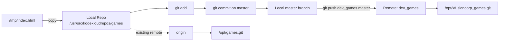

# Git Remote Management Challenge

## Challenge

The xFusionCorp development team maintains the project under:

```text
/opt/games.git
```

A clone already exists on the Storage Server at:

```text
/usr/src/kodekloudrepos/games
```

The task was to update the local repository configuration and push work to a newly added Git remote.

### Requirements

1. In `/usr/src/kodekloudrepos/games`, add a new remote named:

```text
dev_games
```

and point it to:

```text
/opt/xfusioncorp_games.git
```

2. Copy:

```text
/tmp/index.html
```

into the repository.

3. Add and commit the file on the `master` branch.

4. Push the `master` branch to the new remote.

---

# Mermaid Diagram



The local repository now knows about two remotes:

```text
Local repository
├── origin     -> /opt/games.git
└── dev_games  -> /opt/xfusioncorp_games.git
```

---

# Cheat Sheet

| Command | Purpose |
|---|---|
| `git remote -v` | List remotes and their URLs |
| `git remote add <name> <url>` | Add a new remote |
| `git status` | Show branch and working tree state |
| `git branch` | Show local branches |
| `git checkout master` | Switch to `master` |
| `cp /tmp/index.html .` | Copy the required file into the repo |
| `git add index.html` | Stage the file |
| `git commit -m "message"` | Commit staged changes |
| `git push dev_games master` | Push `master` to the new remote |
| `git ls-remote --heads dev_games` | Verify branches on the remote |
| `git config --global --add safe.directory <path>` | Trust a repo with different ownership |
| `ls -ld . .git` | Inspect repository ownership/permissions |

---

# Step-by-Step Guide

## 1. Connect to the Storage Server

From the jump host:

```bash
ssh natasha@ststor01
```

---

## 2. Enter the Repository

```bash
cd /usr/src/kodekloudrepos/games
```

Verify:

```bash
pwd
git branch
```

Expected repository:

```text
/usr/src/kodekloudrepos/games
```

---

## 3. Add the New Remote

```bash
sudo git remote add dev_games /opt/xfusioncorp_games.git
```

General syntax:

```text
git remote add <remote-name> <repository-path-or-url>
```

Verify:

```bash
git remote -v
```

Expected:

```text
dev_games  /opt/xfusioncorp_games.git (fetch)
dev_games  /opt/xfusioncorp_games.git (push)
origin     /opt/games.git (fetch)
origin     /opt/games.git (push)
```

---

## 4. Copy the Required File

```bash
sudo cp /tmp/index.html .
```

Verify:

```bash
ls -l index.html
cat index.html
```

---

## 5. Handle the Dubious Ownership Warning

Running:

```bash
git add .
```

may produce:

```text
fatal: detected dubious ownership in repository
```

If the repository is trusted:

```bash
git config --global --add safe.directory /usr/src/kodekloudrepos/games
```

This only tells Git to trust the repository.

It does **not** change filesystem permissions.

---

## 6. Handle the `.git/index.lock` Permission Error

You may then see:

```text
Unable to create '.git/index.lock': Permission denied
```

This is a filesystem permission problem.

In this lab, the repository required privileged Git operations:

```bash
sudo git add .
```

Then:

```bash
sudo git commit -m "message"
```

Example:

```text
[master <commit-id>] message
 1 file changed, 10 insertions(+)
 create mode 100644 index.html
```

---

## 7. Verify the Commit

```bash
sudo git status
```

Expected:

```text
On branch master
nothing to commit, working tree clean
```

View the latest commit:

```bash
sudo git log --oneline -1
```

Verify the file is committed on `master`:

```bash
sudo git show master:index.html
```

---

## 8. Verify the Remote Again

Before pushing:

```bash
git remote -v
```

Confirm that `dev_games` exists and points to:

```text
/opt/xfusioncorp_games.git
```

---

## 9. Push `master` to the New Remote

```bash
sudo git push dev_games master
```

The syntax is:

```text
git push <remote> <branch>
```

So here:

```text
remote = dev_games
branch = master
```

---

## 10. Verify the Remote Branch

```bash
sudo git ls-remote --heads dev_games
```

Expected output includes:

```text
<commit-hash> refs/heads/master
```

That proves the remote received the `master` branch.

---

# What Was Actually Happening?

This challenge tested more than simply copying a file.

It demonstrated that one local repository can know about multiple remotes:

```text
/usr/src/kodekloudrepos/games
        |
        +---- origin
        |       |
        |       +---- /opt/games.git
        |
        +---- dev_games
                |
                +---- /opt/xfusioncorp_games.git
```

The local repository remained the same.

We added another remote destination, created a local commit, and explicitly pushed that branch to the new remote.

---

# Lessons Learned

## 1. A Repository Can Have Multiple Remotes

A local Git repository can have several remotes, for example:

```text
origin
upstream
dev_games
backup
```

Each can point to a different repository.

---

## 2. `origin` Is Just a Conventional Name

`origin` is not special syntax.

This is valid:

```bash
git remote add dev_games /opt/xfusioncorp_games.git
```

Then:

```bash
git push dev_games master
```

means:

> Push my local `master` branch to the remote named `dev_games`.

---

## 3. `git remote add` Does Not Transfer Anything

This:

```bash
git remote add dev_games /opt/xfusioncorp_games.git
```

only stores a remote name and destination.

Actual transfer happens with commands such as:

```bash
git fetch dev_games
git pull dev_games master
git push dev_games master
```

---

## 4. Safe Directory and Filesystem Permissions Are Different

This error:

```text
fatal: detected dubious ownership
```

is a Git trust/safety issue.

This:

```bash
git config --global --add safe.directory <path>
```

solves the trust issue.

But this error:

```text
Unable to create '.git/index.lock': Permission denied
```

is an operating system permission issue.

The two are separate.

---

## 5. Push Syntax Matters

```bash
git push dev_games master
```

means:

```text
git push <remote> <branch>
```

This becomes easy to remember once you read it that way.

---

## 6. Always Verify the Remote Before Pushing

Use:

```bash
git remote -v
```

This reduces the chance of pushing to the wrong destination.

---

## 7. Verify the Remote After Pushing

A successful local commit does not prove the remote received anything.

Use:

```bash
git ls-remote --heads dev_games
```

to inspect the remote directly.

---

## 8. `sudo` Worked in the Lab, but Proper Permissions Are Better in Production

In this KodeKloud environment, the repository ownership required:

```bash
sudo git add
sudo git commit
sudo git push
```

In a real production environment, proper ownership and group permissions are usually preferable to routinely running Git as root.

---

# Troubleshooting Summary

## Problem: Dubious Ownership

Error:

```text
fatal: detected dubious ownership in repository
```

Fix:

```bash
git config --global --add safe.directory /usr/src/kodekloudrepos/games
```

---

## Problem: Cannot Create `.git/index.lock`

Error:

```text
Permission denied
```

Meaning:

The current user cannot write to Git metadata.

Lab solution:

```bash
sudo git add .
sudo git commit -m "message"
```

---

## Problem: Remote Missing

Check:

```bash
git remote -v
```

If necessary:

```bash
git remote add dev_games /opt/xfusioncorp_games.git
```

---

## Problem: Unsure Whether Push Worked

Check:

```bash
git ls-remote --heads dev_games
```

Look for:

```text
refs/heads/master
```

---

# Interview Questions

## 1. What is a Git remote?

A Git remote is a named reference to another repository.

It may point to GitHub, GitLab, Gitea, another server, a filesystem path, or a bare repository.

---

## 2. What does `git remote -v` show?

It lists configured remotes and the URLs or paths used for fetch and push operations.

---

## 3. Is `origin` a special Git keyword?

No.

It is simply the conventional default remote name commonly created by `git clone`.

---

## 4. Can one local Git repository have multiple remotes?

Yes.

For example:

```text
origin
upstream
dev_games
backup
```

---

## 5. What does this command do?

```bash
git push dev_games master
```

It pushes the local `master` branch to the remote named `dev_games`.

---

## 6. What is the difference between `git remote add` and `git push`?

`git remote add` registers a remote reference.

`git push` transfers local commits and refs to that remote.

---

## 7. What is the difference between `git fetch` and `git push`?

`git fetch` downloads remote data.

`git push` uploads local commits and branch references.

---

## 8. What is `safe.directory`?

It is a Git security mechanism used when repository ownership differs from the current user.

Example:

```bash
git config --global --add safe.directory /path/to/repo
```

It does not modify filesystem permissions.

---

## 9. Why does Git create `.git/index.lock`?

Git uses lock files to prevent multiple processes from modifying repository metadata simultaneously.

If Git cannot create the lock file, the user likely lacks write permission.

---

## 10. How do you verify that a branch exists on a remote?

```bash
git ls-remote --heads <remote>
```

Example:

```bash
git ls-remote --heads dev_games
```

---

## 11. How do you change the URL of an existing remote?

```bash
git remote set-url dev_games <new-url>
```

---

## 12. How do you remove a remote?

```bash
git remote remove dev_games
```

---

## 13. What happens if you run `git push` without a remote name?

Git uses the current branch's configured upstream if one exists.

If no upstream is configured, Git may require you to specify one.

---

## 14. How do you push and configure the upstream at the same time?

```bash
git push -u dev_games master
```

Afterward, future pushes may often be done with:

```bash
git push
```

---

# Final Verification Checklist

Before clicking **CHECK**, verify:

### Remote exists

```bash
git remote -v
```

Must include:

```text
dev_games -> /opt/xfusioncorp_games.git
```

### Working tree is clean

```bash
sudo git status
```

### Commit exists on master

```bash
sudo git log --oneline -1
```

### File exists in committed master

```bash
sudo git show master:index.html
```

### Remote has master

```bash
sudo git ls-remote --heads dev_games
```

Must include:

```text
refs/heads/master
```

---

# Final Result

```text
/usr/src/kodekloudrepos/games
        |
        +-- add dev_games remote
        |
        +-- copy /tmp/index.html
        |
        +-- git add
        |
        +-- git commit on master
        |
        +-- git push dev_games master
        |
        v
/opt/xfusioncorp_games.git
        |
        v
refs/heads/master
```

The challenge was completed successfully and covered practical Git remote management, commits, permissions troubleshooting, pushing, and remote verification.
