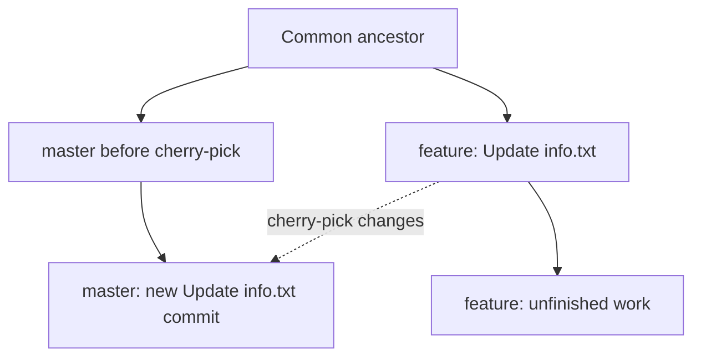

# KodeKloud Git Challenge: Cherry-Pick One Commit

## The challenge

The Nautilus application development team maintains the bare repository `/opt/cluster.git`, cloned on the Stratos DC storage server under `/usr/src/kodekloudrepos/cluster`. The repository has `master` and `feature` branches. Development on `feature` is unfinished, but the team wants **only the commit whose message is `Update info.txt`** brought into `master`. Push the result.

## Cheat sheet

```bash
cd /usr/src/kodekloudrepos/cluster
git status -sb
git log feature --oneline --grep='^Update info\.txt$'
sudo git switch master
sudo git cherry-pick 6f98fb3
sudo git push origin master
sudo git status -sb
sudo git log master -3 --oneline
```

The hash `6f98fb3` was the matching source commit in this attempt. In a fresh lab, look up the hash again. If the repository is writable by your account, omit `sudo`; here, writes to `.git` failed without it.

## How cherry-pick works



Cherry-picking applies the changes from one source commit to the checked-out branch and creates a **new commit with a different hash**. The source commit stays on `feature`; other unfinished feature commits are not merged.

## Step-by-step

### 1. Find the commit and inspect the worktree

```bash
cd /usr/src/kodekloudrepos/cluster
git status -sb
git log feature --oneline --grep='^Update info\.txt$'
```

The search returned:

```text
6f98fb3 Update info.txt
```

Check that the worktree is clean before switching branches. The anchored search narrows results to the exact message; if several commits share it, inspect their content with `git show <hash>`.

### 2. Switch to the destination branch

```bash
sudo git switch master
sudo git branch --show-current
```

The second command must print `master`. Branch selection is critical: cherry-pick applies the commit to **whichever branch is checked out**.

### 3. Apply the selected commit and push

```bash
sudo git cherry-pick 6f98fb3
sudo git push origin master
```

Git creates a new `Update info.txt` commit on `master`. The push sends the updated branch to the bare repository at `/opt/cluster.git` when `origin` points there; check with `git remote -v` if uncertain.

### 4. Verify

```bash
sudo git status -sb
sudo git log master -3 --oneline
sudo git log origin/master -1 --oneline
```

Expect a clean worktree and the new commit at the top of both local `master` and `origin/master`. The new hash will generally differ from `6f98fb3`. A push saying “Everything up-to-date” is not proof of success unless `master` already contains the intended commit.

## What went wrong during this attempt

1. `git switch master` failed: Git could not create `.git/index.lock` because of **Permission denied**. The branch therefore remained `feature`.
2. `git cherry-pick 6f98fb3` also failed without write access. Running it with `sudo` while still on `feature` produced an **empty cherry-pick**, because that branch already contained the source commit.
3. `git push origin master` said “Everything up-to-date”; no new commit had been created on `master`. A non-sudo push also reported a local tracking-ref lock permission error.
4. The correction was to abort the incomplete operation, switch to `master` with adequate permissions, cherry-pick the commit there, and push:

```bash
sudo git cherry-pick --abort
sudo git switch master
sudo git cherry-pick 6f98fb3
sudo git push origin master
```

Use `--abort` only when a cherry-pick is actually in progress. Do not use `--allow-empty` to paper over a cherry-pick attempted on the source branch.

## Troubleshooting and lessons

- **Permission denied on `.git/index.lock`:** The account cannot write repository metadata. In this lab `sudo` enabled the operation. In an ordinary team repository, fix ownership or use the intended account instead of routinely mixing root and user-owned Git files.
- **Cherry-pick conflicts:** Resolve the affected files, stage them with `git add`, then run `git cherry-pick --continue`. To cancel, use `git cherry-pick --abort`.
- **Empty cherry-pick:** Check `git branch --show-current` and whether the changes are already present. `git cherry-pick --skip` skips an empty operation, but aborting was clearer in this mistaken-branch case.
- **Core rule:** Select the destination branch **before** cherry-picking. Verify the new commit and the pushed branch before pressing KodeKloud's Check button.

## Interview questions

1. How is cherry-pick different from merging an entire branch?
2. Why does a cherry-picked commit usually receive a new hash?
3. What happens when you cherry-pick a commit onto the branch that already contains it?
4. How do you recover from a cherry-pick conflict or abort the operation?
5. Why can “Everything up-to-date” appear even though the requested work was not done?
6. What causes `.git/index.lock: Permission denied`, and how would you address it in a shared repository?
