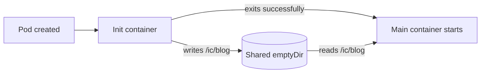

# Kubernetes Init Container with a Shared `emptyDir`



## Objective

Create a Deployment in which an init container writes a message to a shared volume before the main container starts. The main container then reads that message every five seconds.

## Complete manifest

Save as `deploy.yml`:

```yaml
apiVersion: apps/v1
kind: Deployment
metadata:
  name: ic-deploy-datacenter
  labels:
    app: ic-datacenter
spec:
  replicas: 1
  selector:
    matchLabels:
      app: ic-datacenter
  template:
    metadata:
      labels:
        app: ic-datacenter
    spec:
      initContainers:
        - name: ic-msg-datacenter
          image: fedora:latest
          command:
            - /bin/bash
            - -c
            - echo Init Done - Welcome to xFusionCorp Industries > /ic/blog
          volumeMounts:
            - name: ic-volume-datacenter
              mountPath: /ic

      containers:
        - name: ic-main-datacenter
          image: fedora:latest
          command:
            - /bin/bash
            - -c
            - while true; do cat /ic/blog; sleep 5; done
          volumeMounts:
            - name: ic-volume-datacenter
              mountPath: /ic

      volumes:
        - name: ic-volume-datacenter
          emptyDir: {}
```

## Apply and verify

Validate the manifest before creating the Deployment:

```bash
kubectl apply --dry-run=server -f deploy.yml
kubectl apply -f deploy.yml
kubectl rollout status deployment/ic-deploy-datacenter
kubectl get pods
```

The Pod should eventually show `1/1 Running`. The init container is absent from the ready count because it has already completed.

Read the main container's output:

```bash
kubectl logs deployment/ic-deploy-datacenter \
  -c ic-main-datacenter
```

Expected output:

```text
Init Done - Welcome to xFusionCorp Industries
Init Done - Welcome to xFusionCorp Industries
```

Inspect the completed init container when needed:

```bash
kubectl describe pod -l app=ic-datacenter

kubectl logs deployment/ic-deploy-datacenter \
  -c ic-msg-datacenter
```

## How it works

The init container always runs before the main container. It mounts `ic-volume-datacenter` at `/ic` and creates `/ic/blog`. After its command exits successfully, Kubernetes starts `ic-main-datacenter`.

Both containers mount the same `emptyDir`, so the main container can read the file created by the init container. The volume survives container completion and restarts while the Pod exists, but it is deleted when the Pod is removed.

## Important lesson

Declaring only the volume name is incomplete:

```yaml
volumes:
  - name: ic-volume-datacenter
```

The volume must also have a source/type:

```yaml
volumes:
  - name: ic-volume-datacenter
    emptyDir: {}
```

The names under both `volumeMounts` sections must exactly match the name under `volumes`.
