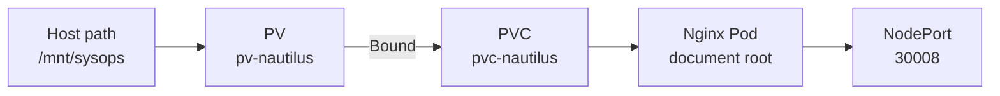

# Kubernetes PV, PVC, Nginx Pod and NodePort



## Objective

Create static persistent storage, claim it from an Nginx Pod, mount it at the web document root, and expose the Pod through a NodePort Service.

## Complete manifest

```yaml
apiVersion: v1
kind: PersistentVolume
metadata:
  name: pv-nautilus
spec:
  storageClassName: manual
  capacity:
    storage: 4Gi
  accessModes:
    - ReadWriteOnce
  persistentVolumeReclaimPolicy: Retain
  hostPath:
    path: /mnt/sysops
---
apiVersion: v1
kind: PersistentVolumeClaim
metadata:
  name: pvc-nautilus
spec:
  storageClassName: manual
  accessModes:
    - ReadWriteOnce
  resources:
    requests:
      storage: 1Gi
---
apiVersion: v1
kind: Pod
metadata:
  name: pod-nautilus
  labels:
    app: nautilus-app
spec:
  containers:
    - name: container-nautilus
      image: nginx:latest
      ports:
        - containerPort: 80
      volumeMounts:
        - name: data-storage
          mountPath: /usr/share/nginx/html
  volumes:
    - name: data-storage
      persistentVolumeClaim:
        claimName: pvc-nautilus
---
apiVersion: v1
kind: Service
metadata:
  name: web-nautilus
spec:
  type: NodePort
  selector:
    app: nautilus-app
  ports:
    - name: http
      protocol: TCP
      port: 80
      targetPort: 80
      nodePort: 30008
```

Save the resources in one file or separate them into `pv.yml`, `pvc.yml`, `pod.yml`, and `svc.yml`. Apply them in storage-to-workload order:

```bash
kubectl apply --dry-run=server -f pv.yml
kubectl apply -f pv.yml
kubectl apply -f pvc.yml
kubectl apply -f pod.yml
kubectl apply -f svc.yml
```

`kubectl create pv` is not available as an imperative generator, so the PV must be written as YAML.

## Verification

```bash
kubectl get pv,pvc
kubectl get pod pod-nautilus
kubectl get svc web-nautilus
kubectl get endpoints web-nautilus
```

Expected results:

- PV and PVC show `Bound`.
- Pod shows `1/1 Running`.
- Service shows `80:30008/TCP`.
- The Service has a Pod endpoint on port `80`.

Confirm the document-root mount:

```bash
kubectl get pod pod-nautilus \
  -o jsonpath='{.spec.containers[0].volumeMounts[0].mountPath}{"\n"}'
```

Expected output:

```text
/usr/share/nginx/html
```

## Key lessons

The PVC requests `1Gi`, but Kubernetes binds the complete `4Gi` PV because it satisfies the minimum request and matches both `manual` and `ReadWriteOnce`. Therefore, `kubectl get pvc` displays a capacity of `4Gi` after binding.

The Service selector must match the Pod label exactly. A populated endpoint proves that `web-nautilus` selected the Pod successfully. The volume name `data-storage` is internal to the Pod; its `volumeMounts` and `volumes` entries must match exactly.
