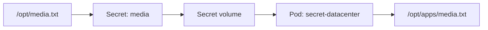

# Kubernetes Secrets: Mount a Secret as a Volume



## Quick cheat sheet

| Requirement | Value |
|---|---|
| Secret | `media` |
| Source file | `/opt/media.txt` |
| Pod | `secret-datacenter` |
| Container | `secret-container-datacenter` |
| Image | `fedora:latest` |
| Mount path | `/opt/apps` |
| Mounted key | `/opt/apps/media.txt` |

## 1. Create the Secret

Create the generic Secret directly from the existing file:

```bash
kubectl create secret generic media --from-file=/opt/media.txt
```

Confirm that it exists:

```bash
kubectl get secret media
kubectl describe secret media
```

`describe` shows the key and size, but deliberately does not reveal the secret value.

## 2. Create the Pod manifest

Save this as `pod.yml`:

```yaml
apiVersion: v1
kind: Pod
metadata:
  name: secret-datacenter
  labels:
    app: secret-datacenter
spec:
  volumes:
    - name: secret-volume
      secret:
        secretName: media
  containers:
    - name: secret-container-datacenter
      image: fedora:latest
      command:
        - sleep
        - "3600"
      volumeMounts:
        - name: secret-volume
          mountPath: /opt/apps
          readOnly: true
```

Validate before creating anything:

```bash
kubectl apply --dry-run=server -f pod.yml
kubectl apply -f pod.yml
kubectl get pod secret-datacenter
```

Wait until the Pod reports `1/1 Running`.

## 3. Verify the mounted Secret

```bash
kubectl exec secret-datacenter -- ls -l /opt/apps
kubectl exec secret-datacenter -- cat /opt/apps/media.txt
```

The second command should display the password or license number stored in `/opt/media.txt`.

## Why this works

The Pod-level `volumes` entry converts the Secret into a volume. The container-level `volumeMounts` entry attaches that same volume at `/opt/apps`. Every Secret key becomes a file; because the Secret was created from `media.txt`, its key and mounted filename are both `media.txt`.

## Common mistakes

- Writing `volumes: secret-volume` instead of making `volumes` a YAML list.
- Putting `secretName` under `volumeMounts`; it belongs under `volumes[].secret`.
- Using different names in `volumes[].name` and `volumeMounts[].name`.
- Running only `sleep` without a duration, causing the container to exit.
- Adding an environment variable when the requirement specifically asks for a mounted Secret.
- Trying to execute `/tmp/index.php` or another data file instead of copying or mounting it; data files are not shell commands.

## Fast troubleshooting

```bash
kubectl describe pod secret-datacenter
kubectl get events --sort-by=.metadata.creationTimestamp
kubectl get secret media -o yaml
```

Do not share the Base64 data printed by the last command. Base64 is encoding, not encryption.
