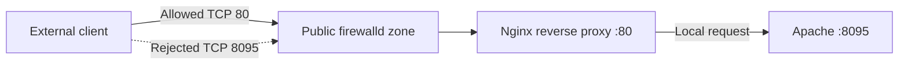

# Firewalld: Protect Apache Behind an Nginx Reverse Proxy



## Challenge

Configure `firewalld` on **Nautilus App Server 3** with these requirements:

- Nginx is the public-facing reverse proxy on TCP port `80`.
- Allow all incoming connections to Nginx port `80`.
- Apache listens on TCP port `8095` behind Nginx.
- Block all incoming connections directly to Apache port `8095`.
- Put the rules in the `public` zone.
- Make every firewall rule permanent.
- Ensure both `nginx` and `httpd` are running.

## Quick Command Summary

```bash
sudo dnf install -y firewalld
sudo systemctl enable --now firewalld

sudo firewall-cmd --zone=public --permanent --add-port=80/tcp
sudo firewall-cmd --zone=public --permanent \
  --add-rich-rule='rule family="ipv4" port port="8095" protocol="tcp" reject'

sudo firewall-cmd --reload
sudo firewall-cmd --zone=public --list-all
```

## Step-by-Step Guide

### 1. Connect to App Server 3

```bash
ssh banner@stapp03
hostname
```

The hostname should confirm that you are working on App Server 3.

### 2. Install and start firewalld

```bash
sudo dnf install -y firewalld
sudo systemctl enable --now firewalld
```

Verify:

```bash
sudo firewall-cmd --state
sudo systemctl is-enabled firewalld
sudo systemctl is-active firewalld
```

Expected results are `running`, `enabled`, and `active`.

### 3. Confirm the active zone

```bash
sudo firewall-cmd --get-active-zones
sudo firewall-cmd --get-default-zone
```

The relevant network interface should belong to `public`. If the challenge server uses another zone, identify the interface first:

```bash
ip -brief address
```

Then assign it when required:

```bash
sudo firewall-cmd --zone=public --permanent --change-interface=<interface>
sudo firewall-cmd --reload
```

Explicitly specifying `--zone=public` on every rule avoids accidentally modifying another zone.

### 4. Allow incoming traffic to Nginx

```bash
sudo firewall-cmd --zone=public --permanent --add-port=80/tcp
```

This changes the permanent configuration. It does not immediately change the active runtime rules until firewalld is reloaded.

### 5. Block direct access to Apache

Add a permanent rich rule rejecting incoming IPv4 traffic to TCP port `8095`:

```bash
sudo firewall-cmd --zone=public --permanent \
  --add-rich-rule='rule family="ipv4" port port="8095" protocol="tcp" reject'
```

Apply both permanent changes:

```bash
sudo firewall-cmd --reload
```

`reject` informs the client that the connection is refused. A `drop` rule would silently discard the packets instead.

### 6. Verify the firewall configuration

```bash
sudo firewall-cmd --zone=public --query-port=80/tcp
sudo firewall-cmd --zone=public --list-rich-rules
sudo firewall-cmd --zone=public --list-all
```

Expected results:

- The port query returns `yes`.
- Port `80/tcp` appears in the public zone.
- A rich rule rejects TCP port `8095`.

Check the permanent configuration independently:

```bash
sudo firewall-cmd --zone=public --permanent --list-all
```

### 7. Verify the service ports

Nginx must own port `80`, while Apache must own `8095`:

```bash
sudo ss -ltnp | grep -E ':80 |:8095 '
```

If `ss` is unavailable, install and use `netstat`:

```bash
sudo dnf install -y net-tools
sudo netstat -ltnp | grep -E ':80 |:8095 '
```

The package is called `net-tools`; attempting `dnf install netstat` fails because `netstat` is the executable name, not the package name.

### 8. Resolve the Nginx port conflict

In this challenge, Nginx initially failed with:

```text
bind() to 0.0.0.0:80 failed (98: Address already in use)
```

Nginx configuration syntax was valid, but another process already owned port `80`. Identify it:

```bash
sudo netstat -ltnp | grep ':80 '
```

If `httpd` is using port `80`, inspect Apache's configured listeners:

```bash
sudo grep -R '^[[:space:]]*Listen' /etc/httpd/conf /etc/httpd/conf.d/
```

Apache should use:

```apache
Listen 8095
```

If `/etc/httpd/conf/httpd.conf` contains `Listen 80`, edit it:

```bash
sudo vi /etc/httpd/conf/httpd.conf
```

Change `Listen 80` to `Listen 8095`, then validate and restart Apache:

```bash
sudo apachectl configtest
sudo systemctl restart httpd
```

Test Nginx and start it:

```bash
sudo nginx -t
sudo systemctl start nginx
```

Confirm both services:

```bash
sudo systemctl is-active httpd nginx
sudo netstat -ltnp | grep -E ':80 |:8095 '
```

### 9. Check the reverse-proxy relationship

Inspect Nginx configuration without replacing a valid existing configuration:

```bash
sudo grep -R 'proxy_pass\|listen' /etc/nginx/nginx.conf /etc/nginx/conf.d/
```

The essential relationship should resemble:

```nginx
server {
    listen 80;

    location / {
        proxy_pass http://127.0.0.1:8095;
    }
}
```

Validate after any edit:

```bash
sudo nginx -t
sudo systemctl restart nginx
```

### 10. Perform functional tests

Test Apache locally:

```bash
curl -I http://127.0.0.1:8095
```

Test the Nginx entry point:

```bash
curl -I http://127.0.0.1:80
```

From another server, port `80` should respond while direct access to `8095` should be rejected:

```bash
curl -I http://stapp03:80
curl --connect-timeout 3 -I http://stapp03:8095
```

## Troubleshooting Checklist

### Nginx reports “address already in use”

```bash
sudo netstat -ltnp | grep ':80 '
sudo grep -R '^[[:space:]]*listen' /etc/nginx/nginx.conf /etc/nginx/conf.d/
```

Only one process can normally bind the same IP address, protocol, and port combination.

### A service fails after configuration changes

```bash
sudo nginx -t
sudo apachectl configtest
sudo systemctl status nginx httpd --no-pager
sudo journalctl -u nginx -u httpd --since '-10 minutes'
```

### Rules disappear after reboot

Confirm they exist in the permanent configuration:

```bash
sudo firewall-cmd --zone=public --permanent --list-all
```

Rules added without `--permanent` exist only in the runtime configuration.

### Nginx cannot connect to Apache with SELinux enforcing

Inspect denials before changing policy:

```bash
getenforce
sudo ausearch -m AVC -ts recent
```

Depending on the system policy, a reverse proxy may require:

```bash
sudo setsebool -P httpd_can_network_connect 1
```

Apache's non-standard port may also need the appropriate SELinux port label. Apply SELinux changes only when the audit log confirms they are necessary.

## Lessons Learned

- Firewalld controls network access; it does not determine which local process may bind a port.
- An `Address already in use` error indicates a local port collision, not a firewall rejection.
- In a reverse-proxy design, only Nginx should be publicly accessible. Apache remains reachable locally but protected from direct external connections.
- `--permanent` writes persistent configuration, while `--reload` copies permanent rules into the active runtime configuration.
- Firewalld zones apply policy to interfaces or sources. Adding a rule to the wrong zone may have no effect on actual traffic.
- `reject` returns an error to the client; `drop` silently discards traffic.
- A closed port, a filtered port, and a port with no listening service are different conditions.
- Configuration validation (`nginx -t` and `apachectl configtest`) should happen before service restarts.
- `ss` is the modern socket-inspection command. `netstat` remains useful but comes from the `net-tools` package.
- Allowing port `80` in firewalld is insufficient if Nginx is stopped; likewise, a running Nginx service remains unreachable if the firewall blocks its port.

## Interview Questions

### 1. What is the difference between runtime and permanent firewalld rules?

Runtime rules take effect immediately but disappear after a reload or reboot. Permanent rules survive, but generally require `firewall-cmd --reload` before becoming active.

### 2. What is a firewalld zone?

A zone is a trust level and collection of rules applied to specified network interfaces or source addresses.

### 3. Why use Nginx in front of Apache?

Nginx can provide reverse proxying, TLS termination, caching, request filtering, connection handling, and a single controlled public entry point.

### 4. Why block Apache's port externally if Nginx needs it?

Nginx reaches Apache through the local loopback interface. Blocking external traffic prevents clients from bypassing controls implemented at the proxy layer.

### 5. What is the difference between `reject` and `drop`?

`reject` refuses traffic and sends an error response. `drop` silently discards packets, causing the client to wait for a timeout.

### 6. What causes `bind(): Address already in use`?

Another process is already listening on the same address, transport protocol, and port—or the same service has conflicting listener definitions.

### 7. How do you identify which process owns a TCP port?

```bash
sudo ss -ltnp
sudo netstat -ltnp
```

### 8. Does opening a firewall port start the associated service?

No. Firewall configuration and service lifecycle are independent. The service must also be installed, correctly configured, and running.

### 9. Why test configurations before restarting services?

Syntax validation prevents a bad configuration from taking a currently functioning service offline.

### 10. How would you allow HTTP by service name instead of port number?

```bash
sudo firewall-cmd --zone=public --permanent --add-service=http
sudo firewall-cmd --reload
```

The `http` service definition normally represents TCP port `80`.

## Final Verification

```bash
sudo firewall-cmd --state
sudo firewall-cmd --get-active-zones
sudo firewall-cmd --zone=public --permanent --list-all
sudo systemctl is-active firewalld nginx httpd
sudo netstat -ltnp | grep -E ':80 |:8095 '
curl -I http://127.0.0.1:80
```

The task is complete when firewalld is active, the permanent public-zone policy allows port `80`, the rich rule rejects external port `8095`, Nginx owns port `80`, Apache owns port `8095`, and both services are running.
