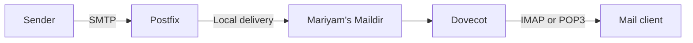

# Postfix and Dovecot Mail Server Challenge



## Challenge

Configure a Linux mail server for the domain `stratos.xfusioncorp.com`:

- Install and configure Postfix for SMTP mail transfer and local delivery.
- Install and configure Dovecot for IMAP/POP3 mailbox access.
- Create the address `mariyam@stratos.xfusioncorp.com` using the Linux system account `mariyam`.
- Store mail in Maildir format under Mariyam's home directory.
- Start and enable the required services.
- Validate authentication and local mail delivery.

The exact server name and Mariyam's password should be taken from the live challenge. Do not place real passwords in a Git repository.

## Overview

Postfix and Dovecot solve different parts of the mail workflow:

| Component | Responsibility | Common ports |
|---|---|---|
| Postfix | Sends, receives and delivers mail using SMTP | 25, 587, 465 |
| Dovecot | Gives authenticated users access to stored mail | 143, 993, 110, 995 |
| IMAP | Synchronizes server-side mailboxes across devices | 143/993 |
| POP3 | Downloads messages to a client | 110/995 |

In this system-user design, the address is formed from:

```text
Linux username + configured mail domain
mariyam        + stratos.xfusioncorp.com
= mariyam@stratos.xfusioncorp.com
```

This is suitable for a controlled lab. Large production systems commonly use virtual mail users stored in LDAP, SQL, or a dedicated password database.

## Step-by-Step Guide

### 1. Confirm the target server

```bash
hostname
cat /etc/os-release
```

Perform the work only on the server specified by the challenge.

### 2. Install the required packages

```bash
sudo dnf install -y postfix dovecot s-nail
```

`s-nail` provides the `mail` command used for testing. Confirm installation:

```bash
rpm -q postfix dovecot s-nail
```

### 3. Create Mariyam's system account

```bash
sudo useradd -m mariyam
sudo passwd mariyam
id mariyam
```

The Linux password will be used by Dovecot when system-user authentication is enabled.

### 4. Configure Postfix

Back up the configuration before editing:

```bash
sudo cp -p /etc/postfix/main.cf /etc/postfix/main.cf.bak
sudo vi /etc/postfix/main.cf
```

Set or update the following values:

```ini
myhostname = mail.stratos.xfusioncorp.com
mydomain = stratos.xfusioncorp.com
myorigin = $mydomain
inet_interfaces = all
mydestination = $myhostname, localhost.$mydomain, localhost, $mydomain
home_mailbox = Maildir/
```

Meaning:

- `myhostname` identifies this mail host.
- `mydomain` defines the mail domain.
- `myorigin` supplies the domain used for locally submitted mail.
- `inet_interfaces = all` allows Postfix to listen on the server's interfaces.
- `mydestination` lists domains for which this server performs final local delivery.
- `home_mailbox = Maildir/` delivers into each user's `~/Maildir` directory.

Check effective values:

```bash
sudo postconf myhostname mydomain myorigin inet_interfaces mydestination home_mailbox
```

Validate Postfix:

```bash
sudo postfix check
```

Do not configure broad trusted networks or permissive relay rules merely to make a test pass. An open SMTP relay can be abused to distribute spam.

### 5. Configure Dovecot protocols

Back up the main configuration:

```bash
sudo cp -p /etc/dovecot/dovecot.conf /etc/dovecot/dovecot.conf.bak
sudo vi /etc/dovecot/dovecot.conf
```

Enable the protocols required by the lab:

```ini
protocols = imap pop3
listen = *
```

If IPv6 is also required, Dovecot may use:

```ini
listen = *, ::
```

### 6. Configure Maildir storage

Edit:

```bash
sudo vi /etc/dovecot/conf.d/10-mail.conf
```

Set:

```ini
mail_location = maildir:~/Maildir
```

Postfix and Dovecot must agree on the mailbox format and location. Postfix writes messages to `~/Maildir`; Dovecot reads the same directory.

### 7. Configure system-user authentication

Edit:

```bash
sudo vi /etc/dovecot/conf.d/10-auth.conf
```

For an isolated lab without TLS, use:

```ini
disable_plaintext_auth = no
auth_mechanisms = plain login
```

Ensure the system authentication include is enabled:

```ini
!include auth-system.conf.ext
```

This lets Dovecot authenticate `mariyam` through the operating system's PAM/passwd facilities.

If clients must log in with the full address instead of only `mariyam`, an optional lab setting is:

```ini
auth_username_format = %Ln
```

This converts `mariyam@stratos.xfusioncorp.com` to the lowercase local part `mariyam` before system authentication.

> Plain authentication without TLS exposes credentials to anyone able to observe the network. Use it only in an isolated training environment. Production access should use TLS and secure IMAP/POP3 ports.

### 8. Prepare Mariyam's Maildir

Postfix can normally create Maildir during first delivery, but creating the standard structure explicitly makes validation easier:

```bash
sudo -u mariyam mkdir -p /home/mariyam/Maildir/{cur,new,tmp}
sudo chown -R mariyam:mariyam /home/mariyam/Maildir
sudo chmod 700 /home/mariyam/Maildir
```

Verify:

```bash
sudo -u mariyam find /home/mariyam/Maildir -maxdepth 1 -type d
```

### 9. Validate Dovecot configuration

Display non-default effective settings:

```bash
sudo doveconf -n
```

Perform a full parse check:

```bash
sudo doveconf >/dev/null
```

No error output indicates that the configuration was parsed successfully.

### 10. Enable and start both services

```bash
sudo systemctl enable --now postfix dovecot
```

Verify:

```bash
sudo systemctl is-enabled postfix dovecot
sudo systemctl is-active postfix dovecot
sudo systemctl status postfix dovecot --no-pager
```

### 11. Check listening ports

```bash
sudo ss -ltnp | grep -E ':25 |:110 |:143 |:993 |:995 '
```

At minimum, Postfix should listen on SMTP port `25`, and Dovecot should listen on the enabled IMAP/POP3 ports.

If `ss` is unavailable, install `iproute`; for the older `netstat` command, install `net-tools`:

```bash
sudo dnf install -y net-tools
sudo netstat -ltnp
```

### 12. Test Dovecot authentication

```bash
sudo doveadm auth test mariyam
```

Enter Mariyam's Linux password when prompted. Success should include:

```text
passdb: mariyam auth succeeded
```

Never place the password directly in shell history or documentation.

### 13. Send a local test message

```bash
echo 'Hello Mariyam' | mail -s 'Postfix and Dovecot test' \
  mariyam@stratos.xfusioncorp.com
```

Inspect the Postfix queue:

```bash
sudo postqueue -p
```

An empty queue after delivery is normally a good sign. Confirm that a message appeared:

```bash
sudo -u mariyam find /home/mariyam/Maildir/new -type f -ls
```

Inspect a test message carefully if needed:

```bash
sudo -u mariyam sed -n '1,30p' /home/mariyam/Maildir/new/<message-file>
```

### 14. Test IMAP locally

For an unencrypted lab listener:

```bash
telnet 127.0.0.1 143
```

Example IMAP conversation:

```text
a1 LOGIN mariyam <password>
a2 LIST "" "*"
a3 SELECT INBOX
a4 LOGOUT
```

Do not perform this plaintext login on an untrusted network. With TLS configured, prefer:

```bash
openssl s_client -connect 127.0.0.1:993 -crlf
```

### 15. Configure firewalld only as required

For an isolated exercise requiring remote plaintext access:

```bash
sudo firewall-cmd --permanent --add-service=smtp
sudo firewall-cmd --permanent --add-service=imap
sudo firewall-cmd --permanent --add-service=pop3
sudo firewall-cmd --reload
```

For production-style encrypted mailbox access, open `imaps` and/or `pop3s` instead of exposing plaintext authentication:

```bash
sudo firewall-cmd --permanent --add-service=imaps
sudo firewall-cmd --permanent --add-service=pop3s
sudo firewall-cmd --reload
```

Open only the protocols required by the design.

## Troubleshooting

### Postfix does not start

```bash
sudo postfix check
sudo postconf -n
sudo systemctl status postfix --no-pager
sudo journalctl -u postfix --since '-15 minutes'
```

Look for duplicated parameters, invalid hostnames, permission errors, or a conflict on TCP port `25`.

### Dovecot does not start

```bash
sudo doveconf -n
sudo systemctl status dovecot --no-pager
sudo journalctl -u dovecot --since '-15 minutes'
```

Common causes include invalid syntax, conflicting listeners, missing certificate files, and incorrect include directives.

### Authentication fails

```bash
id mariyam
sudo passwd -S mariyam
sudo doveadm auth test mariyam
sudo journalctl -u dovecot --since '-10 minutes'
```

Check whether the account is locked, whether the password was set, whether `auth-system.conf.ext` is included, and whether the client is sending `mariyam` or the full email address.

### Mail is queued but not delivered

```bash
sudo postqueue -p
sudo postcat -q <queue-id>
sudo journalctl -u postfix --since '-15 minutes'
```

Check `mydestination`, the recipient account, mailbox permissions, disk space, and the configured mailbox format.

### Mail is delivered somewhere unexpected

Compare both sides:

```bash
sudo postconf home_mailbox
sudo doveconf -n | grep mail_location
```

These should both identify Maildir under the user's home directory.

### Traditional mail log location

Depending on the operating-system logging configuration, mail events may also appear in:

```text
/var/log/maillog
```

Use `journalctl` when that file is absent.

## Security and Production Considerations

A working lab server is not yet a safe public mail service. Production deployment also requires:

- Valid DNS `A/AAAA`, `MX` and reverse-PTR records.
- TLS certificates for SMTP submission and mailbox access.
- SMTP authentication and carefully restricted relay policy.
- SPF, DKIM and DMARC records.
- Spam, malware and rate-limit controls.
- Mail queue monitoring, backups and retention policies.
- Correct host identity and consistent forward/reverse DNS.
- Protection against brute-force authentication attacks.
- Sender-reputation and blacklist monitoring.

Never expose a lab configuration with plaintext authentication or weak relay restrictions to the public internet.

## Lessons Learned

- Postfix and Dovecot are complementary: Postfix transports and delivers messages; Dovecot provides mailbox access.
- IMAP/POP3 do not send mail. SMTP handles mail submission and transfer.
- An email address is not always a separate Linux object. In this lab, the local part maps to a system user and the domain comes from Postfix configuration.
- Postfix and Dovecot must agree on mailbox format and location.
- Service status alone is insufficient. Validate syntax, listeners, authentication, delivery, storage, and retrieval separately.
- `doveconf -n` and `postconf -n` expose effective non-default settings and are invaluable during troubleshooting.
- A successful `doveadm auth test` verifies authentication but not SMTP delivery.
- An empty Postfix queue does not by itself prove successful delivery; inspect Maildir and logs as well.
- Configuration exactness matters because mail passes through several independent layers.
- Administrators are expected to understand the flow and troubleshoot methodically—not memorize every Postfix and Dovecot directive.

## Interview Questions

### 1. What is the difference between Postfix and Dovecot?

Postfix is an SMTP mail-transfer agent. Dovecot is primarily an IMAP/POP3 server that authenticates users and exposes stored mailboxes.

### 2. What are MTA, MDA and MUA?

- **MTA:** transfers mail between systems, such as Postfix.
- **MDA/LDA:** performs final delivery into a mailbox.
- **MUA:** the user's mail application, such as Thunderbird or Outlook.

### 3. What is the difference between IMAP and POP3?

IMAP keeps mail and folder state synchronized on the server. POP3 traditionally downloads messages to a client and offers much less synchronization.

### 4. What is Maildir?

Maildir stores each message as an individual file and organizes mailbox state using `tmp`, `new`, and `cur` directories. It avoids locking problems associated with one large mailbox file.

### 5. What does `mydestination` control in Postfix?

It defines domains for which Postfix considers itself the final destination and performs local delivery.

### 6. What is an open relay?

It is an SMTP server that permits unauthorized third parties to relay mail to unrelated external domains. Attackers exploit open relays for spam and abuse.

### 7. Why might Dovecot authentication succeed while email access still fails?

The mailbox may not exist, permissions may be wrong, `mail_location` may disagree with Postfix, the protocol listener may be unavailable, or a firewall may block access.

### 8. Why use port 993 instead of 143?

Port `993` provides IMAP over implicit TLS. Port `143` is plaintext unless upgraded with STARTTLS.

### 9. How do you inspect the Postfix mail queue?

```bash
postqueue -p
```

Queued messages can be inspected with `postcat -q <queue-id>`.

### 10. Which DNS record directs email to a mail server?

An `MX` record identifies the mail exchanger for a domain. Its hostname must resolve through an `A` or `AAAA` record.

### 11. What are SPF, DKIM and DMARC?

- **SPF** identifies servers authorized to send for a domain.
- **DKIM** adds a cryptographic signature to outgoing mail.
- **DMARC** defines policy and reporting based on SPF/DKIM alignment.

### 12. How would you troubleshoot this mail stack systematically?

Validate in layers: DNS and identity, Postfix syntax, SMTP listener, local delivery, mailbox files and permissions, Dovecot syntax, authentication, IMAP/POP3 listener, firewall, and finally end-to-end client access.

## Final Verification Checklist

```bash
id mariyam
sudo postfix check
sudo postconf mydomain mydestination home_mailbox
sudo doveconf -n
sudo systemctl is-enabled postfix dovecot
sudo systemctl is-active postfix dovecot
sudo ss -ltnp | grep -E ':25 |:110 |:143 |:993 |:995 '
sudo doveadm auth test mariyam
sudo postqueue -p
sudo -u mariyam find /home/mariyam/Maildir/new -type f
```

The challenge is complete when both services are enabled and active, Postfix accepts the configured domain and delivers to Maildir, Dovecot authenticates Mariyam, and the test message appears in her mailbox.
