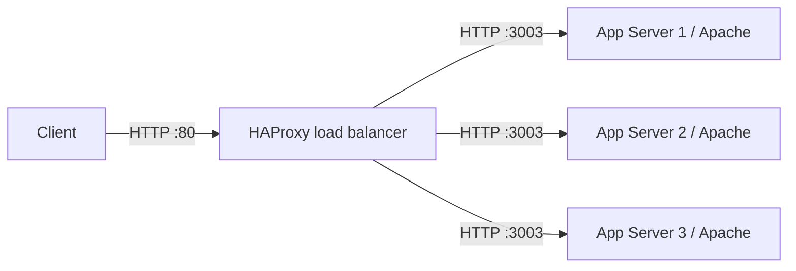

# Installing and Configuring an HAProxy Load Balancer

## Challenge

Configure an HAProxy load balancer in front of three application servers. Apache is already running on TCP port `3003` on every application server.

The load balancer must:

- Accept HTTP requests on the frontend port required by the challenge.
- Distribute requests among all three application servers.
- Send backend traffic to Apache on port `3003`.
- Detect unavailable backend servers with health checks.
- Start now and automatically after reboot.

> **Important:** This guide uses port `80` as an example HAProxy frontend port. If the challenge specifies another port, replace `80` everywhere with that value. Port `3003` is the backend Apache port and should remain unchanged.

---

## Architecture



HAProxy exposes one address to clients. It chooses a healthy backend server for each request and forwards the request to Apache on port `3003`.

| Component | Purpose | Example endpoint |
| --- | --- | --- |
| Client | Sends the request | `http://load-balancer:80` |
| HAProxy frontend | Accepts client connections | `*:80` |
| HAProxy backend | Defines the server pool | `app_servers` |
| Apache servers | Process HTTP requests | `stapp01:3003`, `stapp02:3003`, `stapp03:3003` |

---

## Key HAProxy Concepts

### Frontend

A `frontend` defines where HAProxy receives connections. It normally specifies a listening address, port, operating mode, and default backend.

### Backend

A `backend` is a pool of destination servers. It also defines the load-balancing algorithm and health-check behavior.

### Load-balancing algorithm

`roundrobin` sends requests to healthy servers in rotation. Other algorithms include:

- `leastconn`: chooses the server with the fewest active connections.
- `source`: consistently selects a server using the client source address.
- `random`: selects a server pseudorandomly.

### Health checks

The `check` keyword makes HAProxy test a backend server. An unhealthy server is temporarily removed from rotation and can rejoin after recovering.

---

## Step-by-Step Guide

### 1. Connect to the load-balancer server

Perform the HAProxy installation and configuration on the designated load-balancer host—not on the application servers.

Confirm the host:

```bash
hostname
hostname -f
```

### 2. Confirm name resolution for all application servers

```bash
getent hosts stapp01 stapp02 stapp03
```

If the challenge uses different hostnames, substitute the correct names. HAProxy can also use backend IP addresses, although stable DNS names are easier to maintain.

Inspect the local host mapping when necessary:

```bash
cat /etc/hosts
```

### 3. Verify Apache on every backend

From the load-balancer server, test each application server directly:

```bash
curl -I http://stapp01:3003/
curl -I http://stapp02:3003/
curl -I http://stapp03:3003/
```

For full response bodies:

```bash
curl http://stapp01:3003/
curl http://stapp02:3003/
curl http://stapp03:3003/
```

Each command should connect successfully. If direct access fails, resolve the Apache, networking, DNS, SELinux, or firewall problem before blaming HAProxy.

On an application server, useful checks include:

```bash
sudo systemctl status httpd --no-pager -l
sudo ss -ltnp | grep ':3003 '
curl http://localhost:3003/
```

### 4. Install HAProxy

On RHEL, Rocky Linux, AlmaLinux, or CentOS Stream:

```bash
sudo dnf install -y haproxy
```

Confirm the installation:

```bash
haproxy -vv
rpm -q haproxy
```

### 5. Back up the original configuration

```bash
sudo cp -p /etc/haproxy/haproxy.cfg /etc/haproxy/haproxy.cfg.bak
```

The `-p` option preserves the original file's mode, ownership, and timestamps.

### 6. Configure the frontend and backend

Open the HAProxy configuration:

```bash
sudo vi /etc/haproxy/haproxy.cfg
```

Preserve valid `global` and `defaults` sections. Add the following frontend and backend sections, changing the frontend port if required:

```haproxy
frontend app_frontend
    bind *:80
    mode http
    default_backend app_servers

backend app_servers
    mode http
    balance roundrobin
    option httpchk GET /
    server app1 stapp01:3003 check
    server app2 stapp02:3003 check
    server app3 stapp03:3003 check
```

What each directive means:

| Directive | Meaning |
| --- | --- |
| `bind *:80` | Listen on all local interfaces on frontend port `80` |
| `mode http` | Process traffic as HTTP rather than raw TCP |
| `default_backend app_servers` | Forward requests to the named backend pool |
| `balance roundrobin` | Rotate requests among healthy servers |
| `option httpchk GET /` | Send an HTTP request to `/` during health checks |
| `server app1 stapp01:3003 check` | Define a backend server and enable health checks |

#### Compact `listen` alternative

HAProxy also supports a combined section:

```haproxy
listen app_cluster
    bind *:80
    mode http
    balance roundrobin
    option httpchk GET /
    server app1 stapp01:3003 check
    server app2 stapp02:3003 check
    server app3 stapp03:3003 check
```

Use either the separate `frontend`/`backend` form or the combined `listen` form. Do not define both on the same listening port.

### 7. Validate the configuration before restarting

```bash
sudo haproxy -c -f /etc/haproxy/haproxy.cfg
```

Expected result:

```text
Configuration file is valid
```

This check catches syntax errors without interrupting a running service.

### 8. Enable and start HAProxy

```bash
sudo systemctl enable --now haproxy
```

Verify both runtime and boot state:

```bash
sudo systemctl is-active haproxy
sudo systemctl is-enabled haproxy
sudo systemctl status haproxy --no-pager -l
```

Expected results include `active` and `enabled`.

### 9. Confirm that HAProxy is listening

```bash
sudo ss -ltnp | grep ':80 '
```

If the challenge assigns another frontend port, search for that port instead.

### 10. Configure SELinux when required

Check the SELinux state:

```bash
getenforce
```

If SELinux blocks HAProxy from connecting to the application servers, permit outbound proxy connections:

```bash
sudo setsebool -P haproxy_connect_any 1
```

Then restart HAProxy:

```bash
sudo systemctl restart haproxy
```

Do not disable SELinux merely to work around a policy issue. Apply the narrow policy change required by the service.

### 11. Configure the firewall when required

If `firewalld` is installed and active, allow the HAProxy **frontend** port:

```bash
sudo firewall-cmd --permanent --add-port=80/tcp
sudo firewall-cmd --reload
sudo firewall-cmd --list-ports
```

The backend port `3003` belongs on the application servers. It does not need to be exposed publicly on the load-balancer host.

### 12. Test the load balancer

Test locally on the load-balancer server:

```bash
curl -i http://localhost:80/
```

Send several requests:

```bash
for i in {1..9}; do
    curl -s http://localhost:80/
    echo
done
```

If each application server returns identifying content, the responses should show rotation across the three backends.

Test through the load balancer's hostname or IP as well:

```bash
curl -i http://<LOAD_BALANCER_IP>:80/
```

---

## Final Verification Checklist

```bash
sudo haproxy -c -f /etc/haproxy/haproxy.cfg
sudo systemctl is-active haproxy
sudo systemctl is-enabled haproxy
sudo ss -ltnp | grep ':80 '
curl -I http://stapp01:3003/
curl -I http://stapp02:3003/
curl -I http://stapp03:3003/
curl -I http://localhost:80/
```

- [ ] HAProxy is installed on the load-balancer server.
- [ ] All three application servers are listed in the backend.
- [ ] Every backend uses Apache port `3003`.
- [ ] HAProxy listens on the challenge's required frontend port.
- [ ] The configuration passes `haproxy -c` validation.
- [ ] The service is active and enabled.
- [ ] Backend health checks succeed.
- [ ] Client requests receive valid HTTP responses.
- [ ] The required firewall and SELinux settings are in place.

---

## Troubleshooting Guide

### HAProxy fails to start

Inspect the service and journal:

```bash
sudo systemctl status haproxy --no-pager -l
sudo journalctl -u haproxy -n 100 --no-pager
sudo haproxy -c -f /etc/haproxy/haproxy.cfg
```

Common causes include invalid indentation or spelling, a missing backend, duplicate section names, and an invalid address or port.

### `Address already in use`

Another process already owns the frontend port:

```bash
sudo ss -ltnp | grep ':80 '
```

Stop or reconfigure the conflicting service, or correct HAProxy's frontend port according to the task.

### HTTP `503 Service Unavailable`

A `503` from HAProxy commonly means that no backend is currently healthy. Test the servers directly:

```bash
curl -v http://stapp01:3003/
curl -v http://stapp02:3003/
curl -v http://stapp03:3003/
```

Then check:

- Apache is running on every application server.
- Apache is actually listening on port `3003`.
- Hostnames resolve to the correct addresses.
- Network routes and firewalls permit load-balancer-to-backend traffic.
- SELinux permits HAProxy to connect outward.
- The health-check path returns an acceptable HTTP response.

### Some servers never receive requests

Confirm that every `server` line contains a unique label and the correct hostname and port. Look for spelling mistakes and verify direct connectivity.

### Configuration is valid, but remote clients cannot connect

Check the listening socket, the active firewall zone, and the client's destination address:

```bash
sudo ss -ltnp
sudo firewall-cmd --get-active-zones
sudo firewall-cmd --zone=public --list-all
```

Also confirm that `bind` is not restricted to `127.0.0.1`.

### View HAProxy logs

```bash
sudo journalctl -u haproxy -f
```

In another terminal, send requests with `curl` and observe the messages.

---

## Lessons Learned

1. The frontend and backend ports serve different purposes. Clients connect to HAProxy's frontend port; HAProxy connects to Apache on port `3003`.
2. A load balancer is only useful when its backend servers are reachable and healthy.
3. `roundrobin` distributes requests evenly in sequence, but only among available servers.
4. The `check` keyword enables automatic failure detection and prevents traffic from being sent to unhealthy servers.
5. Always validate configuration with `haproxy -c` before starting or restarting the service.
6. `systemctl enable --now` performs two operations: it enables the service for future boots and starts it immediately.
7. A valid HAProxy configuration does not prove network connectivity; direct `curl` tests to every backend are essential.
8. HTTP `503` often indicates an unhealthy or unreachable backend pool, not necessarily an HAProxy syntax error.
9. SELinux and firewalls are security controls to configure correctly, not obstacles to disable.
10. Clear server names such as `app1`, `app2`, and `app3` make logs and troubleshooting easier.
11. Backing up the configuration before editing provides a quick recovery path.
12. Production validation should test the full path: client → load balancer → backend application.

---

## Interview Questions and Answers

### 1. What is HAProxy?

HAProxy is an open-source, high-performance load balancer and proxy for TCP- and HTTP-based applications. It can distribute traffic, perform health checks, and remove failed servers from rotation.

### 2. What is the difference between a frontend and a backend?

A frontend defines how and where HAProxy accepts client traffic. A backend defines the pool of servers to which that traffic is forwarded.

### 3. What does `roundrobin` mean?

It assigns successive requests to healthy backend servers in rotation. With three equally weighted servers, the sequence is generally app1, app2, app3, and then app1 again.

### 4. What does the `check` keyword do?

It enables health checks for that server. HAProxy stops sending normal traffic to a server after it is considered unhealthy and returns it to rotation after recovery.

### 5. What is the difference between Layer 4 and Layer 7 load balancing?

Layer 4 balancing works with transport-level information such as IP addresses and TCP ports. Layer 7 balancing understands application protocols such as HTTP and can make routing decisions using hosts, paths, headers, or cookies.

### 6. What is the difference between `mode tcp` and `mode http`?

`mode tcp` proxies raw TCP streams and can support many TCP-based protocols. `mode http` understands HTTP and enables HTTP-aware health checks, header manipulation, path routing, and request logging.

### 7. Why validate the configuration before restarting HAProxy?

Validation detects syntax and reference errors without interrupting the currently running process. It reduces the risk of turning a configuration mistake into an outage.

### 8. Why might HAProxy return HTTP 503?

The backend pool may contain no healthy servers. Causes include stopped applications, incorrect ports or hostnames, failed health-check paths, network filtering, or SELinux restrictions.

### 9. How do you confirm which process owns a port?

```bash
sudo ss -ltnp | grep ':80 '
```

### 10. What is the purpose of `leastconn`?

It selects the healthy server with the fewest active connections. It can be useful when connections have significantly different durations.

### 11. Does `systemctl start haproxy` enable it after reboot?

No. `start` affects the current runtime only. Use `systemctl enable haproxy` for boot persistence, or `systemctl enable --now haproxy` to do both.

### 12. How would you safely change a production HAProxy configuration?

Back up the configuration, make the smallest required edit, validate it with `haproxy -c`, reload rather than restart when appropriate, and verify the listening socket, service logs, backend health, and end-to-end traffic.

### 13. What is the difference between restarting and reloading HAProxy?

A restart stops and starts the service. A reload asks the service manager to apply a valid new configuration with minimal interruption when the packaged service supports graceful reload behavior.

### 14. Why should backend port `3003` not necessarily be open to the entire network?

Clients should normally reach the application through HAProxy. Backend access can be limited to trusted sources such as the load-balancer address, reducing the exposed attack surface.

### 15. How can you test high availability manually?

Stop Apache on one backend, send repeated requests through HAProxy, and confirm that traffic continues through the remaining healthy servers. Then restart Apache and confirm that the recovered server returns to rotation.

---

## Useful Command Summary

```bash
# Install
sudo dnf install -y haproxy

# Back up configuration
sudo cp -p /etc/haproxy/haproxy.cfg /etc/haproxy/haproxy.cfg.bak

# Validate
sudo haproxy -c -f /etc/haproxy/haproxy.cfg

# Enable and start
sudo systemctl enable --now haproxy

# Inspect status and logs
sudo systemctl status haproxy --no-pager -l
sudo journalctl -u haproxy -n 100 --no-pager

# Verify listening socket
sudo ss -ltnp | grep ':80 '

# Test backends
curl -I http://stapp01:3003/
curl -I http://stapp02:3003/
curl -I http://stapp03:3003/

# Test HAProxy
curl -I http://localhost:80/

# Allow HAProxy outbound connections under SELinux when required
sudo setsebool -P haproxy_connect_any 1
```

---

## Result

HAProxy was successfully installed and configured as the single frontend for three Apache application servers. Requests arriving on the required frontend port are distributed across healthy backends on port `3003`, while systemd ensures the load balancer starts automatically after reboot.

**Challenge status: Victory!**
