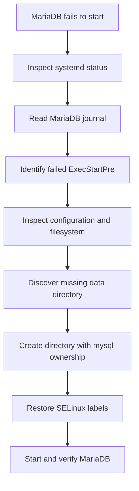

# Troubleshooting MariaDB: Missing Data Directory

## Challenge

The MariaDB service on the database server would not start. Running `systemctl` showed that an `ExecStartPre` process exited with status `1`, leaving `mariadb.service` in the failed state.

The objective was to:

- Determine why MariaDB failed before its main daemon started.
- Distinguish MariaDB configuration files from its systemd unit file.
- Inspect the failure safely without deleting database data.
- Restore the required MariaDB directory with correct ownership and security labels.
- Start MariaDB and ensure it can start automatically after reboot.

---

## Troubleshooting Flow



---

## Symptoms

The service reported a generic systemd failure similar to:

```text
An ExecStartPre= process belonging to unit mariadb.service has exited.
The process' exit code is 'exited' and its exit status is 1.
mariadb.service: Failed with result 'exit-code'.
Failed to start MariaDB 10.5 database server.
```

These lines prove that startup failed, but they do not explain the underlying cause. The useful diagnostic information is usually several lines earlier in the journal.

---

## Step-by-Step Troubleshooting Guide

### 1. Check the service state

```bash
sudo systemctl status mariadb --no-pager -l
```

The `-l` option prevents long lines from being truncated. In this case, the important clue was that an `ExecStartPre` command failed.

### 2. Read the complete service journal

```bash
sudo journalctl -u mariadb -b -n 100 --no-pager
```

Options used:

| Option | Purpose |
| --- | --- |
| `-u mariadb` | Show messages for the MariaDB service |
| `-b` | Show messages from the current boot |
| `-n 100` | Return the latest 100 messages |
| `--no-pager` | Print directly instead of opening a pager |

The journal revealed that MariaDB's preparation stage could not initialize its database directory correctly.

### 3. Inspect the service definition

```bash
sudo systemctl cat mariadb
```

This displayed the packaged systemd unit, including commands such as:

```ini
ExecStartPre=/usr/libexec/mariadb-check-socket
ExecStartPre=/usr/libexec/mariadb-prepare-db-dir %n
ExecStart=/usr/libexec/mariadbd --basedir=/usr $MYSQLD_OPTS $_WSREP_NEW_CLUSTER
```

The failed preparation command runs before `mariadbd`. Therefore, the server daemon had not yet reached its normal startup phase.

> `/usr/lib/systemd/system/mariadb.service` is a systemd unit file, not MariaDB's database configuration. It contains `[Unit]`, `[Service]`, and `[Install]` sections and should not normally be edited directly.

### 4. Find the real MariaDB configuration

The main configuration file is normally:

```text
/etc/my.cnf
```

It commonly includes additional files from:

```text
/etc/my.cnf.d/
```

Inspect them with:

```bash
sudo cat /etc/my.cnf
sudo ls -la /etc/my.cnf.d/
sudo grep -RInE '^[[:space:]]*[^#;[:space:]]' \
    /etc/my.cnf /etc/my.cnf.d/
```

MariaDB server options may appear under any of these groups:

```ini
[mysqld]
[server]
[mariadb]
[mariadb-10.5]
```

Not seeing `[mysqld]` in `/etc/my.cnf` does not mean the configuration is missing. It may be in one of the included `.cnf` files, or the package may rely largely on defaults.

### 5. Check the data directory directly

MariaDB normally stores its database files under:

```text
/var/lib/mysql
```

Check it safely:

```bash
sudo ls -ld /var/lib/mysql
sudo ls -la /var/lib/mysql
sudo du -sh /var/lib/mysql
```

In this challenge, filesystem inspection revealed that the required directory did not exist. This prevented the preparation stage from initializing MariaDB.

### 6. Create the missing directory safely

Instead of using a destructive command, create the directory with the correct ownership and permissions in one operation:

```bash
sudo install -d -o mysql -g mysql -m 0755 /var/lib/mysql
```

This command means:

| Argument | Meaning |
| --- | --- |
| `-d` | Create a directory |
| `-o mysql` | Set the owner to `mysql` |
| `-g mysql` | Set the group to `mysql` |
| `-m 0755` | Set directory permissions |

Verify the result:

```bash
sudo ls -ld /var/lib/mysql
```

Expected ownership:

```text
mysql mysql /var/lib/mysql
```

An equivalent multi-command method is:

```bash
sudo mkdir -p /var/lib/mysql
sudo chown mysql:mysql /var/lib/mysql
sudo chmod 0755 /var/lib/mysql
```

The `install -d` form is preferable because it creates the directory and assigns its metadata atomically.

### 7. Restore the SELinux context

On an SELinux-enabled system, correct Unix ownership may not be sufficient. Restore the expected label:

```bash
sudo restorecon -Rv /var/lib/mysql
```

Inspect it when necessary:

```bash
ls -ldZ /var/lib/mysql
```

Do not disable SELinux as a shortcut.

### 8. Start and enable MariaDB

```bash
sudo systemctl enable --now mariadb
```

If it had already been enabled, starting it is sufficient:

```bash
sudo systemctl start mariadb
```

### 9. Verify service health

```bash
sudo systemctl is-active mariadb
sudo systemctl is-enabled mariadb
sudo systemctl status mariadb --no-pager -l
```

Expected runtime state:

```text
active
```

### 10. Confirm the listening socket and database access

Check TCP port `3306`:

```bash
sudo ss -ltnp 'sport = :3306'
```

Then test the local client:

```bash
sudo mariadb
```

Inside MariaDB, a basic test is:

```sql
SELECT VERSION();
SHOW DATABASES;
EXIT;
```

---

## Why `rm -rf` Was the Wrong First Move

The command below would be extremely risky:

```bash
sudo rm -rf /var/lib/mysql
```

`/var/lib/mysql` is not a cache directory. It can contain:

- Application databases and tables
- MariaDB system tables
- User and privilege information
- InnoDB data and redo logs
- Binary logs and replication state
- Database metadata

Deleting it could permanently destroy every locally stored database.

When a data directory exists but contains unexpected files, inspect first:

```bash
sudo find /var/lib/mysql -mindepth 1 -maxdepth 2 \
    -printf '%y %u:%g %m %p\n'
```

If a file is confirmed to be unrelated, quarantine it instead of immediately deleting it:

```bash
sudo mkdir -p /root/mysql-quarantine
sudo mv /var/lib/mysql/<unexpected-file> /root/mysql-quarantine/
```

If an entire data directory must be replaced during a confirmed fresh installation, moving it aside is safer than deleting it:

```bash
sudo systemctl stop mariadb
sudo mv /var/lib/mysql /var/lib/mysql.pre-repair
sudo install -d -o mysql -g mysql -m 0755 /var/lib/mysql
sudo restorecon -Rv /var/lib/mysql
```

This is appropriate only after confirming that the old directory contains no required database data.

---

## Configuration Files Versus Service Files

| File or directory | Purpose |
| --- | --- |
| `/etc/my.cnf` | Main MariaDB/MySQL configuration |
| `/etc/my.cnf.d/*.cnf` | Additional packaged or custom configuration |
| `/usr/lib/systemd/system/mariadb.service` | Vendor-provided systemd unit |
| `/etc/systemd/system/mariadb.service.d/` | Administrator-created systemd overrides |
| `/var/lib/mysql` | Default MariaDB data directory |
| `/var/log/mariadb/` | Possible MariaDB log directory |
| systemd journal | Common location for MariaDB startup errors |

The systemd unit controls how the service is launched. The `.cnf` files control how MariaDB itself behaves.

---

## Common MariaDB Startup Problems

### Missing data directory

Symptoms:

- `mariadb-prepare-db-dir` fails.
- `/var/lib/mysql` cannot be found.

Resolution:

```bash
sudo install -d -o mysql -g mysql -m 0755 /var/lib/mysql
sudo restorecon -Rv /var/lib/mysql
```

### Incorrect ownership

Inspect:

```bash
sudo ls -ld /var/lib/mysql
```

Repair only after confirming `/var/lib/mysql` is the configured data directory:

```bash
sudo chown mysql:mysql /var/lib/mysql
```

Avoid blindly running recursive ownership changes against an unverified path.

### Stale socket file

The `mariadb-check-socket` pre-start helper may fail if a socket suggests another server is already running. Check before removing anything:

```bash
pgrep -a mariadbd
sudo ss -lxnp | grep mysql
```

Never remove a socket until you have verified that no MariaDB process is using it.

### Invalid configuration option

Inspect configured options:

```bash
sudo my_print_defaults mysqld mariadb server
```

Review recently edited files in `/etc/my.cnf.d/` and check the journal for an unknown-variable error.

### Full filesystem or exhausted inodes

```bash
df -h
df -i
```

MariaDB requires free disk space and inodes for data, logs, temporary tables, sockets, and PID files.

### SELinux denial

```bash
getenforce
sudo ausearch -m AVC -ts recent
ls -ldZ /var/lib/mysql
```

Prefer correcting file contexts with `restorecon` rather than disabling SELinux.

---

## Lessons Learned

1. The final systemd failure message is usually a summary, not the root cause.
2. Read several lines above `Failed to start` in the journal to find the actionable error.
3. `ExecStartPre` commands run before the main daemon and can prevent MariaDB from launching at all.
4. `systemctl cat mariadb` displays the systemd unit, not MariaDB's `.cnf` configuration.
5. MariaDB configuration is normally split between `/etc/my.cnf` and `/etc/my.cnf.d/*.cnf`.
6. A `[mysqld]` section does not have to appear in the main file; included files and alternative server groups may provide the settings.
7. `/var/lib/mysql` is MariaDB's default data directory and should normally belong to `mysql:mysql`.
8. A missing data directory can cause the initialization helper to fail before the server daemon starts.
9. `install -d` is a concise and reliable way to create a directory with explicit ownership and permissions.
10. SELinux labels matter independently of Unix owner, group, and permission bits.
11. Never use `rm -rf` on a database directory without inspecting, backing up, and positively identifying its contents.
12. Moving suspicious data aside is safer and more recoverable than deleting it.
13. Verify the repair at several levels: service state, listening socket, and an actual database client connection.
14. A successful `systemctl start` does not automatically mean the service is enabled for the next boot.

---

## Interview Questions and Answers

### 1. Where is MariaDB commonly configured on RHEL-family systems?

The main file is `/etc/my.cnf`, and it commonly includes additional `.cnf` files from `/etc/my.cnf.d/`.

### 2. What is an `ExecStartPre` command?

It is a systemd command that must complete successfully before the service's primary `ExecStart` command runs.

### 3. What is the difference between `/etc/my.cnf` and `mariadb.service`?

`/etc/my.cnf` controls database-server behavior. `mariadb.service` tells systemd how to prepare, start, stop, and supervise the MariaDB process.

### 4. What is MariaDB's default data directory on many Linux distributions?

It is commonly `/var/lib/mysql`, although it can be changed with the `datadir` option.

### 5. Why is deleting `/var/lib/mysql` dangerous?

It can erase all local databases, database users, privileges, transaction logs, replication metadata, and system tables.

### 6. How do you find the real cause of a systemd service failure?

Start with `systemctl status <service> -l`, then inspect the service journal using `journalctl -u <service>`. Look before the generic failure summary.

### 7. Why does MariaDB need ownership by the `mysql` user?

The daemon normally runs as `mysql`, so that account must be able to create, read, modify, and lock database files in the data directory.

### 8. What does `restorecon` do?

It restores a file or directory's SELinux context according to the system's labeling policy.

### 9. What is the difference between `systemctl start` and `systemctl enable`?

`start` launches the service for the current runtime. `enable` configures it to start automatically during future boots.

### 10. How do you check whether MariaDB listens on port 3306?

```bash
sudo ss -ltnp 'sport = :3306'
```

### 11. What should you do before deleting a suspicious database file?

Stop and identify it, verify whether it belongs to the database, check backups, and prefer moving it to a quarantine location so the action remains reversible.

### 12. Why might correct `chmod` and `chown` values still not be enough?

SELinux can deny access based on security context even when traditional Unix permissions appear correct.

### 13. What is the safest way to test a MariaDB repair?

Confirm the service is active, verify its socket or TCP listener, connect with the MariaDB client, and execute a harmless query such as `SELECT VERSION();`.

### 14. What could cause MariaDB to fail even when the data directory exists?

Incorrect ownership, SELinux labeling, invalid configuration, corrupted tables or logs, a stale socket, another server process, insufficient disk space, or an incompatible data-directory version can all prevent startup.

---

## Final Verification Checklist

```bash
sudo ls -ldZ /var/lib/mysql
sudo systemctl is-active mariadb
sudo systemctl is-enabled mariadb
sudo systemctl status mariadb --no-pager -l
sudo ss -ltnp 'sport = :3306'
sudo mariadb -e 'SELECT VERSION();'
```

- [ ] The MariaDB data directory exists.
- [ ] Its owner and group are `mysql:mysql`.
- [ ] Its SELinux context is correct.
- [ ] MariaDB starts without an `ExecStartPre` failure.
- [ ] The service is active.
- [ ] The service is enabled for future boots.
- [ ] The local client can connect and run a query.
- [ ] No database files were destructively deleted during troubleshooting.

---

## Result

The failure was traced beyond systemd's generic error to MariaDB's pre-start preparation stage. The expected database directory did not exist. After safely creating it with the correct `mysql:mysql` ownership, permissions, and SELinux labeling, MariaDB initialized successfully and the service started normally.

**Challenge status: Victory!**
