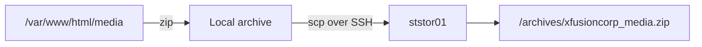

# Bash Scripting Challenge: Archive Media and Copy It to a Storage Server

## Challenge

Create an executable Bash script named:

```text
/scripts/media_archive.sh
```

The script must:

1. Archive the directory `/var/www/html/media`.
2. Name the archive `xfusioncorp_media.zip`.
3. Store the local archive under `/archives`.
4. Copy the archive to the `/archives` directory on the storage server.
5. Connect to the storage server as user `natasha` on host `ststor01`.
6. Run non-interactively and stop if an operation fails.

This guide uses SSH key authentication. Passwords should not be stored as plaintext inside scripts.

---

## Workflow



The application server performs two distinct operations:

- Create the ZIP file locally.
- Transfer the completed ZIP file to the remote storage server.

---

## Final Script

```bash
#!/bin/bash

set -euo pipefail

SOURCE_PARENT="/var/www/html"
SOURCE_NAME="media"
LOCAL_ARCHIVE_DIR="/archives"
ARCHIVE_NAME="xfusioncorp_media.zip"
LOCAL_ARCHIVE="${LOCAL_ARCHIVE_DIR}/${ARCHIVE_NAME}"

REMOTE_USER="natasha"
REMOTE_SERVER="ststor01"
REMOTE_ARCHIVE_DIR="/archives"

# Confirm that the source directory exists.
if [[ ! -d "${SOURCE_PARENT}/${SOURCE_NAME}" ]]; then
    echo "Error: source directory does not exist: ${SOURCE_PARENT}/${SOURCE_NAME}" >&2
    exit 1
fi

# Confirm that the local destination exists and is writable.
if [[ ! -d "$LOCAL_ARCHIVE_DIR" ]]; then
    echo "Error: local archive directory does not exist: $LOCAL_ARCHIVE_DIR" >&2
    exit 1
fi

if [[ ! -w "$LOCAL_ARCHIVE_DIR" ]]; then
    echo "Error: local archive directory is not writable: $LOCAL_ARCHIVE_DIR" >&2
    exit 1
fi

# Remove only the previously generated archive.
rm -f "$LOCAL_ARCHIVE"

# Archive media/ without embedding /var/www/html in the ZIP paths.
(
    cd "$SOURCE_PARENT"
    zip -r "$LOCAL_ARCHIVE" "$SOURCE_NAME"
)

# Verify the ZIP structure before transferring it.
unzip -t "$LOCAL_ARCHIVE" >/dev/null

# Copy the archive to the storage server.
scp "$LOCAL_ARCHIVE" \
    "${REMOTE_USER}@${REMOTE_SERVER}:${REMOTE_ARCHIVE_DIR}/"

echo "Archive created successfully: $LOCAL_ARCHIVE"
echo "Archive copied successfully to ${REMOTE_SERVER}:${REMOTE_ARCHIVE_DIR}/"
```

---

## Step-by-Step Solution

### 1. Verify the required commands

```bash
command -v bash
command -v zip
command -v unzip
command -v scp
command -v ssh
```

If `zip` and `unzip` are unavailable on a RHEL-family system:

```bash
sudo dnf install -y zip unzip
```

### 2. Verify the source directory

```bash
sudo ls -ld /var/www/html/media
sudo find /var/www/html/media -maxdepth 2 -type f | head
```

The user executing the script needs read access to the source directory and its contents.

### 3. Create the script directory

```bash
sudo install -d -o tony -g tony -m 0755 /scripts
```

`install -d` creates a directory and assigns its ownership and permissions in one operation.

### 4. Create the local archive directory

```bash
sudo install -d -o tony -g tony -m 0755 /archives
```

Verify it:

```bash
ls -ld /archives
test -w /archives && echo "Local archive directory is writable"
```

Avoid using mode `777`. Since `tony` owns the directory, `0755` gives the owner write permission without granting write access to everyone.

### 5. Create the remote archive directory

Connect to the storage server:

```bash
ssh natasha@ststor01
```

Create the destination with suitable ownership:

```bash
sudo install -d -o natasha -g natasha -m 0755 /archives
exit
```

Verify it remotely:

```bash
ssh natasha@ststor01 \
    'ls -ld /archives; test -w /archives && echo writable'
```

### 6. Configure passwordless SSH

Generate a key as the same local user that will execute the script:

```bash
ssh-keygen -t ed25519
```

Accept the default key location. Then install the public key for the remote account:

```bash
ssh-copy-id natasha@ststor01
```

The storage account password is used interactively during this one-time setup. It is not stored in the script.

Verify non-interactive authentication:

```bash
ssh -o BatchMode=yes natasha@ststor01 'hostname'
```

If this command succeeds without requesting a password, the script can use `scp` unattended.

> SSH keys belong to individual local users. If the script runs as `tony`, configure the key for `tony`. A key created under `root` will not automatically work when `tony` runs the script.

### 7. Create the Bash script

```bash
vi /scripts/media_archive.sh
```

Add the final script shown earlier, save it, and make it executable:

```bash
chmod 0755 /scripts/media_archive.sh
```

Verify the first line:

```bash
head -n 1 /scripts/media_archive.sh
```

Expected:

```text
#!/bin/bash
```

### 8. Check the script syntax

```bash
bash -n /scripts/media_archive.sh
```

No output means Bash found no syntax errors.

For a traced test run:

```bash
bash -x /scripts/media_archive.sh
```

`-x` prints commands as Bash executes them and is useful during troubleshooting. Avoid it if commands could expose secrets.

### 9. Run the script normally

```bash
/scripts/media_archive.sh
```

### 10. Verify the local archive

```bash
ls -lh /archives/xfusioncorp_media.zip
unzip -l /archives/xfusioncorp_media.zip
unzip -t /archives/xfusioncorp_media.zip
```

`unzip -l` lists the contents. `unzip -t` tests the archive for errors without extracting it.

### 11. Verify the remote archive

```bash
ssh natasha@ststor01 \
    'ls -lh /archives/xfusioncorp_media.zip'
```

Test the remote ZIP file as well:

```bash
ssh natasha@ststor01 \
    'unzip -t /archives/xfusioncorp_media.zip'
```

---

## How the Script Works

### The shebang

```bash
#!/bin/bash
```

The shebang tells Linux to execute the file using `/bin/bash`.

### Variables

```bash
LOCAL_ARCHIVE="${LOCAL_ARCHIVE_DIR}/${ARCHIVE_NAME}"
```

Variables make paths and remote connection details easy to read and modify. Quoting variable expansions prevents spaces or wildcard characters from being interpreted unexpectedly.

### Strict mode

```bash
set -euo pipefail
```

| Option | Effect |
| --- | --- |
| `-e` | Exit when an unhandled command fails |
| `-u` | Treat an unset variable as an error |
| `pipefail` | Make a pipeline fail if any command in it fails |

Strict mode prevented the script from continuing to `scp` after `zip` failed. Without it, the script could transfer an old or incomplete archive.

### Source validation

```bash
if [[ ! -d "${SOURCE_PARENT}/${SOURCE_NAME}" ]]; then
```

`[[ -d PATH ]]` tests whether a path exists and is a directory.

### Subshell and `cd`

```bash
(
    cd "$SOURCE_PARENT"
    zip -r "$LOCAL_ARCHIVE" "$SOURCE_NAME"
)
```

Parentheses create a subshell. The `cd` affects only that subshell. Running `zip` from `/var/www/html` stores paths beginning with `media/` rather than `var/www/html/media/`.

### Recursive ZIP creation

```bash
zip -r "$LOCAL_ARCHIVE" "$SOURCE_NAME"
```

The `-r` option recursively includes directories and their contents.

### Secure copy

```bash
scp "$LOCAL_ARCHIVE" \
    "${REMOTE_USER}@${REMOTE_SERVER}:${REMOTE_ARCHIVE_DIR}/"
```

`scp` transfers the archive over SSH. The colon separates the remote host from the remote path.

---

## Problems Encountered and Their Causes

### Problem 1: `Could not create output file`

Observed error:

```text
zip I/O error: Permission denied
zip error: Could not create output file (/archives/xfusioncorp_media.zip)
```

Possible causes include:

- `/archives` does not exist.
- The script user cannot write to `/archives`.
- An existing `xfusioncorp_media.zip` belongs to another user and cannot be overwritten.
- `/archives` is mistakenly treated as a local path when it exists only on the remote server.

Diagnostic commands:

```bash
ls -ld /archives
ls -l /archives/xfusioncorp_media.zip
test -w /archives && echo writable
touch /archives/permission-test
rm -f /archives/permission-test
```

### Problem 2: Changing the directory to mode `777` did not solve it

The directory eventually showed:

```text
drwxrwxrwx tony tony /archives
```

The directory was writable, proven by successfully creating a test file. The remaining problem was likely the already-existing archive file and its ownership—not the directory itself.

Inspect the file separately:

```bash
ls -l /archives/xfusioncorp_media.zip
```

Repair its ownership if preservation is required:

```bash
sudo chown tony:tony /archives/xfusioncorp_media.zip
```

For a generated archive, safely remove only that exact file before rebuilding it:

```bash
rm -f /archives/xfusioncorp_media.zip
```

The final script performs this targeted removal using a quoted variable.

### Problem 3: The transfer continued after ZIP creation failed

The script showed an archive-creation error and then displayed file-transfer progress. Bash normally continues after a failed command unless instructed otherwise.

The fix was:

```bash
set -euo pipefail
```

Now a failed `zip` command prevents `scp` from transferring stale data.

### Problem 4: Confusing local and remote paths

These are different locations even though they share the same pathname:

```text
stapp01:/archives
ststor01:/archives
```

The first stores the locally generated archive. The second is the remote destination. Permissions and ownership must be correct independently on each server.

### Problem 5: Password handling

`scp` does not accept a password as a normal command-line argument. Embedding a password in a script exposes it to anyone who can read the file and may expose it through process inspection or backups.

The production-quality solution is:

```bash
ssh-keygen -t ed25519
ssh-copy-id natasha@ststor01
```

For isolated training environments, `sshpass` sometimes appears in examples, but it still stores a reusable secret and should not be the normal design.

---

## Safer Permissions

Recommended local state:

```text
/scripts                         root or administrator controlled
/scripts/media_archive.sh        executable, not world-writable
/archives                        owned by the script runner
```

Example:

```bash
sudo chown tony:tony /scripts/media_archive.sh
chmod 0755 /scripts/media_archive.sh

sudo chown tony:tony /archives
sudo chmod 0755 /archives
```

Recommended remote state:

```bash
ssh natasha@ststor01 \
    'sudo chown natasha:natasha /archives && sudo chmod 0755 /archives'
```

Do not automatically use `chmod 777` to resolve permission errors. It grants every local user permission to add, replace, or delete files in that directory.

---

## Improved Operational Version

For repeatable backups, add a temporary filename and atomic replacement so clients never see a partially uploaded archive:

```bash
#!/bin/bash

set -euo pipefail

SOURCE_PARENT="/var/www/html"
SOURCE_NAME="media"
LOCAL_ARCHIVE="/archives/xfusioncorp_media.zip"

REMOTE="natasha@ststor01"
REMOTE_DIR="/archives"
REMOTE_TEMP="${REMOTE_DIR}/.xfusioncorp_media.zip.uploading"
REMOTE_FINAL="${REMOTE_DIR}/xfusioncorp_media.zip"

rm -f "$LOCAL_ARCHIVE"

(
    cd "$SOURCE_PARENT"
    zip -r "$LOCAL_ARCHIVE" "$SOURCE_NAME"
)

unzip -t "$LOCAL_ARCHIVE" >/dev/null

scp "$LOCAL_ARCHIVE" "${REMOTE}:${REMOTE_TEMP}"
ssh "$REMOTE" "mv '$REMOTE_TEMP' '$REMOTE_FINAL'"

echo "Backup completed successfully."
```

The upload first receives a temporary name. Only after a successful transfer is it renamed to the final archive name.

---

## Lessons Learned

1. Break a complex automation task into independently testable stages.
2. Use absolute paths inside scripts because their working directory may vary.
3. A path on the application server is different from the same path on the storage server.
4. Directory permissions and existing-file permissions must be inspected separately.
5. Successful `touch` proves directory write access but does not prove that an existing file can be overwritten in the way a program expects.
6. `chmod 777` is rarely the correct fix and creates unnecessary security exposure.
7. Use ownership and the minimum required permission bits instead.
8. Bash continues after many command failures unless error handling is added.
9. `set -euo pipefail` prevents later steps from running with invalid or missing output.
10. Remove only the precisely identified generated archive, never a broad directory.
11. Quote every pathname and variable expansion.
12. Test ZIP integrity with `unzip -t`, not merely file existence.
13. Configure SSH keys for the actual account that runs the script.
14. Keep passwords out of scripts, repositories, shell history, and command-line arguments.
15. Verify both the local artifact and its remote copy.
16. `bash -n` checks syntax, while `bash -x` traces execution.
17. Running `zip` from the source's parent directory produces cleaner internal archive paths.
18. A temporary remote filename followed by `mv` avoids exposing partial uploads.

---

## Interview Questions and Answers

### 1. What is a Bash shebang?

The shebang is the first line of an executable script, such as `#!/bin/bash`. It tells the operating system which interpreter should execute the file.

### 2. Why should variables be quoted?

Quoting prevents word splitting and pathname expansion. `"$FILE"` is treated as one argument even if it contains spaces or wildcard characters.

### 3. What does `set -euo pipefail` do?

It exits on unhandled command failure, treats unset variables as errors, and makes pipelines fail when any component command fails.

### 4. What is the difference between `scp` and `cp`?

`cp` copies files within locally accessible filesystems. `scp` copies files between hosts over an SSH connection.

### 5. Why is SSH key authentication preferable for scripts?

It supports non-interactive authentication without storing a plaintext account password in the script. Keys can also be individually revoked, restricted, and audited.

### 6. Why did `scp` run after `zip` failed?

By default, Bash normally continues to the next command. The script did not initially check the exit status or enable `set -e`.

### 7. How can a script explicitly test whether a command succeeded?

```bash
if zip -r "$ARCHIVE" "$SOURCE"; then
    echo "Archive created"
else
    echo "Archive failed" >&2
    exit 1
fi
```

### 8. What is an exit status?

It is an integer returned by a command. Zero conventionally means success; a nonzero value indicates failure or another exceptional condition.

### 9. What is the purpose of `$?`?

`$?` contains the exit status of the most recently completed foreground command. It must be checked immediately because the next command replaces it.

### 10. Why is `chmod 777` discouraged?

It grants read, write, and execute permissions to everyone. On a shared system, any user could modify or delete archive files or substitute malicious content.

### 11. What is the difference between file and directory write permission?

File write permission controls modification of file contents. Directory write permission controls creating, deleting, and renaming directory entries; directory execute permission controls traversal.

### 12. How do you test a Bash script without executing it?

```bash
bash -n script.sh
```

This checks Bash syntax but does not validate runtime dependencies or permissions.

### 13. How do you debug script execution?

Use `bash -x script.sh` or temporarily enable tracing with `set -x`. Be careful because tracing may expose secrets.

### 14. Why use absolute paths in automation?

Automated scripts may run from different working directories or under cron and systemd environments. Absolute paths reduce ambiguity.

### 15. What does `zip -r` do?

It recursively adds a directory and everything beneath it to a ZIP archive.

### 16. How can you verify a ZIP file without extracting it?

```bash
unzip -t archive.zip
```

### 17. How can you verify passwordless SSH before running automation?

```bash
ssh -o BatchMode=yes user@server 'true'
```

It fails instead of asking for a password if non-interactive authentication is unavailable.

### 18. Why upload to a temporary remote filename?

It prevents consumers from seeing a partial file. After the transfer succeeds, a rename on the same filesystem exposes the completed archive atomically.

### 19. How would you prevent two copies of the script from running simultaneously?

Use a lock with `flock`, for example:

```bash
flock -n /run/media_archive.lock /scripts/media_archive.sh
```

### 20. How should backup scripts be monitored?

Record start time, completion, archive size, checksum, transfer result, and failures in logs. Monitoring should alert when the script does not run or exits nonzero.

---

## Final Verification Checklist

```bash
# Script syntax and permissions
bash -n /scripts/media_archive.sh
ls -l /scripts/media_archive.sh

# SSH automation
ssh -o BatchMode=yes natasha@ststor01 'true'

# Execute
/scripts/media_archive.sh

# Local verification
ls -lh /archives/xfusioncorp_media.zip
unzip -t /archives/xfusioncorp_media.zip

# Remote verification
ssh natasha@ststor01 \
    'ls -lh /archives/xfusioncorp_media.zip && unzip -t /archives/xfusioncorp_media.zip'
```

- [ ] `/var/www/html/media` exists and is readable.
- [ ] `/archives` exists locally and is writable by the script user.
- [ ] `/archives` exists remotely and is writable by `natasha`.
- [ ] `/scripts/media_archive.sh` has a valid shebang.
- [ ] The script is executable.
- [ ] `bash -n` reports no syntax errors.
- [ ] SSH key authentication works non-interactively.
- [ ] ZIP creation succeeds.
- [ ] The local ZIP passes `unzip -t`.
- [ ] `scp` succeeds only after ZIP creation succeeds.
- [ ] The remote ZIP exists and passes integrity testing.
- [ ] No password is stored in the script.
- [ ] The archive directories are not unnecessarily world-writable.

---

## Result

The completed Bash script reliably packages `/var/www/html/media` as `xfusioncorp_media.zip`, validates the archive, and transfers it securely from the application server to `ststor01:/archives/`. Permission problems, stale archive ownership, unsafe `777` permissions, local-versus-remote path confusion, and accidental continuation after failure were all identified and resolved.

**Challenge status: Victory!**
