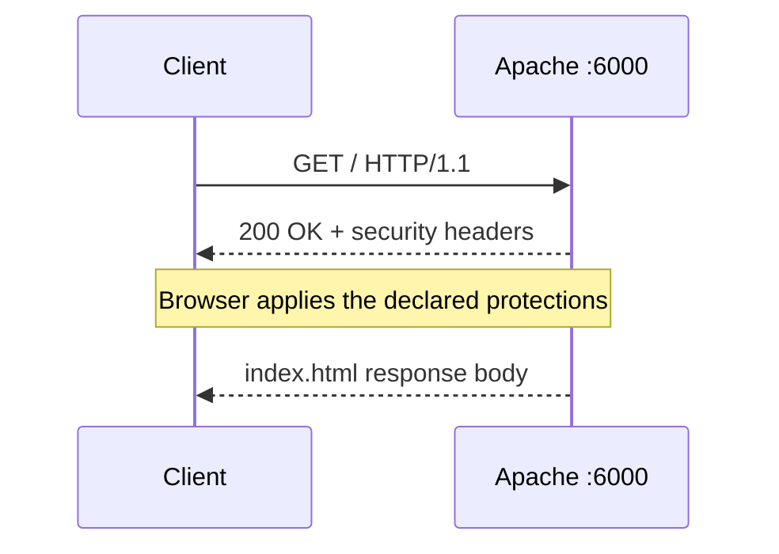

# Apache Response Security Headers on Port 6000

## Challenge

Configure Apache HTTP Server so that the website served on TCP port `6000` returns the following HTTP response headers:

| Header | Required value |
|---|---|
| `X-XSS-Protection` | `1; mode=block` |
| `X-Frame-Options` | `SAMEORIGIN` |
| `X-Content-Type-Options` | `nosniff` |

Before changing the headers, confirm that Apache is running, listening on port `6000`, and serving its `index.html` page correctly.

> Environment used in this exercise: CentOS/RHEL-style Apache, where the service and executable are named `httpd`.

---

## Overview

HTTP response headers are metadata sent by a web server to a client along with the response body. Security-related headers tell browsers how they should handle the returned content.



For example, the response should contain lines similar to these:

```http
HTTP/1.1 200 OK
X-XSS-Protection: 1; mode=block
X-Frame-Options: SAMEORIGIN
X-Content-Type-Options: nosniff
Content-Type: text/html
```

Apache provides the `Header` directive through the `mod_headers` module.

---

## Step-by-Step Solution

### 1. Connect to the target application server

From the jump host, connect using the correct application-server account. In this exercise, the shell prompt showed user `tony` on `stapp01`:

```bash
ssh tony@stapp01
```

### 2. Confirm Apache is installed and running

```bash
sudo systemctl status httpd --no-pager
```

If it is stopped, start it:

```bash
sudo systemctl start httpd
```

To start it automatically at boot as well:

```bash
sudo systemctl enable --now httpd
```

### 3. Confirm Apache is configured for port 6000

Search the Apache configuration for `Listen` and virtual-host directives:

```bash
sudo grep -RniE '^[[:space:]]*Listen|<VirtualHost' \
    /etc/httpd/conf/httpd.conf /etc/httpd/conf.d/
```

The relevant configuration should include port `6000`, for example:

```apache
Listen 6000
```

If a virtual host is used, it might instead include:

```apache
<VirtualHost *:6000>
    DocumentRoot "/var/www/html"
</VirtualHost>
```

Do not add duplicate `Listen 6000` directives. First determine whether another configuration file already defines the port.

### 4. Check whether Apache is listening on port 6000

```bash
sudo ss -ltnp | grep ':6000'
```

A successful result should show a `LISTEN` socket associated with `httpd`.

### 5. Confirm that `index.html` is being served

The default CentOS/RHEL document root is `/var/www/html`, so first check the page:

```bash
sudo ls -l /var/www/html/index.html
```

Then request it through Apache—not directly from the filesystem:

```bash
curl -i http://localhost:6000/
```

This test proves several things at once:

- Apache is running.
- Port `6000` is reachable locally.
- The virtual host or document root is working.
- Apache can read and return `index.html`.

### 6. Confirm that `mod_headers` is loaded

```bash
sudo httpd -M | grep headers
```

Expected output:

```text
headers_module (shared)
```

On CentOS/RHEL, this module is commonly loaded from a file under `/etc/httpd/conf.modules.d/`.

If Apache reports that `Header` is an invalid command, check for the module declaration:

```bash
sudo grep -Rni 'headers_module' /etc/httpd/conf.modules.d/
```

### 7. Create a dedicated security-header configuration

Create a separate file so the change remains organized and easy to maintain:

```bash
sudo vi /etc/httpd/conf.d/security-headers.conf
```

Add:

```apache
<IfModule mod_headers.c>
    Header always set X-XSS-Protection "1; mode=block"
    Header always set X-Frame-Options "SAMEORIGIN"
    Header always set X-Content-Type-Options "nosniff"
</IfModule>
```

#### Why use `always set`?

- `set` replaces an existing header with the required value instead of creating unnecessary duplicates.
- `always` applies the header to successful responses and to many non-success responses generated by Apache.

The semicolon in `1; mode=block` is part of the header value, so the complete value is enclosed in quotation marks.

### 8. Validate the Apache configuration

Always test the configuration before reloading or restarting the service:

```bash
sudo apachectl configtest
```

Successful output:

```text
Syntax OK
```

During this challenge, Apache also displayed a message similar to:

```text
AH00558: httpd: Could not reliably determine the server's fully qualified domain name...
Syntax OK
```

`AH00558` is a warning, not a syntax failure. Apache can still start and serve the website. It merely means no global `ServerName` was defined.

If desired, suppress it with a dedicated configuration file:

```bash
echo 'ServerName stapp01' | sudo tee /etc/httpd/conf.d/servername.conf
```

Then run the configuration test again. This optional warning cleanup is not required for the response headers to work.

### 9. Reload Apache safely

```bash
sudo systemctl reload httpd
```

A reload applies valid configuration changes without a complete stop-and-start cycle. If Apache was not running, use:

```bash
sudo systemctl enable --now httpd
```

Confirm its state:

```bash
sudo systemctl is-active httpd
```

Expected result:

```text
active
```

### 10. Verify the final response

Inspect the response headers:

```bash
curl -sD - -o /dev/null http://localhost:6000/
```

Alternatively:

```bash
curl -I http://localhost:6000/
```

The response must include:

```text
X-XSS-Protection: 1; mode=block
X-Frame-Options: SAMEORIGIN
X-Content-Type-Options: nosniff
```

For a focused, case-insensitive check:

```bash
curl -sD - -o /dev/null http://localhost:6000/ |
    grep -iE '^(X-XSS-Protection|X-Frame-Options|X-Content-Type-Options):'
```

Finally, test from the jump host or another permitted machine to confirm that the service is reachable over the network:

```bash
curl -sD - -o /dev/null http://stapp01:6000/
```

---

## Complete Configuration

The finished `/etc/httpd/conf.d/security-headers.conf` file is:

```apache
<IfModule mod_headers.c>
    Header always set X-XSS-Protection "1; mode=block"
    Header always set X-Frame-Options "SAMEORIGIN"
    Header always set X-Content-Type-Options "nosniff"
</IfModule>
```

The essential execution sequence is:

```bash
sudo httpd -M | grep headers
sudo vi /etc/httpd/conf.d/security-headers.conf
sudo apachectl configtest
sudo systemctl reload httpd
curl -sD - -o /dev/null http://localhost:6000/
```

---

## What Each Header Does

### `X-XSS-Protection: 1; mode=block`

Historically enabled a browser's reflected cross-site scripting filter and requested that the browser block the page when an attack was detected.

This header is obsolete in modern browsers. Modern applications should primarily use a carefully designed Content Security Policy, output encoding, and input handling. It is included here because the challenge explicitly requires it.

### `X-Frame-Options: SAMEORIGIN`

Allows the page to appear in a frame only when the framing page has the same origin. It helps reduce clickjacking attacks.

`SAMEORIGIN` is less restrictive than `DENY`, which prevents all framing. Modern applications can also control framing with the CSP `frame-ancestors` directive.

### `X-Content-Type-Options: nosniff`

Instructs browsers not to guess a resource's MIME type. The browser should respect the server's declared `Content-Type`, helping prevent some content-type confusion attacks.

---

## Troubleshooting Guide

### Apache does not listen on port 6000

Check the effective configuration:

```bash
sudo apachectl -S
sudo grep -RniE '^[[:space:]]*Listen|<VirtualHost' \
    /etc/httpd/conf/httpd.conf /etc/httpd/conf.d/
sudo ss -ltnp | grep ':6000'
```

If SELinux prevents Apache from binding to a nonstandard port, inspect the allowed HTTP ports:

```bash
sudo semanage port -l | grep http_port_t
```

If port `6000` is not present and the challenge requires Apache to bind there, add it:

```bash
sudo semanage port -a -t http_port_t -p tcp 6000
```

If an entry for that port already exists under another SELinux type, modify it carefully rather than adding a duplicate:

```bash
sudo semanage port -m -t http_port_t -p tcp 6000
```

### `Header` is reported as an invalid command

`mod_headers` is not loaded. Verify it with:

```bash
sudo httpd -M | grep headers
sudo grep -Rni 'headers_module' /etc/httpd/conf.modules.d/
```

### Apache configuration test fails

Read the exact filename and line number in the error. Also inspect recent logs:

```bash
sudo journalctl -u httpd -n 50 --no-pager
```

Do not restart Apache until `apachectl configtest` reports `Syntax OK`.

### The page loads, but the headers are absent

Check all active header directives and included configuration files:

```bash
sudo grep -RniE '^[[:space:]]*Header' /etc/httpd/
sudo apachectl -t -D DUMP_INCLUDES
```

Then verify that Apache was reloaded and that the request is reaching the expected port and virtual host.

### A header appears more than once

Search for duplicate definitions:

```bash
sudo grep -Rni 'X-XSS-Protection\|X-Frame-Options\|X-Content-Type-Options' /etc/httpd/
```

Prefer a single authoritative `Header always set` definition for each header.

### Local access works, but remote access fails

Inspect the firewall configuration:

```bash
sudo firewall-cmd --list-all
```

If the task requires remote clients to reach port `6000`, allow it permanently and reload firewalld:

```bash
sudo firewall-cmd --permanent --add-port=6000/tcp
sudo firewall-cmd --reload
```

Only expose the port when the requirements authorize it.

---

## Lessons Learned

1. **Verify the existing service before editing it.** Checking the running service, listening socket, and returned page provides a known-good baseline.
2. **A successful configuration test matters.** `Syntax OK` confirms that Apache can parse the configuration before a reload is attempted.
3. **Warnings and failures are different.** The `AH00558` `ServerName` message is informational; it does not mean the configuration test failed.
4. **Apache modules provide directives.** The `Header` directive comes from `mod_headers`, so the module must be loaded.
5. **Use dedicated files under `conf.d`.** This keeps security settings separate from the main configuration and simplifies maintenance.
6. **Use `always set` deliberately.** It replaces conflicting values and covers more response paths than a basic `set` rule.
7. **Test through HTTP, not only the filesystem.** The presence of `index.html` does not prove Apache can serve it; `curl` tests the complete request path.
8. **Test the actual port.** A successful request to port `80` says nothing about a service expected on port `6000`.
9. **Security headers are defense-in-depth.** They complement secure application code; they do not repair underlying XSS, clickjacking, or MIME-type vulnerabilities by themselves.
10. **Legacy requirements may still appear.** `X-XSS-Protection` is obsolete in modern browsers, but administrators must sometimes implement exact compliance requirements while understanding their current security value.

---

## Interview Questions and Answers

### 1. What are HTTP response headers?

They are metadata sent by a server with an HTTP response. They describe the response, caching behavior, content type, security policy, cookies, and other client-handling instructions.

### 2. Which Apache module provides the `Header` directive?

`mod_headers`.

### 3. How do you confirm that `mod_headers` is loaded?

```bash
httpd -M | grep headers
```

### 4. What is the difference between `Header set` and `Header always set`?

`Header set` commonly modifies the normal successful-response header table. `Header always set` also covers headers generated along additional response paths, including many error responses. Exact behavior can depend on how Apache and upstream applications generate the response.

### 5. Why use `set` instead of `add`?

`set` replaces an existing value, helping avoid duplicate headers. `add` appends another instance even when the header already exists.

### 6. What does `X-Frame-Options: SAMEORIGIN` do?

It permits framing only by pages from the same origin, helping mitigate clickjacking.

### 7. What does `X-Content-Type-Options: nosniff` do?

It tells supported browsers to honor the declared MIME type instead of guessing another content type.

### 8. Is `X-XSS-Protection` still considered modern protection?

No. It is obsolete in modern browsers. Strong output encoding and a well-designed Content Security Policy are more appropriate modern protections.

### 9. How do you test Apache configuration safely?

```bash
apachectl configtest
```

Proceed with a reload only when the result is `Syntax OK`.

### 10. What is the difference between reloading and restarting Apache?

A reload asks Apache to apply configuration changes gracefully, normally without a full service interruption. A restart stops and starts the service, which is more disruptive.

### 11. How do you determine which process owns port 6000?

```bash
sudo ss -ltnp | grep ':6000'
```

### 12. Why might Apache fail to bind to a nonstandard port on an SELinux-enabled system?

SELinux may not label that port as an allowed HTTP port. The administrator should inspect `http_port_t` assignments and add or modify the required port mapping when appropriate.

### 13. What is the difference between `curl -I` and `curl -i`?

`curl -I` sends a `HEAD` request and displays response headers. `curl -i` performs the normal request and includes response headers with the response body.

### 14. Where should global custom Apache configuration be placed on CentOS/RHEL?

A dedicated `.conf` file under `/etc/httpd/conf.d/` is usually preferable to modifying the main configuration directly.

### 15. How would you apply headers only to one virtual host?

Place the `Header` directives inside the relevant `<VirtualHost ...>` block rather than in a global configuration context.

---

## Final Verification Checklist

- [ ] Apache is active.
- [ ] Apache listens on TCP port `6000`.
- [ ] `http://localhost:6000/` returns the expected `index.html` content.
- [ ] `mod_headers` is loaded.
- [ ] The three required `Header always set` directives exist.
- [ ] `apachectl configtest` reports `Syntax OK`.
- [ ] Apache has been reloaded successfully.
- [ ] All three headers appear with their exact required values.
- [ ] The service is reachable remotely if the challenge requires remote access.

---

## Result

Apache successfully served the website on port `6000` and returned all three required response security headers. Challenge completed successfully.
