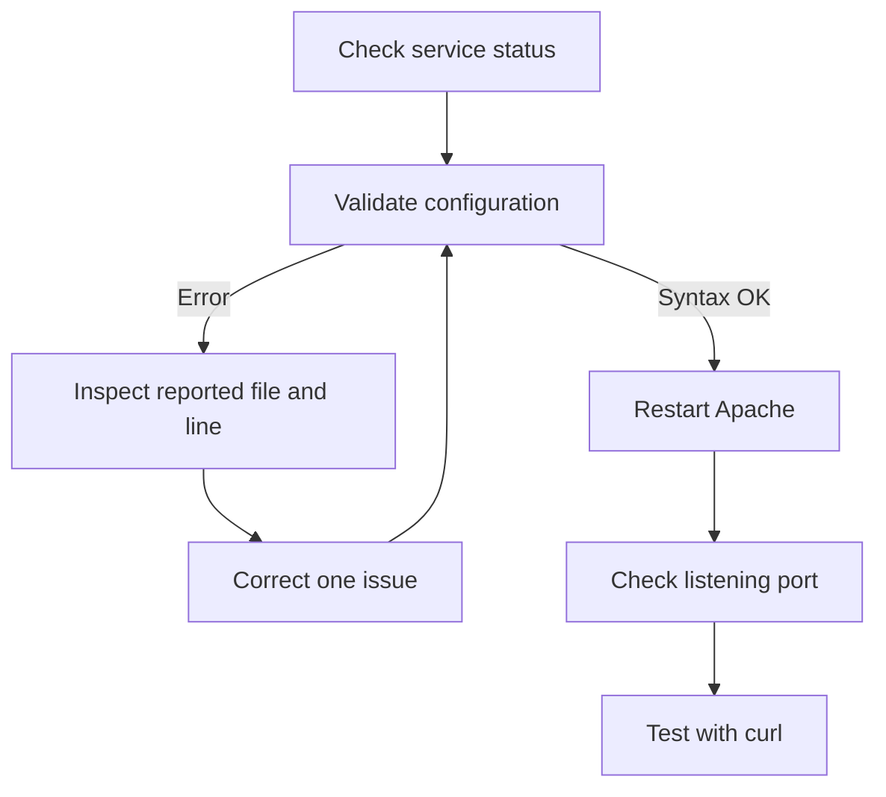

# Troubleshooting a Broken Apache Configuration

## Challenge

Apache HTTP Server (`httpd`) was not operating correctly because its main configuration file contained several typographical errors. The task was to inspect the configuration, repair the invalid directives, ensure Apache used the required port, start the service, and verify that the website was reachable.

One discovered error was:

```apache
ServerRoot "/etc/httpd;"
```

The semicolon was inside the quotation marks, so Apache interpreted it as part of the directory name. The corrected directive was:

```apache
ServerRoot "/etc/httpd"
```

> The `ServerRoot` directive belongs in Apache's configuration. It was the value—not the directive itself—that was incorrect.

---

## Troubleshooting Workflow



The key principle is to let Apache's own validation and logs guide the investigation instead of changing several unrelated settings at once.

---

## Step-by-Step Guide

### 1. Check Apache's service status

```bash
sudo systemctl status httpd --no-pager -l
```

Useful related commands:

```bash
sudo systemctl is-active httpd
sudo systemctl is-enabled httpd
```

These distinguish the current runtime state from whether Apache is configured to start automatically during boot.

### 2. Inspect recent Apache logs

```bash
sudo journalctl -u httpd -n 50 --no-pager
```

For detailed messages from the current boot:

```bash
sudo journalctl -xeu httpd.service
```

The logs commonly identify a malformed directive, an inaccessible path, a port conflict, or the file and line where parsing failed.

### 3. Validate the configuration

```bash
sudo apachectl configtest
```

Equivalent commands on many CentOS/RHEL systems include:

```bash
sudo httpd -t
sudo apachectl -t
```

A healthy configuration returns:

```text
Syntax OK
```

If a file and line number are reported, inspect that location before making unrelated changes.

### 4. Back up the configuration before editing

```bash
sudo cp -a /etc/httpd/conf/httpd.conf \
    /etc/httpd/conf/httpd.conf.before-troubleshooting
```

This preserves permissions and provides an easy comparison point.

### 5. Inspect the configuration with line numbers

Open the main file:

```bash
sudo vi /etc/httpd/conf/httpd.conf
```

To display a particular range with line numbers:

```bash
sudo nl -ba /etc/httpd/conf/httpd.conf | sed -n '1,120p'
```

Replace `1,120` with the range surrounding the line reported by `configtest`.

### 6. Correct `ServerRoot`

Incorrect:

```apache
ServerRoot "/etc/httpd;"
```

Correct:

```apache
ServerRoot "/etc/httpd"
```

`ServerRoot` defines the base directory Apache uses when resolving various relative configuration paths. Punctuation placed inside quotation marks becomes part of the literal path.

Confirm the configured value:

```bash
sudo grep -nE '^[[:space:]]*ServerRoot' /etc/httpd/conf/httpd.conf
```

### 7. Find every port declaration

Do not assume the listening port or add a second `Listen` directive without checking existing files:

```bash
sudo grep -RniE '^[[:space:]]*Listen|<VirtualHost' \
    /etc/httpd/conf/httpd.conf /etc/httpd/conf.d/
```

Apache's listening port is set with:

```apache
Listen <PORT>
```

For example, if a task requires port `8080`:

```apache
Listen 8080
```

If a virtual host is present, its port must agree with the intended listener:

```apache
<VirtualHost *:8080>
    DocumentRoot "/var/www/html"
</VirtualHost>
```

Replace `8080` with the exact port required by the challenge. Do not reuse a port from another exercise.

### 8. Display Apache's interpreted virtual-host configuration

```bash
sudo apachectl -S
```

This helps identify virtual hosts, addresses, ports, configuration filenames, and line numbers.

### 9. Re-run validation after every correction

```bash
sudo apachectl configtest
```

Continue correcting the reported problems until the result is:

```text
Syntax OK
```

Do not restart Apache while the configuration test still reports an error.

### 10. Understand the `AH00558` warning

The validation command may return something similar to:

```text
AH00558: httpd: Could not reliably determine the server's fully qualified domain name...
Syntax OK
```

This is a warning, not a syntax failure. Apache can still start. It means that a global `ServerName` was not configured.

If the environment requires the warning to be removed, create a small configuration file using the server's correct hostname:

```bash
echo 'ServerName stapp01' | sudo tee /etc/httpd/conf.d/servername.conf
```

Then validate again:

```bash
sudo apachectl configtest
```

This step is optional unless the challenge explicitly requires a `ServerName`.

### 11. Restart Apache

After receiving `Syntax OK`:

```bash
sudo systemctl restart httpd
```

Then confirm that it remains active:

```bash
sudo systemctl status httpd --no-pager -l
sudo systemctl is-active httpd
```

To start Apache now and enable it at boot:

```bash
sudo systemctl enable --now httpd
```

### 12. Confirm the listening socket

To show sockets owned by Apache:

```bash
sudo ss -ltnp | grep httpd
```

To check a specific required port:

```bash
sudo ss -ltnp | grep ':<PORT>'
```

Replace `<PORT>` with the required number.

### 13. Test the website locally

```bash
curl -i http://localhost:<PORT>/
```

To retrieve only the response headers:

```bash
curl -I http://localhost:<PORT>/
```

To display only the response body:

```bash
curl -s http://localhost:<PORT>/
```

Testing locally separates Apache configuration problems from external firewall, routing, and DNS problems.

### 14. Test from another machine

After the local request succeeds, test from the jump host or another authorized client:

```bash
curl -i http://stapp01:<PORT>/
```

If local access works but remote access fails, investigate the firewall and network path.

---

## Nonstandard Ports: SELinux and firewalld

Only perform these checks if Apache has valid syntax but cannot bind to the required nonstandard port, or if local access works while remote access fails.

### Inspect SELinux-approved HTTP ports

```bash
sudo semanage port -l | grep http_port_t
```

If the required port is not listed, authorize it:

```bash
sudo semanage port -a -t http_port_t -p tcp <PORT>
```

If the port already exists under a different SELinux type, it may need to be modified rather than added:

```bash
sudo semanage port -m -t http_port_t -p tcp <PORT>
```

### Inspect firewalld

```bash
sudo firewall-cmd --list-all
```

If remote access to the port is explicitly required:

```bash
sudo firewall-cmd --permanent --add-port=<PORT>/tcp
sudo firewall-cmd --reload
sudo firewall-cmd --list-ports
```

Do not expose a port unless the task authorizes it.

---

## Useful Command Reference

| Purpose | Command |
|---|---|
| Service status | `sudo systemctl status httpd --no-pager -l` |
| Current service state | `sudo systemctl is-active httpd` |
| Recent service logs | `sudo journalctl -u httpd -n 50 --no-pager` |
| Detailed service failure | `sudo journalctl -xeu httpd.service` |
| Configuration test | `sudo apachectl configtest` |
| Alternative syntax test | `sudo httpd -t` |
| Show virtual hosts | `sudo apachectl -S` |
| Find `ServerRoot` | `sudo grep -nE '^[[:space:]]*ServerRoot' /etc/httpd/conf/httpd.conf` |
| Find listeners/vhosts | `sudo grep -RniE '^[[:space:]]*Listen|<VirtualHost' /etc/httpd/conf/httpd.conf /etc/httpd/conf.d/` |
| Show Apache sockets | `sudo ss -ltnp \| grep httpd` |
| Restart Apache | `sudo systemctl restart httpd` |
| Enable and start Apache | `sudo systemctl enable --now httpd` |
| HTTP test | `curl -i http://localhost:<PORT>/` |
| Header-only test | `curl -I http://localhost:<PORT>/` |
| SELinux HTTP ports | `sudo semanage port -l \| grep http_port_t` |
| Firewall configuration | `sudo firewall-cmd --list-all` |

---

## Common Failure Patterns

### Incorrect punctuation inside a quoted value

```apache
ServerRoot "/etc/httpd;"
```

Apache treats `/etc/httpd;` as a different path from `/etc/httpd`.

### Misspelled directive

Apache directives must be spelled correctly. A typo generally causes `configtest` to report an invalid command and identify its location.

### Duplicate `Listen` directives

Adding a new listener without searching included files can cause address-binding conflicts. Search the complete configuration tree first.

### Mismatched `Listen` and `VirtualHost` ports

If Apache listens on one port while a virtual host is declared for another, requests may not reach the intended site configuration.

### Port already in use

Check the owner of the port:

```bash
sudo ss -ltnp | grep ':<PORT>'
```

Apache cannot bind to a port already held by another process.

### Confusing a warning with a fatal error

`AH00558` followed by `Syntax OK` does not prevent Apache from starting. Focus first on actual parse failures or service errors.

---

## Lessons Learned

1. Run `apachectl configtest` before every restart after editing Apache configuration.
2. Read error messages carefully; they often identify the exact file and line requiring attention.
3. Quoted configuration values are literal. Even one accidental character can change a filesystem path.
4. `ServerRoot` is a valid and important directive; its malformed value was the problem.
5. Search all included configuration files before adding or changing a listening port.
6. A successful syntax test does not prove the website works. Verify the service, socket, and HTTP response separately.
7. Test locally before investigating firewalls or remote networking.
8. Make the smallest justified correction, validate it, and continue iteratively.
9. Preserve a backup before manually repairing an important configuration file.
10. Warnings, syntax errors, runtime failures, and network-access failures are different classes of problem.

---

## Interview Questions

### How do you troubleshoot an Apache service that will not start?

Check `systemctl status`, validate the configuration with `apachectl configtest`, inspect `journalctl`, correct the reported issue, restart the service, inspect its listening socket, and test locally with `curl`.

### What does `ServerRoot` control?

It defines Apache's base configuration directory and is used to resolve various relative paths.

### How do you configure Apache to listen on another port?

Set the required port with the `Listen` directive and ensure any relevant `<VirtualHost>` declaration uses the intended port. Then consider SELinux and firewall policy if applicable.

### What is the difference between `Listen` and `<VirtualHost>`?

`Listen` creates a network listener on an address or port. `<VirtualHost>` selects the site configuration Apache should use for matching requests arriving on an address and port.

### How do you validate Apache configuration without restarting it?

```bash
sudo apachectl configtest
```

### How do you find which process owns a TCP port?

```bash
sudo ss -ltnp | grep ':<PORT>'
```

### Why might Apache fail to use a nonstandard port even when its syntax is valid?

The port may already be occupied, SELinux may not permit `httpd` to bind to it, or the service may lack the necessary privileges or configuration.

### Why test with `curl` from localhost first?

It verifies the local web-server path without introducing external DNS, routing, or firewall variables.

---

## Final Checklist

- [ ] Back up the configuration before editing.
- [ ] Correct malformed directives and quoted values.
- [ ] Confirm `ServerRoot "/etc/httpd"` is valid.
- [ ] Configure the exact port required by the challenge.
- [ ] Ensure `Listen` and relevant virtual-host ports agree.
- [ ] Run `sudo apachectl configtest` until it returns `Syntax OK`.
- [ ] Restart Apache successfully.
- [ ] Confirm Apache is active.
- [ ] Confirm Apache owns the required listening socket.
- [ ] Verify the page locally with `curl`.
- [ ] Verify remote access if the challenge requires it.

## Result

The typographical errors in Apache's configuration were corrected, the required listening port was configured, the syntax check passed, Apache started successfully, and the website became reachable.
