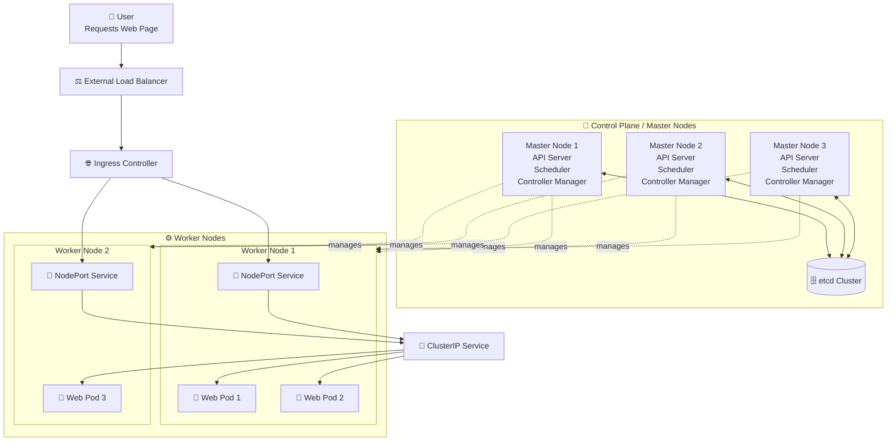

```mermaid

flowchart TB

    USER[👤 User<br/>Requests Web Page]
    LB[⚖️ External Load Balancer]
    ING[🌐 Ingress Controller]

    USER --> LB
    LB --> ING

    subgraph CP[🧠 Control Plane / Master Nodes]
        M1[Master Node 1<br/>API Server<br/>Scheduler<br/>Controller Manager]
        M2[Master Node 2<br/>API Server<br/>Scheduler<br/>Controller Manager]
        M3[Master Node 3<br/>API Server<br/>Scheduler<br/>Controller Manager]

        ETCD[(🗄️ etcd Cluster)]

        M1 <--> ETCD
        M2 <--> ETCD
        M3 <--> ETCD
    end

    subgraph WORKERS[⚙️ Worker Nodes]

        subgraph W1[Worker Node 1]
            NP1[🔌 NodePort Service]
            P1[🚀 Web Pod 1]
            P2[🚀 Web Pod 2]
        end

        subgraph W2[Worker Node 2]
            NP2[🔌 NodePort Service]
            P3[🚀 Web Pod 3]
        end

    end

    ING --> NP1
    ING --> NP2

    NP1 --> CIP[🔗 ClusterIP Service]
    NP2 --> CIP

    CIP --> P1
    CIP --> P2
    CIP --> P3

    M1 -. manages .-> W1
    M1 -. manages .-> W2
    M2 -. manages .-> W1
    M2 -. manages .-> W2
    M3 -. manages .-> W1
    M3 -. manages .-> W2

```